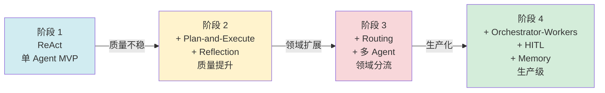
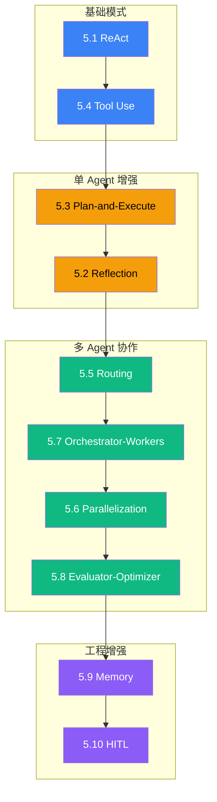

# 5.12 模式组合实战：从单 Agent 到多 Agent 演化路径

> 🟢🟡 核心+进阶

> **本节钩子**：生产级 Agent **不是"用了一个模式"**——而是 **4-5 个模式叠加**：ReAct 做工具调用 + Reflection 做质量把控 + HITL 做关键审批 + Memory 做跨会话 + Routing 做子任务委派。本节用一个"研究助手"完整案例,展示 4 阶段**演化路径**——而非"选一个用"。

## 正文大纲

1. **一句话定义**：本节是 L5 的"总收尾"——用 1 个完整案例（"研究助手"）展示 4 阶段**模式叠加演化**：① ReAct（单 Agent）→ ② Plan-and-Execute + Reflection（单 Agent 进阶）→ ③ Routing + Multi-Agent（多 Agent 起步）→ ④ Orchestrator-Workers + HITL + Memory（生产级）。**关键观察**：演化的**驱动力**是"任务复杂度 + 质量要求"——单 Agent 撑不住时自然升级到多 Agent。
2. **适用场景**：所有生产 Agent 的"演化路径参考"——本节是"如何叠加模式"的样板间。
3. **4 阶段演化路径**（驱动力 + 叠加模式 + 代码增量）
   - **阶段 1：ReAct 单 Agent**——MVP 阶段，能用但质量不稳；任务：单源查询。
   - **阶段 2：Plan-and-Execute + Reflection**——质量提升；任务：多步报告生成。
   - **阶段 3：Routing + 多 Agent**——领域分流；任务：客服 / 多领域专家。
   - **阶段 4：Orchestrator-Workers + HITL + Memory**——生产级；任务：复杂研究 + 高风险操作 + 跨会话。
4. **代码示例**：研究助手 4 阶段 LangGraph 代码骨架（每阶段 30-50 行）。
5. **常见误区**：
   - ❌ "上来就用最复杂模式"——错；Anthropic 内部经验：80% 项目在阶段 1-2 就能上线，不要"过度工程化"。
   - ❌ "模式越多越好"——错；每加一个模式都增加协调成本；只叠加"任务真正需要"的模式。
6. **与其他节对比**：本节是 5.1-5.11 的"组合示范"；8.2 Coding Agent（L8 案例）是本节"研究助手"的端到端实现。

## 图 1：4 阶段演化路径



## 图 2：模式叠加矩阵



> Source: 综合 5.1-5.11 模式 + L8 案例 8.2 Coding Agent + LangGraph 多模式组合示例.

## 代码

```python
# pattern_composition.py
"""
研究助手 4 阶段演化代码骨架(每阶段 30-50 行 LangGraph)
"""

# ========== 阶段 1: ReAct 单 Agent(MVP) ==========
def stage1_react(user_query: str) -> str:
    """阶段 1: 25 行 LangGraph ReAct"""
    from langgraph.prebuilt import create_react_agent
    agent = create_react_agent(
        model="openai:gpt-4.1",
        tools=[search_web, fetch_url],
    )
    result = agent.invoke({"messages": [{"role": "user", "content": user_query}]})
    return result["messages"][-1].content

# ========== 阶段 2: + Plan-and-Execute + Reflection ==========
def stage2_plan_reflect(user_query: str) -> str:
    """阶段 2: 50 行 LangGraph 计划+反思"""
    # Plan-and-Execute 步骤 1: Planner 生成计划
    plan = planner_llm.invoke(f"任务:{user_query}\n生成 3-5 步计划").content.split("\n")
    results = []
    for step in plan:
        result = executor_llm.invoke(f"执行:{step}\n前序:{results}").content
        results.append(result)
    # Reflection 步骤 2: 评审输出
    critique = critic_llm.invoke(
        f"评审以下研究结果,给 0-10 分 + 改进建议:\n{results[-1]}"
    ).content
    if "改进" in critique:
        improved = executor_llm.invoke(f"根据反馈改进:{critique}\n原文:{results[-1]}").content
        return improved
    return results[-1]

# ========== 阶段 3: + Routing 多 Agent ==========
def stage3_routing(user_query: str) -> str:
    """阶段 3: 30 行 Supervisor + Sub-agents"""
    domain = supervisor_llm.invoke(
        f"判断用户问题属于哪个领域(技术/商业/医疗/通用):{user_query}"
    ).content.strip()
    agents = {
        "技术": tech_agent, "商业": biz_agent,
        "医疗": med_agent, "通用": general_agent,
    }
    return agents.get(domain, general_agent).invoke(user_query)

# ========== 阶段 4: + Orchestrator-Workers + HITL + Memory ==========
def stage4_full_stack(user_query: str, session_id: str) -> str:
    """阶段 4: 60 行 LangGraph 完整生产版"""
    # 1) 召回长期 Memory
    long_ctx = long_term_recall(user_query, user_id=session_id, k=3)
    # 2) Orchestrator 决定子任务
    sub_tasks = orchestrator_llm.invoke(
        f"任务:{user_query}\n历史:{long_ctx}\n生成 2-4 个子任务"
    ).content
    # 3) Workers 并行执行
    results = asyncio.gather(*[worker.invoke(st) for st in sub_tasks])
    # 4) Evaluator 评估整体质量
    score, feedback = evaluator.evaluate(results)
    if score < 0.8:
        # HITL: 关键决策点打断
        decision = interrupt({"score": score, "feedback": feedback, "results": results})
        if decision == "reject":
            return "rejected by human"
    # 5) 写回 Memory
    long_term_store(f"Q:{user_query}\nA:{results}", session_id)
    return results
```

实战要点：

1. **演化驱动 = 任务复杂度**——不要"上来就用阶段 4 完整版"；MVP 先用阶段 1，撑不住再升级。
2. **每加一个模式都有成本**——模式叠加的协调成本 / 通信成本 / 错误放大成本；只叠加"任务真正需要"的模式。
3. **HITL 必加在阶段 3+**——阶段 1-2 内部 demo 不必 HITL；阶段 3+ 上线后必须对"高风险操作"打断。

## 实战片段

完整 4 阶段演化路径可参考 L8 案例 8.2 Coding Agent——那里有端到端 100+ 行 LangGraph 实现。本节聚焦"**模式叠加的思维模型**"：

- **阶段 1 何时停**——任务成功率 > 80% 且 token 成本可接受时，**不要**急于升级。
- **阶段 2 何时升**——任务成功率 < 80% 或质量反馈"经常答错"时，加 Reflection。
- **阶段 3 何时升**——任务跨多个领域（"客服"拆订单/账单/物流）时，加 Routing。
- **阶段 4 何时升**——任务跨小时 / 跨会话 / 高风险时，加 Orchestrator-Workers + HITL + Memory。

实战要点：
- **不要"为了多 Agent 而多 Agent"**——5.11 反模式明确：单 Agent 串行在 70% 场景下更快更便宜更稳定。
- **模式叠加顺序有讲究**——基础模式（ReAct / Tool Use）→ 单 Agent 增强（Plan-and-Execute / Reflection）→ 多 Agent（Routing / Orchestrator-Workers）→ 工程增强（Memory / HITL）；跳级会导致"为了多 Agent 而多 Agent"。
- **L8 是端到端落地**——8.2 Coding Agent 是阶段 4 完整版的 100+ 行 LangGraph 实现，可作为模板套用到自己的项目。

## 框架映射

| 阶段 | 主导框架 | 关键 API |
|---|---|---|
| 阶段 1 | LangGraph | `create_react_agent` |
| 阶段 2 | LangGraph | `StateGraph` + plan / reflect 节点 |
| 阶段 3 | LangGraph Supervisor | `create_supervisor` + Sub-agents |
| 阶段 4 | LangGraph + Checkpointer | `Send` API + `interrupt()` + `PostgresSaver` |

## 自测题

1. **概念辨析**：为什么"生产级 Agent = 4-5 个模式叠加"而不是"选一个最复杂模式"？叠加模式的本质困难是什么？
2. **场景判断**：下面哪个项目**最应该从阶段 1 起步**而非直接跳到阶段 4？
   - A. 大型电商客服系统
   - B. 个人周末玩具项目（"自动总结我每天的 GitHub commit"）
   - C. 金融风控审批
   - D. 跨 5 数据源的研究助手
3. **代码补全**：补全阶段 4 完整的 HITL 决策逻辑：
   ```python
   score, feedback = evaluator.evaluate(results)
   if score < 0.8:
       decision = interrupt({"score": score, "feedback": feedback})
       # 缺什么? 2-3 行关键代码
   ```
4. **反直觉题**：有人说"模式叠加越多越好,生产级一定要把所有 12 个模式都用上"。这种说法的根本问题是什么？Anthropic 内部经验怎么说？
5. **对比题**：5.12 模式组合 vs L8 端到端案例在"工程价值"上的差异是什么？为什么先读 L5 再读 L8？

**答案**：

1. **本质**：单一模式无法覆盖所有场景——ReAct 没有质量控制，Plan-and-Execute 没有灵活调整，Routing 没有动态委派，Orchestrator-Workers 没有跨会话记忆。**叠加才能互补**：ReAct（工具调用）+ Reflection（质量）+ HITL（关键审批）+ Memory（跨会话）。**叠加困难**：① 协调成本（多模式的状态同步）；② 通信成本（多 Agent N² token）；③ 错误放大（5.11 反模式）；④ 调试成本（trace 复杂度）。
2. **B 最该从阶段 1 起步**——"个人周末玩具项目"任务简单、风险低、单人使用，阶段 1 ReAct 完全够用；直接上阶段 4 是过度工程化。A/C/D 都是复杂生产项目，应该根据需要演化。
3. ```python
   if decision == "reject":
       return "rejected by human"
   if decision.startswith("modify:"):
       # 解析人类修改意见,重新生成
       feedback = decision.replace("modify:", "").strip()
       results = regenerate_with_feedback(results, feedback)
   ```
   关键：① 拒绝直接返回；② 修改意见重新生成；③ "approve" 继续走主流程；④ 用 `decision.startswith("modify:")` 区分"修改"和"批准"。
4. **根本问题**：① **每个模式都有协调成本**——叠加 12 个模式 = 12 倍协调成本；② **不是所有项目都需要**——玩具项目用阶段 1 就够，硬上阶段 4 是过度工程化；③ **边际收益递减**——第 5 个模式之后增加的模式边际收益 < 成本。**Anthropic 内部经验**：80% 项目在阶段 1-2 就能上线，15% 需要阶段 3-4，5% 才需要"全套 12 模式"；盲目追求"模式齐全"反而拖慢迭代。
5. **价值差异**：L5 模式组合是"**抽象层**"——讲"哪些模式可以叠加"和"演化路径";L8 端到端案例是"**实现层**"——给 100+ 行完整 LangGraph 代码可直接套用。**先读 L5 再读 L8**：L5 提供"模式词汇表"和"叠加思维模型",L8 给出"具体代码模板"；没有 L5 的抽象层直接看 L8 代码会"知其然不知其所以然",无法迁移到自己的项目。

> 📚 本节参考
> - [S 级] LangGraph 多模式组合示例 — https://github.com/langchain-ai/langgraph
> - [S 级] Anthropic, *Building Effective Agents* (2024-10) — https://www.anthropic.com/research/building-effective-agents
> - [S 级] Anthropic, *How we built our multi-agent research system* (2025) — https://www.anthropic.com/engineering/built-multi-agent-research-system
> - 本地参考: L8 端到端案例 8.2 Coding Agent — `handbook/l8-cases/8.2-coding-agent.md`
> - 本地参考: 5.1-5.11 全部模式节