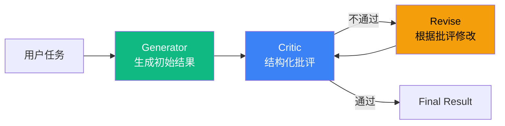

# 5.2 Reflection 模式：自批评迭代提质量

> 🟡 进阶

> **本节钩子**：Reflection 不是"再问一次"——必须**结构化批评**（"具体哪里错 + 为什么错 + 怎么改"）。无结构的"再生成一次"只是随机重试，提不了质量还会浪费 token。

## 正文大纲

1. **一句话定义**：Reflection 是 Self-Critique 循环——Agent 生成结果后，让"评审员"（同 LLM 或不同 LLM）打分或提修改意见，反复迭代提质量。**关键观察**：评审 prompt 的结构化程度直接决定提升幅度——一句"再想想"平均只能提 5% 质量，"具体哪里错 + 为什么错 + 怎么改"能提 20-30%。
2. **适用场景**（3 个典型 + 2 个反例）
   - **典型 1**：长报告 / 文档写作——首稿质量 60 分，迭代 2-3 次可到 85+ 分。
   - **典型 2**：代码生成——首版代码常缺边界处理，Reflection 评审能补"异常路径"。
   - **典型 3**：翻译 / 摘要——质量优先于速度的任务。
   - **反例 1**：实时对话（聊天 / 客服）——延迟敏感，Reflection 的多轮迭代不划算。
   - **反例 2**：客观题（数学 / 事实问答）——要么对要么错，无"渐进改进"空间。
3. **关键机制**（3 个要点）
   - **结构化批评 prompt**："请按三段式批评：① 具体哪里错（行号/段落）② 为什么错（原理）③ 怎么改（具体动作）"——这是 Self-Refine 论文的核心发现。
   - **同 LLM vs 不同 LLM**：同 LLM 简单便宜但有"自我盲区"；不同 LLM（如 Critic 用 GPT-4，Generator 用 Claude）能引入外部视角但成本翻倍。
   - **最大迭代次数 2-3 次**：Self-Refine 实验显示 2-3 次后边际收益骤降，4+ 次成本超过质量提升。
4. **代码示例**：Reflection 最小循环。
5. **常见误区**：
   - ❌ "Reflection = 再问一次同样的问题"——错；无结构化 = 重新随机生成，token 成本翻倍但质量不变。
   - ❌ "迭代次数越多越好"——错；4+ 次后边际收益 < 成本（Self-Refine 实验数据）。
6. **与其他模式对比**：Reflection vs ReAct（自我批评 vs 工具调用）/ Reflection vs Evaluator-Optimizer（轻量 vs 重量评估）。

## 图



> Source: Shinn et al., *Reflexion: Language Agents with Verbal Reinforcement Learning*, 2023.

## 代码

```python
# reflection_loop.py
"""
Reflection 最小循环（伪代码）
"""
def reflection_loop(task: str, generator, critic, max_iters: int = 3) -> str:
    output = generator(task)
    for i in range(max_iters):
        critique = critic(
            f"任务:{task}\n输出:{output}\n"
            f"请按三段式批评:① 具体哪里错 ② 为什么错 ③ 怎么改"
        )
        if critique.is_approved:
            return output
        output = generator(
            f"任务:{task}\n上一版:{output}\n批评:{critique.text}\n请改进"
        )
    return output  # 达到 max_iters 即返回当前最佳
```

实战要点：

1. **评审 prompt 模板必用三段式**（"具体/为什么/怎么改"）——Self-Refine 论文实验：无结构化提示提 5% 质量，三段式提 20-30%。
2. **max_iters 默认 2-3**——超过 3 次后边际成本超过质量提升（GPT-4 实验：第 4 次平均只再提 2% 质量但 token 成本增加 33%）。
3. **同 LLM vs 不同 LLM**——同 LLM 便宜但有"自我盲区"（同一个模型对同一输出的评价高度相似）；不同 LLM 引入外部视角但成本翻倍，建议**关键项目用混合**——首轮用同 LLM 快速迭代，末轮用更强 LLM 做"专家评审"。

## 实战片段

生产中 Reflection 常和"prompt 模板版本化 + 评审日志"配合——下面是 40 行可运行的 LangGraph 实现：

```python
# reflection_production.py
from typing import TypedDict
from langgraph.graph import StateGraph, START, END

class ReflectState(TypedDict):
    task: str
    output: str
    critique: str
    iter: int
    approved: bool

def generate_node(state: ReflectState):
    """Generator: 根据上一轮 critique 改进(首轮无 critique)"""
    if state["iter"] == 0:
        prompt = state["task"]
    else:
        prompt = (
            f"任务:{state['task']}\n"
            f"上一版:{state['output']}\n"
            f"批评:{state['critique']}\n请改进"
        )
    output = llm.invoke(prompt)
    return {"output": output, "iter": state["iter"] + 1}

def critique_node(state: ReflectState):
    """Critic: 三段式结构化评审"""
    critique = critic_llm.invoke(
        f"任务:{state['task']}\n输出:{state['output']}\n"
        f"请按三段式批评:① 具体哪里错 ② 为什么错 ③ 怎么改\n"
        f"如果输出已经满足要求,回复'APPROVED'"
    )
    approved = "APPROVED" in critique
    return {"critique": critique, "approved": approved}

def should_continue(state: ReflectState) -> str:
    if state["approved"] or state["iter"] >= 3:
        return END
    return "generate"  # 回到 generate 节点根据 critique 改进

graph = (
    StateGraph(ReflectState)
    .add_node("generate", generate_node)
    .add_node("critique", critique_node)
    .add_edge(START, "generate")
    .add_edge("generate", "critique")
    .add_conditional_edges("critique", should_continue, {END: END, "generate": "generate"})
    .compile()
)
```

实战要点：
- **评审日志必须落盘**——把每轮的 `task / output / critique / approved` 写入数据库，方便后续分析"评审 prompt 是否真的有效"。
- **APPROVED 信号靠关键词**——`"APPROVED" in critique` 简单粗暴但有效；更稳的做法是让 Critic 输出 JSON `{approved: bool, critique: str}` 再 parse。

## 框架映射

| 框架 | API 入口 | 备注 |
|---|---|---|
| LangGraph | 自建 `generate` / `critique` 节点 + 条件边 | **推荐**——循环 + 状态持久化最清晰 |
| LangChain | `langchain.agents.create_agent` + 自定义反思 prompt | 1.x 风格，需手动写循环 |
| AutoGen | `AssistantAgent` + `UserProxyAgent`（用户给反馈） | 经典"两 Agent 互喷"风格 |
| OpenAI Agents SDK | `Runner.run_sync` + 多次调用 + 状态外存 | 轻量，循环逻辑需自己写 |
| Claude Agent SDK | `query()` 多轮 + 内置 reflexion 风格 | 原生支持 verbal self-reflection |

## 自测题

1. **概念辨析**：Self-Refine 论文的核心发现是什么？为什么"再问一次"提不了质量？
2. **场景判断**：下面哪个任务**最不适合**用 Reflection？
   - A. 写一份 3000 字的年度报告
   - B. 实时聊天回复（"你好吗？"）
   - C. 生成一段复杂的 SQL 查询
   - D. 翻译一篇技术博客
3. **代码补全**：补全下面的"已批准"判断逻辑，让 Reflection 循环能正确终止：
   ```python
   critique = critic(...)
   if ???:
       return output
   ```
4. **反直觉题**：有人说"Reflection 迭代 10 次质量肯定比 1 次好"。这种说法的根本问题是什么？Self-Refine 论文的实验数据怎么说？
5. **对比题**：Reflection vs Evaluator-Optimizer 的核心差异是什么？什么场景用 Reflection 什么场景用 Evaluator-Optimizer？

**答案**：

1. **核心发现**：结构化批评 prompt 显著提升质量——无结构化提示（"再想想"）平均只提 5% 质量；三段式提示（"具体哪里错 / 为什么错 / 怎么改"）平均提 20-30% 质量。**为什么"再问一次"没用**：同一个 LLM 在相似 prompt 下生成的结果高度相似（self-consistency），没有外部信号打破"局部最优"；只有结构化批评给出了**新信息**才能突破。
2. **B 最不适合**——实时聊天延迟敏感（用户期望 < 1s 回复），Reflection 的多轮迭代不划算；且聊天回复无客观"质量"标准，评审 prompt 也难写。A、C、D 都有明确的"质量可衡量"标准（字数 / SQL 正确性 / 翻译准确率）。
3. `if "APPROVED" in critique: return output`——这是关键词判断，简单有效。更稳的做法是 `if critique_dict.get("approved", False): return output`（用 JSON parse）。
4. **根本问题**：① 边际收益递减——Self-Refine 实验：第 1 次提 20%、第 2 次再提 8%、第 3 次再提 3%、第 4 次只提 1%；② 边际成本递增——每次迭代 = 1 次 Generator + 1 次 Critic 调用，token 成本线性增长；③ "自我一致性陷阱"——同一 LLM 迭代 4+ 次后输出高度相似。**实验数据**：Self-Refine 论文在 7 个任务上测试，3 次迭代后 5/7 任务已收敛，4+ 次平均提质 < 2% 但成本增加 33%。
5. **核心差异**：Reflection 的 Critic 是**轻量 LLM 调用**，prompt 自由形式；Evaluator-Optimizer 的 Evaluator 是**独立 Agent**，可基于规则（regex / 单元测试）或更复杂的 LLM-as-Judge，且常带**结构化阈值**（如"必须 8/10 才通过"）。**场景**：Reflection 适合**主观质量**（写作 / 翻译 / 创意）——评审标准模糊，重在"哪里可以更好"；Evaluator-Optimizer 适合**客观质量**（代码可运行 / 报告合规 / 翻译准确率）——有明确 pass/fail 标准，重在"是否达标"。

> 📚 本节参考
> - [S 级] Shinn et al., *Reflexion: Language Agents with Verbal Reinforcement Learning* (2023) — https://arxiv.org/abs/2303.11366
> - [S 级] Madaan et al., *Self-Refine: Iterative Refinement with Self-Feedback* (2023) — https://arxiv.org/abs/2303.17651
> - [A 级] Lilian Weng, *LLM Powered Autonomous Agents* (2023) — https://lilianweng.github.io/posts/2023-06-23-agent/
> - [A 级] Anthropic, *Building Effective Agents* (2024-10) — https://www.anthropic.com/research/building-effective-agents
