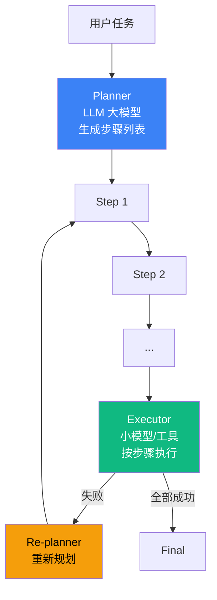

# 5.3 Plan-and-Execute 模式：分离推理与执行

> 🟢 核心

> **本节钩子**：Plan-and-Execute 不是"ReAct 的优化版"——本质是"**分离推理与执行**"，节省 token（Planner 只调一次）但牺牲灵活性（计划固化后难改）。它是 5.1 ReAct 的**互补模式**而非进化版。

## 正文大纲

1. **一句话定义**：Plan-and-Execute 是**先规划后执行**——Planner（大 LLM）一次性生成完整步骤列表，Executor（小 LLM / 工具）按步骤执行；Re-planner 在执行失败时重新规划剩余步骤。
2. **适用场景**（3 个典型 + 2 个反例）
   - **典型 1**：数据 ETL / 多步 API 调用链——步骤明确、顺序固定、不需要中途分支。
   - **典型 2**：长报告生成（"写市场分析"——大纲固定，只需按大纲填充）。
   - **典型 3**：批处理（"批量重命名 1000 个文件"——步骤可预定义）。
   - **反例 1**：浏览器交互 / 调试代码——每步结果都改变下一步策略，**计划固化反而碍事**。
   - **反例 2**：多分支决策（"如果 A 条件满足走 X 路径，否则走 Y"）——Plan-and-Execute 不擅长动态分支，应改用 5.1 ReAct 或 5.7 Orchestrator-Workers。
3. **关键机制**（3 个要点）
   - **Planner 用大 LLM，Executor 可用小模型**：Planner 决定质量，Executor 只负责"按步骤做"——生产中常用 GPT-4 做 Planner、GPT-3.5 / Haiku 做 Executor，成本降 60-80%。
   - **Re-planner 触发条件**：Executor 失败 1 次 → 触发 Re-planner 重规划剩余步骤；失败 2 次 → 降级到 5.1 ReAct（动态调整）。
   - **计划粒度**：每步对应"一个明确动作 + 一个明确产物"——"调用 GitHub API 拿 issue 列表"是合适粒度，"处理 issue"太粗，"调用 API 拿 issue 列表的第 3 页再过滤已关闭的"太细。
4. **代码示例**：Plan-and-Execute 最小循环。
5. **常见误区**：
   - ❌ "Plan-and-Execute = ReAct 的优化版"——错；本质是**互补**模式：ReAct 适合"边走边调"，Plan-and-Execute 适合"先画好地图再走"。
   - ❌ "计划越详细越好"——错；过细的计划在执行时反而脆弱（环境稍有变化就失败），粒度要"粗到能容错、细到能执行"。
6. **与其他模式对比**：Plan-and-Execute vs ReAct（一次性规划 vs 动态规划）/ Plan-and-Execute vs Orchestrator-Workers（任务列表 vs 动态分发）。

## 图



> Source: Wang et al., *Plan-and-Execute: A Framework for Advanced LLM Reasoning*, 2023.

## 代码

```python
# plan_and_execute.py
"""
Plan-and-Execute 最小循环（伪代码）
"""
def plan_and_execute(task: str, planner, executor) -> str:
    plan = planner.plan(task)  # ["步骤 1", "步骤 2", ...]
    results = []
    for i, step in enumerate(plan):
        try:
            result = executor.run(step, context=results)
            results.append(result)
        except Exception as e:
            # 触发 Re-planner 重新规划剩余步骤
            plan = planner.replan(task, plan[:i], results, str(e))
            results = []  # 清空结果，从新计划第 1 步开始
    return results[-1]
```

实战要点：

1. **Planner 用大模型 + Executor 用小模型**：生产中常用 GPT-4 / Claude Opus 做 Planner（质量优先），GPT-3.5 / Claude Haiku 做 Executor（成本优先），总成本降 60-80%。
2. **Re-planner 触发阈值**：失败 1 次 → 重规划；失败 2 次 → **降级到 5.1 ReAct**（动态调整）；避免 Re-planner 自己也陷入循环。
3. **计划粒度**：每步 = "一个明确动作 + 一个明确产物"。"调用 GitHub API 拿 issue 列表"是合适粒度；"处理 issue"太粗（产物不明）；"调 API 拿第 3 页再过滤"太细（环境一变就失败）。

## 实战片段

生产中 Plan-and-Execute 经常和"步骤状态持久化"配合——支持长任务中断后从断点恢复。下面是 50 行 LangGraph 实现：

```python
# plan_and_execute_production.py
from typing import TypedDict
from langgraph.graph import StateGraph, START, END
from langgraph.checkpoint.memory import MemorySaver

class PlanState(TypedDict):
    task: str
    plan: list[str]
    results: list[str]
    current_step: int
    failed_steps: int

def plan_node(state: PlanState):
    """Planner: 一次性生成完整步骤列表"""
    plan = planner_llm.invoke(
        f"任务:{state['task']}\n请生成 3-7 步执行计划,每步一行"
    ).content.split("\n")
    return {"plan": plan, "current_step": 0, "results": [], "failed_steps": 0}

def execute_node(state: PlanState):
    """Executor: 执行当前步骤"""
    step = state["plan"][state["current_step"]]
    context = state["results"]
    try:
        result = executor_llm.invoke(
            f"当前步骤:{step}\n已完成:{context}\n请执行并返回结果"
        ).content
        return {
            "results": state["results"] + [result],
            "current_step": state["current_step"] + 1,
        }
    except Exception as e:
        return {"failed_steps": state["failed_steps"] + 1}

def replan_node(state: PlanState):
    """Re-planner: 失败时重新规划剩余步骤"""
    remaining = state["plan"][state["current_step"]:]
    new_plan = planner_llm.invoke(
        f"原计划:{remaining}\n已完成:{state['results']}\n"
        f"失败信息:第{state['current_step']}步执行失败\n请重新规划剩余步骤"
    ).content.split("\n")
    return {
        "plan": state["plan"][:state["current_step"]] + new_plan,
        "failed_steps": 0,  # 重置失败计数
    }

def should_continue(state: PlanState) -> str:
    if state["current_step"] >= len(state["plan"]):
        return END
    if state["failed_steps"] >= 2:
        return "fallback"  # 降级到 ReAct(此处省略实现)
    return "execute"

graph = (
    StateGraph(PlanState)
    .add_node("plan", plan_node)
    .add_node("execute", execute_node)
    .add_node("replan", replan_node)
    .add_edge(START, "plan")
    .add_edge("plan", "execute")
    .add_conditional_edges("execute", should_continue, {
        END: END, "execute": "execute", "fallback": "fallback"
    })
    .add_edge("replan", "execute")
    .compile(checkpointer=MemorySaver())  # 支持中断恢复
)
```

实战要点：
- **checkpointer 是关键**——`MemorySaver()` / `PostgresSaver()` 让 Plan-and-Execute 支持小时级长任务中断后从断点恢复；不持久化就只能跑"分钟级"任务。
- **Re-planner 失败计数**——`failed_steps` 防止"Re-planner 自己死循环"；生产中第 2 次失败时**降级到 ReAct**（保留"已经做对的部分"+ 从失败点开始 ReAct 动态调整）。

## 框架映射

| 框架 | API 入口 | 备注 |
|---|---|---|
| LangGraph | `StateGraph` + `plan` / `execute` / `replan` 节点 | **推荐**——天然支持 checkpointer |
| LangChain | `langchain.experimental.PlanAndExecute` | 1.x 已 deprecated，建议直接用 LangGraph |
| AutoGen | `GroupChat` + 显式 planning agent | 角色化驱动，需自定义 plan 节点 |
| OpenAI Agents SDK | `Runner.run_sync` + 手动拆分 plan/execute | 轻量，长任务需自己接 checkpointer |
| Claude Agent SDK | `query()` + 内置 plan mode | 原生支持 plan-then-execute |

## 自测题

1. **概念辨析**：Plan-and-Execute 与 ReAct 在"规划时机"上有什么本质差异？这带来什么 trade-off？
2. **场景判断**：下面哪个任务**最适合**用 Plan-and-Execute？
   - A. 浏览器自动化操作（点开网页、登录、抓数据）
   - B. 批量重命名 1000 个文件（按规则改名）
   - C. 多分支决策（"如果 API 返回 200 走 X，否则走 Y"）
   - D. 调试一段 Python 代码（看 error message 后改）
3. **代码补全**：补全下面的 Re-planner 触发逻辑：
   ```python
   def plan_and_execute(task, planner, executor):
       plan = planner.plan(task)
       results = []
       for i, step in enumerate(plan):
           try:
               result = executor.run(step, context=results)
               results.append(result)
           except Exception as e:
               # 缺什么？给出 2 行关键逻辑
               pass
   ```
4. **反直觉题**：有人说"Plan-and-Execute 是 ReAct 的升级版，更先进"。这个判断错在哪里？
5. **对比题**：Plan-and-Execute vs Orchestrator-Workers 在"任务结构"上的差异是什么？各适合什么场景？

**答案**：

1. **本质差异**：ReAct 是"边走边规划"（每步重新思考下一步），Plan-and-Execute 是"一次性规划 + 按计划执行"（Planner 调 1 次，Executor 跑 N 步）。**Trade-off**：Plan-and-Execute 节省 token（Plan 调 1 次 vs ReAct 每步都调 LLM），代价是灵活性差（计划固化后，环境变化时难调整）。**具体数据**：10 步任务，ReAct 平均 10 次 LLM 调用（成本 $X），Plan-and-Execute 平均 1 次 Planner + 10 次 Executor（小模型），成本约 $0.3X。
2. **B 最适合**——"批量重命名 1000 个文件"是步骤完全可预测的批处理，Planner 一次生成"按规则改名"的计划，Executor 直接执行。A、C、D 都需要"看结果再决定下一步"，不适合 Plan-and-Execute。
3. ```python
   failed_count = getattr(plan_and_execute, "_failed", 0) + 1
   plan_and_execute._failed = failed_count
   if failed_count >= 2:
       raise FallbackToReactError(f"Plan-and-Execute 连续失败 {failed_count} 次，降级到 ReAct")
   plan = planner.replan(task, plan[:i], results, str(e))
   results = []
   continue
   ```
   关键点：① 失败计数防止 Re-planner 自身死循环；② 失败 ≥ 2 次时**降级到 ReAct**（这是经验阈值，Re-planner 自己重规划成功率 < 30%）。
4. **错在**：① **互补关系不是进化关系**——ReAct 适合"边走边调"，Plan-and-Execute 适合"先画好地图再走"，两者解决不同问题；② **没有"更先进"**——ReAct 在动态环境更稳，Plan-and-Execute 在静态任务更省 token；③ **Plan-and-Execute 在长任务上反而更脆弱**——计划固化后第 5 步失败时，Re-planner 经常生成"完全不同的新计划"导致前 4 步白做。
5. **任务结构差异**：Plan-and-Execute 的 plan 是**步骤列表**（["调用 API A", "解析结果", "调用 API B", ...]），每步线性执行；Orchestrator-Workers 的子任务是**动态生成**的——Orchestrator 根据 Workers 返回结果决定"下一步派什么子任务给谁"。**场景**：Plan-and-Execute 适合**步骤明确 + 顺序固定**（ETL、报告生成）；Orchestrator-Workers 适合**任务结构动态变化**（多源研究、复杂报告、用户交互式 Agent）。

> 📚 本节参考
> - [S 级] Wang et al., *Plan-and-Execute: A Framework for Advanced LLM Reasoning* (2023) — https://arxiv.org/abs/2309.03664
> - [S 级] LangChain `PlanAndExecute` 实验文档 — https://python.langchain.com/docs/experimental/plan_and_execute (1.x 已 deprecated, 推荐用 LangGraph)
> - [A 级] BabyAGI 仓库 — https://github.com/yoheinakajima/babyagi (Plan-and-Execute 思想起源)
> - [A 级] Anthropic, *Building Effective Agents* (2024-10) — https://www.anthropic.com/research/building-effective-agents
