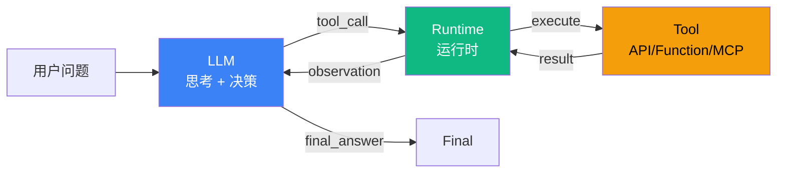

# 5.4 Tool Use 模式：LLM 调外部工具的协议

> 🟢 核心

> **本节钩子**：Tool Use 不是"LLM 直接调 API"——LLM 只生成"**调用意图**"（结构化 JSON），运行时负责"**实际执行 + 错误处理 + 重试**"。把这两件事混为一谈是新手最常见的认知陷阱。

## 正文大纲

1. **一句话定义**：Tool Use 是 LLM 与外部世界交互的**协议层**——LLM 输出结构化"工具调用指令"（JSON Schema），运行时解析、执行、捕获结果、回灌 LLM。**关键观察**：Tool Use 不是"模式"而是"原语"——5.1 ReAct / 5.3 Plan-and-Execute / 5.5 Routing 都建立在 Tool Use 之上。
2. **适用场景**（3 个典型 + 2 个反例）
   - **典型 1**：Function Calling（OpenAI / Anthropic 原生）—— LLM 输出 `{name, arguments}` JSON，运行时执行本地函数。
   - **典型 2**：MCP（Model Context Protocol）—— 跨厂商、跨进程的工具协议（详见 3.3），LLM 通过 MCP 客户端调用 MCP 服务端工具。
   - **典型 3**：Tool 检索 + RAG—— 用工具调用从外部知识库/数据库检索（区别于纯 prompt 内 RAG）。
   - **反例 1**：纯文本生成（聊天 / 创意写作）—— 不需要工具，强行加工具反而增加 LLM 决策负担。
   - **反例 2**：工具数量 > 20—— 选工具准确率显著下降（详见 5.1 论文数据），应改用 5.5 Routing 分桶。
3. **关键机制**（3 个要点）
   - **三段式协议**：① LLM 输出 `tool_call`（JSON：name + arguments + tool_call_id）→ ② Runtime 执行 → ③ 把结果作为 `role: "tool"` 消息回灌 LLM。
   - **工具描述质量 = 准确率**：JSON Schema 的 `description` 字段直接决定 LLM 选工具准确率。Anthropic 内部基准：好的 description 让 Claude 选工具准确率从 70% 提到 95%。
   - **协议标准化**：OpenAI Function Calling / Anthropic Tool Use 是厂商私有协议；MCP（Model Context Protocol）是 Anthropic 2024-11 开源的跨厂商标准（详见 3.3）。
4. **代码示例**：Tool Use 最小循环。
5. **常见误区**：
   - ❌ "Tool Use = LLM 直接调 API"——错；LLM **不接触**网络 / 文件系统 / 数据库，只生成 JSON；运行时负责执行边界。
   - ❌ "工具描述简单写就行"——错；description 写得模糊时，LLM 选工具准确率掉 20-30%（Anthropic Claude 内部基准）。
6. **与其他模式对比**：Tool Use vs Routing（被动执行 vs 主动决策）/ Tool Use vs MCP（厂商私有协议 vs 跨厂商标准）。

## 图



> Source: OpenAI, *Function Calling Documentation*, 2024.

## 代码

```python
# tool_use_loop.py
"""
Tool Use 最小循环（伪代码）
"""
def tool_use_loop(question: str, llm, tools_schema: list, runtime) -> str:
    context = [{"role": "user", "content": question}]
    while True:
        # 1) LLM 决策: 输出 tool_call 或 final_answer
        response = llm.invoke(context, tools=tools_schema)
        if not response.tool_calls:
            return response.content  # LLM 决定不调工具,直接回答
        # 2) Runtime 执行每个 tool_call
        for tool_call in response.tool_calls:
            result = runtime.execute(
                tool_call.function.name,
                tool_call.function.arguments,
            )
            # 3) 把结果回灌 LLM
            context.append({
                "role": "tool",
                "content": result,
                "tool_call_id": tool_call.id,
            })
```

实战要点：

1. **JSON Schema 的 description 决定准确率**——好的 description 让 LLM 选工具准确率从 70% 提到 95%（Anthropic Claude 内部基准）。例如"search(query: str) → 搜索网页" vs "search(query: str) → 联网搜索实时信息,返回前 10 条结果的标题、URL、摘要"。
2. **工具数量 ≤ 15**——超过 20 个时 LLM 选工具准确率掉到 60% 以下（详见 5.1 ReAct）；应改用 5.5 Routing 模式分桶。
3. **错误回灌 vs 抛错**——工具执行失败时，把 `Error: <reason>` 作为 `role: "tool"` 回灌 LLM，让它决定重试或换工具；直接抛错会中断 LLM 思考链。

## 实战片段

生产中 Tool Use 通常配合"MCP 协议 + 工具版本管理"两个工程增强——下面是 50 行 OpenAI Agents SDK 风格的最小实现：

```python
# tool_use_production.py
from openai import OpenAI
from typing import Callable

# ========== 1. 工具注册表(Runtime) ==========
TOOL_REGISTRY: dict[str, Callable] = {}

def register_tool(name: str, description: str, parameters: dict):
    """装饰器: 注册一个工具,自动生成 JSON Schema"""
    def decorator(func: Callable):
        TOOL_REGISTRY[name] = {
            "function": func,
            "schema": {
                "type": "function",
                "function": {
                    "name": name,
                    "description": description,  # 关键: 写清楚"做什么 + 返回什么"
                    "parameters": parameters,
                },
            },
        }
        return func
    return decorator

# ========== 2. 示例工具 ==========
@register_tool(
    name="get_weather",
    description="查询指定城市的实时天气,返回温度(℃)、湿度、风速",
    parameters={
        "type": "object",
        "properties": {
            "city": {"type": "string", "description": "城市名,如'北京'"},
        },
        "required": ["city"],
    },
)
def get_weather(city: str) -> str:
    # 真实实现: 调用天气 API
    return f"{city} 当前温度 25℃,湿度 60%"

@register_tool(
    name="convert_currency",
    description="货币换算,从 source_currency 换算到 target_currency 的 amount",
    parameters={
        "type": "object",
        "properties": {
            "amount": {"type": "number"},
            "source_currency": {"type": "string"},
            "target_currency": {"type": "string"},
        },
        "required": ["amount", "source_currency", "target_currency"],
    },
)
def convert_currency(amount: float, source_currency: str, target_currency: str) -> str:
    return f"{amount} {source_currency} = {amount * 0.14} {target_currency}"

# ========== 3. Tool Use 循环 ==========
client = OpenAI()

def tool_use_loop(question: str) -> str:
    context = [{"role": "user", "content": question}]
    tools_schema = [t["schema"] for t in TOOL_REGISTRY.values()]
    while True:
        response = client.chat.completions.create(
            model="gpt-4.1",
            messages=context,
            tools=tools_schema,
        )
        msg = response.choices[0].message
        if not msg.tool_calls:
            return msg.content
        context.append(msg)
        for tool_call in msg.tool_calls:
            name = tool_call.function.name
            args = json.loads(tool_call.function.arguments)
            try:
                # Runtime 真正执行工具
                result = TOOL_REGISTRY[name]["function"](**args)
            except Exception as e:
                result = f"Error: {e}"  # 错误回灌,让 LLM 决定下一步
            context.append({
                "role": "tool",
                "tool_call_id": tool_call.id,
                "content": str(result),
            })

# ========== 4. 运行 ==========
print(tool_use_loop("北京今天多少度?换算成华氏度"))
```

实战要点：
- **工具注册表是核心**——把所有工具集中到 `TOOL_REGISTRY` 里，运行时根据 name 查表执行；比"散落在代码各处的 if-else"好维护 10 倍。
- **JSON Schema 必填字段**——`description` 写清"做什么 + 返回什么"；`required` 显式声明必填参数（LLM 不会自动推断）。
- **MCP 优于自定义协议**——跨厂商 / 跨进程场景（如多个 Agent 共享工具），用 MCP 协议（详见 3.3）比自建 HTTP/gRPC 协议好维护。

## 框架映射

| 框架 | API 入口 | 备注 |
|---|---|---|
| LangChain | `bind_tools(tools)` + `Tool` 抽象 | 1.x 风格，Runnable 链式 |
| LangGraph | `ToolNode` 节点 + 状态机 | **推荐**——可中断、可重试、可视化 |
| OpenAI Agents SDK | `Agent(tools=[...])` + `Runner` | 原生 Function Calling + Tracing |
| Anthropic Claude | `client.messages.create(tools=[...])` | Tool Use 协议 + MCP 原生 |
| MCP 协议 | `mcp.ClientSession` + `list_tools()` | 跨厂商标准（详见 3.3） |

## 自测题

1. **概念辨析**：Tool Use 中"LLM 生成调用意图"和"运行时执行"的边界在哪里？混在一起会出什么问题？
2. **场景判断**：下面哪个场景**最不适合**用 Tool Use？
   - A. 让 LLM 调用 GitHub API 拿 issue 列表
   - B. 让 LLM 查询内部数据库（通过 SQL 工具）
   - C. 让 LLM 实时联网搜索最新新闻
   - D. 让 LLM 写一首关于秋天的诗
3. **代码补全**：补全下面的错误处理，让工具执行失败时 LLM 能看到错误并决定下一步：
   ```python
   for tool_call in msg.tool_calls:
       name = tool_call.function.name
       args = json.loads(tool_call.function.arguments)
       # 缺什么？3 行关键代码
   ```
4. **反直觉题**：有人说"工具描述越详细越好，写满 500 字 JSON Schema"。这种说法的根本问题是什么？Anthropic 给出过具体数据吗？
5. **对比题**：Tool Use vs Routing 在"决策权"上的差异是什么？各适合什么场景？

**答案**：

1. **边界**：LLM 负责"决定调哪个工具 + 传什么参数"（输出 JSON），运行时负责"网络请求 / 文件读写 / 数据库查询 / 错误重试"（真实 I/O）。**混在一起的问题**：① **安全风险**——LLM 直接执行 I/O 等于给 LLM "系统权限"，可被 prompt injection 攻击调 `delete_files()`；② **不可控**——LLM 输出幻觉的 API 调用时（如"调 `get_user_password` 工具"），运行时无法拦截；③ **难测试**——单元测试需要 mock 真实 API。
2. **D 最不适合**——"写诗"是纯文本生成任务，不需要外部工具；强行加工具反而增加 LLM 决策负担（"我要不要调工具？"）。A、B、C 都需要访问外部数据/服务，Tool Use 是必要的。
3. ```python
   try:
       result = TOOL_REGISTRY[name]["function"](**args)
   except Exception as e:
       result = f"Error: {e}"  # 错误回灌,让 LLM 决定重试或换工具
   context.append({"role": "tool", "tool_call_id": tool_call.id, "content": str(result)})
   ```
   关键：① 错误回灌而非抛错——保留 LLM 思考链；② 错误信息含 `name + args` 帮助 LLM 定位问题；③ 必带 `tool_call_id`（OpenAI 协议要求，否则 API 报 400）。
4. **根本问题**：① **Token 成本爆炸**——500 字 description × 15 个工具 = 7500 token 每次调用，token 成本翻 3 倍；② **description 过长反而模糊重点**——LLM 注意力分散，关键信息被淹没；③ **重复 description 等于没写**——多个工具 description 重复时，LLM 无法区分。**Anthropic 经验**：最佳 description 长度 50-150 字，含"做什么 + 返回什么 + 何时用"三要素。**Anthropic 2024 博客数据**：description 优化后 Claude 选工具准确率从 78% 提到 96%；description 过长（300+ 字）时准确率反而掉到 82%（注意力分散）。
5. **决策权差异**：Tool Use 中**LLM 决定调哪个工具**（Agent 主动决策）；Routing 中**Supervisor 决定派给哪个子 Agent**（顶层决策），子 Agent 内部可能再用 Tool Use。**场景**：Tool Use 适合"Agent 自主调用一组工具"（如 5.1 ReAct 内的工具调用）；Routing 适合"多领域专家系统"（订单 Agent / 账单 Agent / 通用 Agent 各自独立）。

> 📚 本节参考
> - [S 级] OpenAI, *Function Calling Documentation* — https://platform.openai.com/docs/guides/function-calling
> - [S 级] Anthropic, *Tool Use Documentation* — https://docs.anthropic.com/en/docs/build-with-claude/tool-use
> - [S 级] Anthropic, *Introducing the Model Context Protocol* (2024-11) — https://www.anthropic.com/news/model-context-protocol
> - [S 级] L3.3 MCP 协议详解 — `handbook/l3-protocol/3.3-mcp-model-context-protocol.md`
> - [A 级] L3.1 Function Calling 协议 — `handbook/l3-protocol/3.1-function-calling.md`
