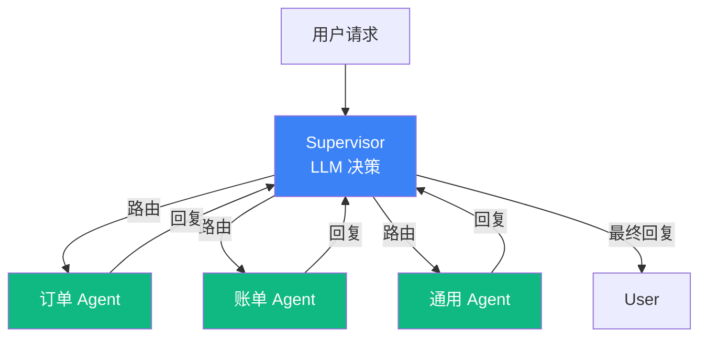

# 5.5 Routing 模式：Supervisor + Sub-agent 委派

> 🟡 进阶

> **本节钩子**：Routing 不是"if-else 分发"——Supervisor 用 **LLM 动态决策**派给谁，比硬编码路由灵活但慢；**2025 年新趋势**是 **Sub-agent Delegation**（Claude Agent SDK / LangGraph 都强化）——父 Agent 把任务"完整委派"给子 Agent 而非"单步工具调用"，子 Agent 可独立完成子任务再返回结果。

## 正文大纲

1. **一句话定义**：Routing 是**中心化分发模式**——Supervisor（Triage Agent）分析用户请求，用 LLM 决策派给哪个子 Agent / 子工具；子 Agent 独立完成任务后返回结果。**关键观察**：Routing 与 5.7 Orchestrator-Workers 边界模糊——区别在于 Routing 的子任务"**结构已知**"（订单 / 账单 / 通用），Orchestrator-Workers 的子任务"**动态生成**"。
2. **适用场景**（3 个典型 + 2 个反例）
   - **典型 1**：客服分流（订单 Agent / 账单 Agent / 物流 Agent / 通用 Agent）—— 用户请求领域明确，Supervisor 一次决策。
   - **典型 2**：多领域专家系统（医疗 Agent / 法律 Agent / 编程 Agent）—— 每个子 Agent 专注一个领域。
   - **典型 3**：前端路由（FastAPI / Flask）把请求派给不同 handler—— LLM 版的"智能路由"。
   - **反例 1**：步骤数 < 5 的简单任务—— Supervisor 决策成本 > 任务本身成本，应直接用 5.1 ReAct。
   - **反例 2**：任务结构动态变化（"先调研再写代码"）—— Supervisor 难预测子任务边界，应改用 5.7 Orchestrator-Workers。
3. **关键机制**（3 个要点）
   - **Supervisor 用强 LLM**：GPT-4 / Claude Opus 做 Supervisor（决策质量优先），子 Agent 可用小模型（成本优先）。
   - **Sub-agent 是完整委派，不是工具调用**：子 Agent 有自己的 system prompt + 工具集 + 上下文，独立完成子任务后只返回"最终结果"给 Supervisor。
   - **2025 Sub-agent Delegation 新趋势**：Claude Agent SDK（sub-agents）+ LangGraph（Supervisor）+ OpenAI Agents SDK（handoffs）都原生支持；父 Agent 委派"完整任务"而非"单步工具调用"。
4. **代码示例**：Routing 最小循环。
5. **常见误区**：
   - ❌ "Routing = if-else 分发"——错；硬编码 if-else 路由死板，Supervisor 用 LLM 决策派给谁，能处理"用户没说清需求"等模糊场景。
   - ❌ "Sub-agent = 工具调用"——错；Sub-agent 有独立上下文 + 独立工具集 + 独立决策能力，本质是"嵌套 Agent"而非"函数"。
6. **与其他模式对比**：Routing vs Orchestrator-Workers（静态分发 vs 动态委派）/ vs Parallelization（串行 vs 并行分发）/ vs ReAct（分发一次 vs 每步都决策）。

## 图



> Source: Anthropic, *Building Effective Agents* (2024-10) + LangGraph Supervisor 文档.

## 代码

```python
# routing_supervisor.py
"""
Routing 最小循环（Supervisor 风格）
"""
def supervisor_route(user_request: str, supervisor, sub_agents: dict) -> str:
    # 1) Supervisor LLM 决策: 派给哪个子 Agent
    decision = supervisor.decide(
        user_request,
        options=list(sub_agents.keys()),  # ["订单", "账单", "通用"]
    )
    # 2) 调用子 Agent（独立上下文 + 独立工具集）
    selected_agent = sub_agents[decision]
    result = selected_agent.handle(user_request)
    return result
```

实战要点：

1. **Supervisor 用强 LLM**（GPT-4 / Opus）——决策质量直接决定系统上限；子 Agent 可用 GPT-3.5 / Haiku 降成本。
2. **Sub-agent 是完整委派**——子 Agent 有自己的 system prompt + 工具集 + 上下文，独立完成子任务；Supervisor 只接收"最终结果摘要"（不接收中间步骤）。
3. **Supervisor 不做工具调用**——Supervisor 只做"决策 + 调度"，不直接调工具；避免"Supervisor 又当裁判又当选手"的混乱。

## 实战片段

生产 Routing 经常配合"Sub-agent 隔离 + 路由日志 + fallback"三个工程增强——下面是 LangGraph Supervisor 风格的最小实现：

```python
# routing_production.py
from typing import TypedDict, Literal
from langgraph.graph import StateGraph, START, END
from langgraph_supervisor import create_supervisor  # 第三方 LangGraph 扩展
from langchain.chat_models import init_chat_model

# ========== 1. 三个子 Agent（独立工具集）==========
order_agent = create_react_agent(
    model="openai:gpt-4.1",
    tools=[query_order, modify_order, cancel_order],
    prompt="你是订单处理助手,负责订单状态查询、修改、取消",
)

billing_agent = create_react_agent(
    model="openai:gpt-4.1",
    tools=[query_invoice, download_invoice, refund],
    prompt="你是账单助手,负责发票查询、下载、退款",
)

general_agent = create_react_agent(
    model="openai:gpt-4.1",
    tools=[search_kb, transfer_to_human],
    prompt="你是通用助手,处理订单/账单外的咨询;无法回答时 transfer_to_human",
)

# ========== 2. Supervisor 工作流 ==========
workflow = create_supervisor(
    agents=[order_agent, billing_agent, general_agent],
    model=init_chat_model("openai:gpt-4.1"),  # 强 LLM 做 Supervisor
    prompt=(
        "你是客服 Supervisor。根据用户请求,派给最合适的子 Agent:\n"
        "- 订单相关(状态/修改/取消)→ order_agent\n"
        "- 账单相关(发票/退款)→ billing_agent\n"
        "- 其他 → general_agent\n"
        "只返回子 Agent 的最终结果,不要自己回答"
    ),
    add_handoff_back_messages=True,  # 子 Agent 完成后自动回到 Supervisor
    output_mode="last_message",
)

app = workflow.compile()

# ========== 3. 运行 ==========
# result = app.invoke({
#     "messages": [{"role": "user", "content": "我的订单 #12345 还没发货"}]
# })
```

实战要点：
- **Sub-agent 隔离是关键**——每个子 Agent 独立的工具集 + 独立的 system prompt；避免"订单 Agent 也能调退款工具"的安全漏洞。
- **Supervisor 不接工具**——Supervisor 只做"决策 + 调度"，不直接调工具；让"决策"和"执行"职责清晰。
- **fallback 必须有**——`general_agent` 处理"无法路由"的请求；不设置 fallback 时 Supervisor 在边界场景会无限循环。

## 框架映射

| 框架 | API 入口 | 备注 |
|---|---|---|
| LangGraph | `langgraph_supervisor.create_supervisor` | **推荐**——状态机 + 持久化 + HITL |
| Claude Agent SDK | `options.agents = {"order": {...}, "billing": {...}}` | 原生 sub-agents，2025 新趋势 |
| OpenAI Agents SDK | `triage_agent.handoffs = [order_agent, billing_agent]` | handoffs 协议 + Tracing |
| CrewAI | `Crew(agents=[...], process=Process.hierarchical)` | manager_llm 做 Supervisor |
| AutoGen | `GroupChat` + 显式 manager agent | 对话流驱动 |

## 自测题

1. **概念辨析**：Routing 与"硬编码 if-else 分发"的本质差异是什么？Supervisor 用 LLM 决策有什么 trade-off？
2. **场景判断**：下面哪个场景**最不适合**用 Routing？
   - A. 客服系统：订单 / 账单 / 物流 / 通用 4 个 Agent
   - B. 浏览器操作：用户说"帮我订机票"
   - C. 多领域专家：医疗 / 法律 / 编程 Agent
   - D. 电商导购：服装 / 数码 / 食品 Agent
3. **代码补全**：补全下面 Supervisor 的决策 prompt：
   ```python
   supervisor_prompt = """
   你是客服 Supervisor。根据用户请求,派给最合适的子 Agent。
   子 Agent 列表: order_agent / billing_agent / general_agent
   ???
   """
   ```
4. **反直觉题**：有人说"Sub-agent 委派 = 工具调用"。这个等式错在哪里？2025 年的 Sub-agent Delegation 趋势和传统工具调用有什么本质差异？
5. **对比题**：Routing vs Orchestrator-Workers 在"任务结构"上的差异是什么？什么场景用 Routing 什么场景用 Orchestrator-Workers？

**答案**：

1. **本质差异**：硬编码 if-else 路由是"程序员预设规则 → 用户请求匹配规则 → 派发"；Supervisor LLM 路由是"用户请求 → LLM 推理 → LLM 决定派给谁"。**Trade-off**：LLM 路由灵活（处理模糊请求："我想取消那个东西"——"那个"是订单还是订阅？），代价是延迟（每次决策 = 1 次 LLM 调用）+ 不可预测（同样的请求两次可能派给不同子 Agent，需要 temperature=0 + 强 prompt 约束）。
2. **B 最不适合**——"订机票"是单一任务，不需要 Supervisor 派发；用 5.1 ReAct 单 Agent + 工具调用即可。Routing 在 5 步以下的简单任务上**复杂度税 > 收益**（Anthropic 内部经验：5.11 反模式）。A、C、D 都是"多领域 + 用户请求领域明确"的场景，适合 Routing。
3. ```python
   supervisor_prompt = """
   你是客服 Supervisor。根据用户请求,派给最合适的子 Agent。
   子 Agent 列表: order_agent / billing_agent / general_agent
   
   规则:
   - 订单相关(状态/修改/取消)→ order_agent
   - 账单相关(发票/退款)→ billing_agent
   - 其他 / 不确定 → general_agent
   
   只返回派给哪个 Agent,不要自己回答用户。
   """
   ```
   关键：① **规则显式**——给出"何时派给谁"的明确规则（避免 LLM 瞎猜）；② **fallback 必须**——"其他 / 不确定 → general_agent"处理边界场景；③ **明确禁止自答**——"不要自己回答用户"避免 Supervisor 抢子 Agent 活儿。
4. **根本错误**：把"完整 Agent"当"工具"调用。**本质差异**：① 工具是被动执行（输入→输出，无决策）；Sub-agent 是主动决策（有独立 system prompt + 工具集 + 决策循环）。② 工具调用是"单步"（LLM 调一次工具拿结果）；Sub-agent 委派是"完整任务"（子 Agent 可独立完成多步任务）。③ 工具共享 LLM 上下文；Sub-agent 有独立上下文（父 Agent 不直接看到子 Agent 内部思考）。**2025 趋势**：Claude Agent SDK / LangGraph Supervisor / OpenAI Agents SDK handoffs 都强化"完整委派"——父 Agent 不需要懂子 Agent 的工具细节，只委派"任务"拿"结果"，大幅降低父 Agent 的 prompt 复杂度。
5. **任务结构差异**：Routing 的子 Agent 列表是**静态已知**（order / billing / general），Supervisor 把请求"分类"到已有类别；Orchestrator-Workers 的子任务是**动态生成**（Orchestrator 根据当前状态生成"下一步派什么任务给谁"），子任务列表不固定。**场景**：Routing 适合"**领域明确 + 用户请求领域可分类**"（客服分流、多领域专家）；Orchestrator-Workers 适合"**任务结构动态变化 + 子任务边界不固定**"（多源研究、复杂报告、用户交互式 Agent）。

> 📚 本节参考
> - [S 级] LangGraph Supervisor 文档 — https://langchain-ai.github.io/langgraph/concepts/multi_agent/
> - [S 级] Claude Agent SDK Sub-agents 文档 — https://docs.anthropic.com/en/docs/build-with-claude/agent-sdk/overview
> - [S 级] OpenAI Agents SDK Handoffs — https://openai.github.io/openai-agents-python/handoffs/
> - [S 级] Anthropic, *Building Effective Agents* (2024-10) — https://www.anthropic.com/research/building-effective-agents
> - [A 级] Anthropic, *How we built our multi-agent research system* (2025) — https://www.anthropic.com/engineering/built-multi-agent-research-system
