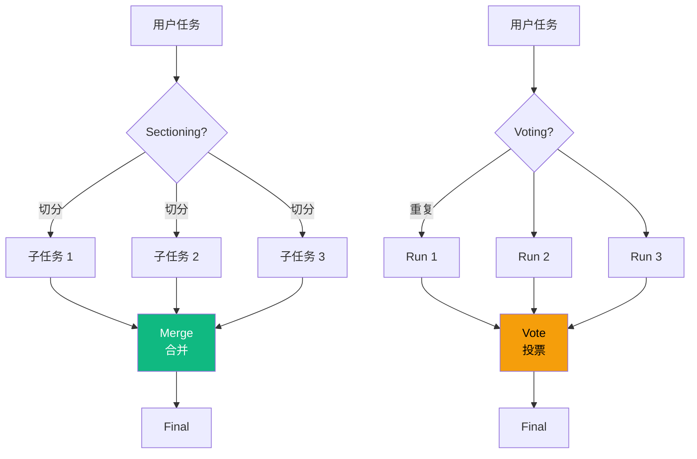

# 5.6 Parallelization 模式：Sectioning / Voting 并行

> 🟡 进阶

> **本节钩子**：Parallelization 不是"为了快"——主要价值是"**提质量**"（多次投票过滤错误）+"**提覆盖**"（不同视角看同一问题）；token 成本是串行的 N 倍，速度提升通常**不是**主要目标。

## 正文大纲

1. **一句话定义**：Parallelization 是**多 Agent 并行处理同一任务**——Sectioning 切分任务后并行处理再合并，Voting 多次执行后投票。**关键观察**：Anthropic 5 模式中 Parallelization 是 5 个之一，与 Orchestrator-Workers / Evaluator-Optimizer 经常组合使用。
2. **适用场景**（3 个典型 + 2 个反例）
   - **典型 1**：代码评审——多个 reviewer Agent 并行评审同一 PR，投票决定"通过 / 拒绝 / 需修改"。
   - **典型 2**：内容生成——多风格 Agent 并行生成"幽默 / 严肃 / 学术"三个版本，人选 / LLM 选优。
   - **典型 3**：高风险决策（医疗 / 法律）——多 LLM 共识降低单点错误概率。
   - **反例 1**：步骤数 < 3 的简单任务——并行启动开销 > 任务本身成本。
   - **反例 2**：任务强依赖（步骤 2 必须等步骤 1 结果）——无法并行，应改用 5.1 ReAct / 5.3 Plan-and-Execute。
3. **关键机制**（3 个要点）
   - **Sectioning（切分并行）**：把任务切分成 N 个独立子任务，并行执行后合并。子任务间无依赖，MapReduce 思想。
   - **Voting（投票并行）**：同一任务跑 N 次（不同 prompt / 不同 LLM / 不同 temperature），投票决定最终结果。Self-Consistency 论文证明：5 次投票可在数学推理上提准确率 10-15%。
   - **token 成本 N 倍**：N 个 Agent 并行 = N 倍 token 成本；速度提升来自并发，不是来自"少调 LLM"。
4. **代码示例**：Parallelization 两种风格的最小循环。
5. **常见误区**：
   - ❌ "Parallelization = 为了快"——错；LLM 调用受 API 限流，并行 N 个不一定快 N 倍；主要价值是"质量"和"覆盖"。
   - ❌ "并行越多越好"——错；5 次投票后边际收益骤降，10+ 次基本无提升（Self-Consistency 论文数据）。
6. **与其他模式对比**：Parallelization vs Orchestrator-Workers（独立并行 vs 协调委派）/ vs Evaluator-Optimizer（生成一次 vs 多次迭代）/ vs Sectioning vs Voting。

## 图



> Source: Anthropic, *Building Effective Agents* (2024-10); Wang et al., *Self-Consistency Improves Chain of Thought Reasoning* (2022).

## 代码

```python
# parallelization.py
"""
Parallelization 两种风格: Sectioning + Voting
"""
import asyncio
from collections import Counter

# ========== 1. Sectioning: 切分子任务后并行 ==========
async def parallel_sectioning(sub_tasks: list, agent, merge_fn) -> str:
    """子任务并行执行后合并"""
    results = await asyncio.gather(*[agent.run(st) for st in sub_tasks])
    return merge_fn(results)

# ========== 2. Voting: 同一任务多次执行后投票 ==========
def parallel_voting(task: str, agent, n: int = 5) -> str:
    """同一任务跑 N 次,多数投票"""
    results = [agent.run(task) for _ in range(n)]
    counter = Counter(results)
    return counter.most_common(1)[0][0]  # 票数最多的结果
```

实战要点：

1. **Sectioning 子任务必须独立**——子任务间不能有数据依赖（"步骤 2 依赖步骤 1 结果"就不适合 Sectioning）；有依赖时应改用 5.3 Plan-and-Execute 串行。
2. **Voting N=5 是经验值**——Self-Consistency 论文实验：N=5 时性价比最高，N=10 时边际增益 < 5% 但 token 翻倍；N=3 在简单任务上够用。
3. **LLM 投票 vs 简单多数**——多数投票假设"答案唯一"；对于开放式任务（写作 / 摘要），用 LLM-as-Judge 评分选优更合适（见 5.8 Evaluator-Optimizer）。

## 实战片段

生产中 Parallelization 经常和"并发控制 + 异常重试"配合——下面是 30 行 asyncio + LangChain 实现：

```python
# parallelization_production.py
import asyncio
from langchain.chat_models import init_chat_model
from langchain.prompts import ChatPromptTemplate

llm = init_chat_model("openai:gpt-4.1")

# ========== 1. Sectioning: 3 个并行 reviewer Agent ==========
async def parallel_review(code_diff: str) -> list[str]:
    """3 个 reviewer 并行评审同一 PR,返回各自的评审意见"""
    reviewers = [
        ("security", "你是安全审查员,关注 SQL 注入 / XSS / 权限提升"),
        ("performance", "你是性能审查员,关注 N+1 查询 / 内存泄漏 / 慢 SQL"),
        ("maintainability", "你是可维护性审查员,关注命名 / 函数长度 / 测试覆盖"),
    ]
    async def review_one(role: str, prompt: str) -> str:
        chain = ChatPromptTemplate.from_template(
            "{role} 评审以下 code diff:\n{diff}\n给出 3 条最关键的建议"
        ) | llm
        return await chain.ainvoke({"role": prompt, "diff": code_diff})

    results = await asyncio.gather(*[review_one(r, p) for r, p in reviewers])
    return list(results)

# ========== 2. Voting: Self-Consistency 数学推理 ==========
def self_consistency_math(problem: str, n: int = 5) -> str:
    """数学题跑 N 次,投票选最频繁答案"""
    chain = ChatPromptTemplate.from_template(
        "请逐步推理以下数学题,最后给出 ANSWER: <数字>\n{problem}"
    ) | llm
    import re
    answers = []
    for _ in range(n):
        response = chain.invoke({"problem": problem}).content
        match = re.search(r"ANSWER:\s*(\d+)", response)
        if match:
            answers.append(match.group(1))
    return Counter(answers).most_common(1)[0][0] if answers else "无答案"

# ========== 3. 调用 ==========
# reviews = asyncio.run(parallel_review(my_pr_diff))
# answer = self_consistency_math("如果 x + 5 = 12, x 是多少?")
```

实战要点：
- **asyncio.gather 必须设超时**——某个 LLM 调用 hang 住时整个并行挂掉；`asyncio.wait_for(..., timeout=30)` 防止雪崩。
- **Voting 答案抽取**——Self-Consistency 论文中用 `ANSWER: <num>` 格式抽取答案，正则匹配；不要用"让 LLM 自己投票"（LLM 容易被自己生成的结果锚定）。
- **LLM 限流**——并行 N=5 时可能触发 OpenAI 限流；用 `asyncio.Semaphore(3)` 限制并发数。

## 框架映射

| 框架 | API 入口 | 备注 |
|---|---|---|
| LangGraph | `Send` API + 节点 fan-out/fan-in | **推荐**——动态并行 + 状态合并 |
| LangChain | `RunnableParallel` + `asyncio.gather` | 1.x 链式并行 |
| OpenAI Agents SDK | `asyncio.gather` + `Runner.run` | 轻量，需手动管理并发 |
| CrewAI | `Crew(process=Process.parallel)` | Crew 内置并行 |
| AutoGen | `GroupChat` + 多 agent 并行发言 | 对话流式并行 |

## 自测题

1. **概念辨析**：Sectioning 和 Voting 的核心差异是什么？各适合什么场景？
2. **场景判断**：下面哪个任务**最不适合**用 Parallelization？
   - A. 代码评审（3 个 reviewer 评审同一 PR）
   - B. 多风格内容生成（幽默 / 严肃 / 学术）
   - C. 顺序数据处理（步骤 2 依赖步骤 1 结果）
   - D. 数学推理（同一题跑 5 次投票）
3. **代码补全**：补全下面的并发控制逻辑：
   ```python
   import asyncio
   async def parallel_review(code_diff):
       reviewers = [("security", ...), ("performance", ...), ("maintainability", ...)]
       # 缺什么？3 行关键代码
   ```
4. **反直觉题**：有人说"并行 10 次比并行 5 次质量好 2 倍"。这个推断错在哪里？Self-Consistency 论文的实验数据怎么说？
5. **对比题**：Parallelization vs Evaluator-Optimizer 在"质量提升机制"上的差异是什么？各适合什么场景？

**答案**：

1. **核心差异**：Sectioning 是"切分不同子任务并行"（多任务并行），Voting 是"同一任务重复并行"（冗余并行）。**场景**：Sectioning 适合"任务可切分 + 子任务独立"（多 reviewer 评审同一 PR、多源数据并行抓取）；Voting 适合"任务单点 + 需要多视角"（数学推理、敏感决策）。
2. **C 最不适合**——"步骤 2 依赖步骤 1 结果"是强依赖，无法并行；应改用 5.1 ReAct 串行执行。A、B 是 Sectioning 场景，D 是 Voting 场景。
3. ```python
   sem = asyncio.Semaphore(3)  # 限流: 最多 3 个并发
   async def review_one(role, prompt):
       async with sem:
           return await chain.ainvoke({"role": prompt, "diff": code_diff})
   results = await asyncio.gather(*[review_one(r, p) for r, p in reviewers])
   ```
   关键：① `Semaphore` 限流避免触发 API 限流；② `async with sem` 确保获取信号量；③ `asyncio.gather` 并发执行所有 reviewer。
4. **错在**：① **边际收益递减**——Self-Consistency 实验：N=5 提 12%，N=10 再提 2%，N=20 再提 0.5%；② **token 成本线性增长**——N=10 成本是 N=5 的 2 倍；③ **多数投票假设答案唯一**——N>5 后多数投票已"收敛"，再增加次数无效。**Self-Consistency 数据**：在 GSM8K 数学题上，N=5 准确率 74.4% → N=10 准确率 76.1%（+1.7%），N=20 准确率 76.5%（+0.4%）；N=5 性价比最高。
5. **质量提升机制差异**：Parallelization Voting 是"**冗余 + 投票**"——生成 N 个独立答案选最优，1 轮搞定；Evaluator-Optimizer 是"**迭代 + 改进**"——生成 → 评估 → 不达标则重生成，多轮迭代。**场景**：Voting 适合"答案唯一 + 容易投票"（数学 / 事实问答 / 代码评审）；Evaluator-Optimizer 适合"答案开放 + 质量可迭代"（写作 / 翻译 / 复杂报告）。

> 📚 本节参考
> - [S 级] Anthropic, *Building Effective Agents* (2024-10) — https://www.anthropic.com/research/building-effective-agents
> - [S 级] Wang et al., *Self-Consistency Improves Chain of Thought Reasoning in Language Models* (2022) — https://arxiv.org/abs/2203.11171
> - [A 级] LangGraph Send API 文档 — https://langchain-ai.github.io/langgraph/concepts/send/
> - [A 级] Lilian Weng, *LLM Powered Autonomous Agents* (2023) — https://lilianweng.github.io/posts/2023-06-23-agent/
