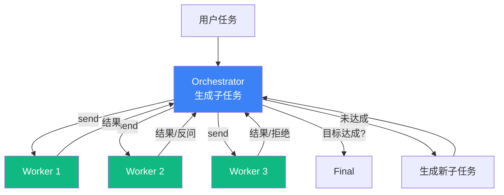

# 5.7 Orchestrator-Workers 模式：动态委派

> 🟡 进阶

> **本节钩子**：Orchestrator-Workers **不等于"主从架构"**——Orchestrator 的输出是"**任务描述**"（不是命令），Workers 有自主权可**拒绝 / 反问 / 委派回** Orchestrator；这是与"硬派发模式"(5.5 Routing) 的根本差异。

## 正文大纲

1. **一句话定义**：Orchestrator-Workers 是**中央调度 + 动态子任务**——Orchestrator 根据当前状态生成下一批子任务，Workers 并行执行并返回结果；Orchestrator 收集后判断"目标是否达成"，未达成则生成新子任务循环。**关键观察**：与 5.5 Routing 的关键差异——Routing 的子 Agent 列表"静态已知"，Orchestrator-Workers 的子任务"动态生成"。
2. **适用场景**（3 个典型 + 2 个反例）
   - **典型 1**：复杂研究（多源数据采集 + 报告生成）—— Orchestrator 决定"下一步查什么源"，Workers 查数据。
   - **典型 2**：Coding Agent（multi-file 代码生成）—— Orchestrator 决定"改哪些文件"，Workers 改文件。
   - **典型 3**：交互式 Agent（用户反馈驱动）—— Orchestrator 决定"下一步问用户什么 / 做什么"，Workers 执行。
   - **反例 1**：任务结构固定（"批量重命名文件"）—— 动态生成子任务是浪费，应改用 5.3 Plan-and-Execute。
   - **反例 2**：< 5 步的简单任务—— Orchestrator 循环成本 > 任务本身成本，应改用 5.1 ReAct。
3. **关键机制**（3 个要点）
   - **Orchestrator 用强 LLM**：Orchestrator 决定"下一步生成什么子任务"是质量关键；GPT-4 / Opus 是主力，Workers 可用小模型。
   - **Workers 有自主权**：Workers 可以"接受任务" / "拒绝（任务无法完成）" / "反问（需要更多信息）" / "委派回 Orchestrator"——本质是"任务"而非"命令"。
   - **LangGraph `Send` API**：动态并行 Workers 的关键 API——根据 Orchestrator 输出动态决定派几个 Worker，Worker 输出再汇合到 Orchestrator。
4. **代码示例**：Orchestrator-Workers 最小循环。
5. **常见误区**：
   - ❌ "Orchestrator-Workers = 主从架构"——错；Orchestrator 是"任务生成器"，Workers 可拒绝 / 反问 / 委派回；不是"主命令 → 从执行"。
   - ❌ "Orchestrator 必须等所有 Workers 完成"——错；可流式处理（部分 Worker 完成即可触发 Orchestrator 决策），避免长尾 Worker 拖慢整体。
6. **与其他模式对比**：Orchestrator-Workers vs Routing（计划已知 vs 动态生成）/ vs Plan-and-Execute（任务结构 vs 任务列表）/ vs Parallelization（协调委派 vs 独立并行）。

## 图



> Source: Anthropic, *Building Effective Agents* (2024-10) + Anthropic, *How we built our multi-agent research system* (2025).

## 代码

```python
# orchestrator_workers.py
"""
Orchestrator-Workers 最小循环（伪代码）
"""
def orchestrator_workers(task: str, orchestrator, workers: list) -> str:
    state = {"task": task, "results": [], "done": False}
    while not state["done"]:
        # 1) Orchestrator 动态生成子任务
        sub_tasks = orchestrator.generate_subtasks(state)
        if not sub_tasks:  # Orchestrator 决定"够了"
            state["done"] = True
            break
        # 2) Workers 并行执行(Worker 可拒绝/反问)
        results = [w.run(st, state) for w, st in zip(workers, sub_tasks)]
        # 3) Orchestrator 收集结果并更新状态
        state = orchestrator.update_state(state, results)
    return orchestrator.final_answer(state)
```

实战要点：

1. **Orchestrator 用强 LLM**——GPT-4 / Opus 决定"下一步生成什么子任务"是质量关键；Workers 可用 GPT-3.5 / Haiku 降成本。
2. **Worker 必须支持 4 种响应**：`accept` / `reject`（任务无法完成）/ `ask`（需要更多信息）/ `delegate_back`（委派回 Orchestrator）；用结构化 JSON 响应而非自然语言。
3. **流式处理减少长尾**——不要 `gather` 等所有 Worker 完成；用 `asyncio.as_completed` 边完成边处理，Worker 1 完成立即触发 Orchestrator 决策，Worker 3 慢不影响整体。

## 实战片段

生产中 Orchestrator-Workers 经常用 LangGraph `Send` API + 状态合并——下面是 60 行 LangGraph 实现：

```python
# orchestrator_workers_production.py
from typing import TypedDict
from langgraph.graph import StateGraph, START, END
from langgraph.constants import Send

class OrchState(TypedDict):
    task: str
    sub_tasks: list[str]
    results: list[dict]
    done: bool
    final: str

# ========== 1. Orchestrator: 动态生成子任务 ==========
def orchestrator_node(state: OrchState):
    """根据当前状态决定下一步子任务"""
    if len(state["results"]) >= 3:  # 简化: 3 轮后强制结束
        return {"done": True, "final": state["results"][-1]["output"]}
    response = orchestrator_llm.invoke(
        f"任务:{state['task']}\n已有结果:{state['results']}\n"
        f"请生成下一批 2-3 个子任务(JSON 列表),如果够了返回 []"
    )
    sub_tasks = parse_json(response.content) or []
    return {"sub_tasks": sub_tasks, "done": len(sub_tasks) == 0}

# ========== 2. Worker: 执行子任务 ==========
def worker_node(state: OrchState):
    """Worker 接受 1 个子任务,返回结果"""
    sub_task = state["sub_tasks"][0]  # Send API 会分派不同子任务
    response = worker_llm.invoke(f"子任务:{sub_task}\n请执行并返回结果")
    return {"results": state["results"] + [{"sub_task": sub_task, "output": response.content}]}

# ========== 3. Send API: 动态 fan-out ==========
def route_to_workers(state: OrchState) -> list[Send]:
    """根据 Orchestrator 输出的子任务数量,动态派发 Worker"""
    return [Send("worker", {**state, "sub_tasks": [st]}) for st in state["sub_tasks"]]

# ========== 4. 状态合并: fan-in ==========
def merge_results(state: OrchState):
    """所有 Worker 完成后,回到 Orchestrator 决策"""
    return {"results": state["results"]}  # 已在 worker_node 累加

# ========== 5. 图组装 ==========
graph = (
    StateGraph(OrchState)
    .add_node("orchestrator", orchestrator_node)
    .add_node("worker", worker_node)
    .add_node("merge", merge_results)
    .add_edge(START, "orchestrator")
    .add_conditional_edges("orchestrator", route_to_workers, ["worker"])
    .add_edge("worker", "merge")
    .add_edge("merge", "orchestrator")  # 循环回到 Orchestrator
    .compile()
)
```

实战要点：
- **`Send` API 是关键**——`route_to_workers` 返回 `Send` 列表实现动态 fan-out；不用 `Send` 就只能硬编码并行数。
- **强制终止条件**——Orchestrator LLM 不会主动说"够了"，必须有 `len(results) >= N` 之类的硬终止；否则会无限循环。
- **状态合并用 reducer**——`results` 字段用 `Annotated[list, operator.add]` 自动合并多 Worker 输出；不用 reducer 会覆盖。

## 框架映射

| 框架 | API 入口 | 备注 |
|---|---|---|
| LangGraph | `Send` API + 条件边 | **推荐**——动态 fan-out + 状态合并最清晰 |
| Claude Agent SDK | `Task` tool（sub-agent 委派） | 原生 sub-agents，2025 新趋势 |
| AutoGen | `GroupChat` + manager 动态派发 | 对话流式 |
| CrewAI | `Crew(process=Process.hierarchical)` | manager_llm 决定子任务 |
| OpenAI Agents SDK | `asyncio.gather` + 手动编排 | 轻量，动态派发需自己写 |

## 自测题

1. **概念辨析**：Orchestrator-Workers 与"主从架构"的本质差异是什么？Workers 的"自主权"具体指什么？
2. **场景判断**：下面哪个场景**最适合**用 Orchestrator-Workers？
   - A. 批量重命名 1000 个文件（按规则）
   - B. 多源研究报告（Orchestrator 决定查哪些源,Workers 查源）
   - C. 客服分流（订单 / 账单 / 通用）
   - D. 浏览器自动化（用户说"帮我订机票"）
3. **代码补全**：补全下面的 `Send` API 动态派发逻辑：
   ```python
   def route_to_workers(state):
       sub_tasks = state["sub_tasks"]  # Orchestrator 生成的 1-3 个子任务
       # 缺什么？2-3 行关键代码
   ```
4. **反直觉题**：有人说"Orchestrator-Workers 就是多 Agent 协作的银弹"。这个判断错在哪里？什么场景下 Orchestrator-Workers 反而是负优化？
5. **对比题**：Orchestrator-Workers vs Routing 在"子任务来源"上的差异是什么？各适合什么场景？

**答案**：

1. **本质差异**：主从架构是"主命令 → 从执行"（单向、强约束），Orchestrator-Workers 是"主生成任务 → 从自主决策"（双向、可拒绝）。**Workers 自主权**指：① 接受任务（继续执行）；② 拒绝（任务无法完成，反馈给 Orchestrator 重规划）；③ 反问（需要更多信息，触发 Orchestrator 补充上下文）；④ 委派回（"这事儿不该我做"，Orchestrator 重新分派）。
2. **B 最适合**——"多源研究"任务结构动态变化（Orchestrator 根据已查到的结果决定"下一步查哪个源"），子任务数量 / 类型都不可预测。A 步骤固定、C 领域分类、D 单一任务都不适合。
3. ```python
   def route_to_workers(state):
       return [Send("worker", {**state, "sub_tasks": [st]}) for st in state["sub_tasks"]]
   ```
   关键：① `Send("worker", ...)` 每个子任务派发到 worker 节点；② `{**state, "sub_tasks": [st]}` 把单个子任务注入 state；③ 列表推导式实现"动态派发 N 个 Worker"。
4. **错在**：① **不是银弹**——5.11 反模式明确：单 Agent 串行在 < 5 步任务上比 3 Agent 协作更快更便宜更稳定；② **复杂度税**——Orchestrator-Workers 需要 LLM 做任务生成 + 状态合并 + 终止判断，token 成本是单 Agent 的 3-5 倍；③ **长尾 Worker 拖慢整体**——Workers 并行中最慢的 Worker 决定整体延迟，CPU-bound 任务反而不如串行。**反优化场景**：任务 < 5 步 / 子任务间强依赖 / 任务结构固定 / 实时对话。
5. **子任务来源差异**：Routing 的子 Agent 列表"**静态已知**"（订单 / 账单 / 通用在系统设计时就定好）；Orchestrator-Workers 的子任务"**动态生成**"（Orchestrator 在运行时根据当前状态决定下一步做什么）。**场景**：Routing 适合"**领域分类**"（用户请求属于哪个领域，分类是封闭集）；Orchestrator-Workers 适合"**任务探索**"（下一步做什么不固定，需要根据中间结果动态决策）。

> 📚 本节参考
> - [S 级] LangGraph `Send` API 文档 — https://langchain-ai.github.io/langgraph/concepts/send/
> - [S 级] Claude Agent SDK `Task` tool — https://docs.anthropic.com/en/docs/build-with-claude/agent-sdk/overview
> - [S 级] Anthropic, *Building Effective Agents* (2024-10) — https://www.anthropic.com/research/building-effective-agents
> - [S 级] Anthropic, *How we built our multi-agent research system* (2025) — https://www.anthropic.com/engineering/built-multi-agent-research-system
