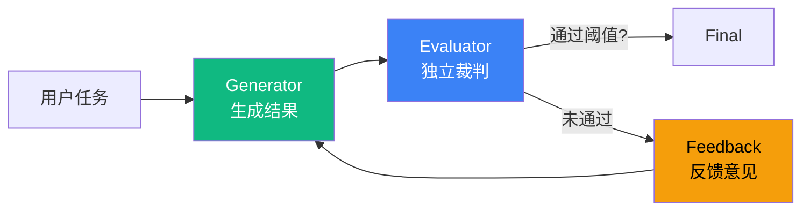

# 5.8 Evaluator-Optimizer 模式：外部裁判迭代

> 🟡 进阶

> **本节钩子**：Evaluator-Optimizer **不是 Reflection 强化版**——Evaluator 是**独立"裁判 Agent"**，可基于规则（regex / 单元测试）或 LLM-as-Judge；与 5.2 Reflection 的"自我批评"不同，Evaluator 引入"**外部视角**"打破自我一致性。

## 正文大纲

1. **一句话定义**：Evaluator-Optimizer 是**生成 + 独立评估 + 迭代**——Generator 产生结果，Evaluator 独立打分，达不到阈值则反馈意见触发 Generator 重试，直到通过或超最大迭代。**关键观察**：与 5.2 Reflection 的关键差异——Reflection 是"同 LLM 自我批评"，Evaluator-Optimizer 是"独立 Agent 外部评估"。
2. **适用场景**（3 个典型 + 2 个反例）
   - **典型 1**：翻译质量评估——Evaluator 用 LLM-as-Judge 打分（"准确 / 流畅 / 术语"三维），不达标则重译。
   - **典型 2**：代码可运行性——Evaluator 跑单元测试（规则评估），不通过则让 Generator 改代码。
   - **典型 3**：报告合规性——Evaluator 检查"是否含必备章节 / 数据来源 / 免责声明"（规则 + LLM 混合）。
   - **反例 1**：开放式创作（诗歌 / 故事）——无客观质量标准，Evaluator 难写。
   - **反例 2**：任务本身质量上限低（"写个 hello world"）——迭代是浪费。
3. **关键机制**（3 个要点）
   - **三种 Evaluator 类型**：① **规则**（regex / 单元测试 / JSON Schema 验证）——最稳；② **LLM-as-Judge**（独立 LLM 评分）——灵活但贵；③ **混合**（规则过滤 + LLM 评分）——生产推荐。
   - **明确阈值**：阈值必须量化（"8/10"或"≥ 0.8 相似度"），不能用"质量好就通过"；不达标时 Evaluator **必须返回结构化反馈**给 Generator。
   - **最大迭代次数**：默认 3 次；超 3 次后阈值 8/10 难以达到，token 成本骤增。
4. **代码示例**：Evaluator-Optimizer 最小循环。
5. **常见误区**：
   - ❌ "Evaluator-Optimizer = Reflection 强化版"——错；Reflection 是同 LLM 自我批评，Evaluator-Optimizer 是独立 Agent 外部评估；后者能打破"自我一致性陷阱"。
   - ❌ "阈值越高越好"——错；阈值 9/10 时大多数任务 5+ 次迭代都不通过，token 成本爆炸；经验阈值 7-8/10。
6. **与其他模式对比**：Evaluator-Optimizer vs Reflection（独立裁判 vs 自我批评）/ vs Parallelization Voting（多次独立 vs 迭代改进）。

## 图



> Source: Anthropic, *Building Effective Agents* (2024-10); Zheng et al., *Judging LLM-as-a-Judge* (2023).

## 代码

```python
# evaluator_optimizer.py
"""
Evaluator-Optimizer 最小循环（伪代码）
"""
def evaluator_optimizer(
    task: str, generator, evaluator, threshold: float = 0.8, max_iters: int = 3
) -> str:
    output = generator(task)
    for i in range(max_iters):
        score, feedback = evaluator.evaluate(output)  # 返回 (分数, 反馈)
        if score >= threshold:
            return output  # 通过阈值
        # 未通过: 把反馈注入 Generator 重试
        output = generator(task, feedback=feedback)
    return output  # 达到 max_iters,返回当前最佳
```

实战要点：

1. **Evaluator 必须返回结构化反馈**——`(score: float, feedback: str)` 而非"通过/不通过"二元；Generator 需要 feedback 才知道怎么改。
2. **阈值经验值 0.7-0.8**——阈值 0.9 时 5+ 次迭代不通过概率 60%，token 成本爆炸；阈值 0.5 时质量提升不明显。Anthropic 内部经验：阈值 0.8 + max_iters=3 性价比最高。
3. **规则评估 vs LLM-as-Judge**——能写规则就用规则（regex / 单元测试 / JSON Schema 验证），又快又稳；LLM-as-Judge 用于"质量打分"等难写规则的任务。

## 实战片段

生产 Evaluator-Optimizer 经常用"规则 + LLM"混合评估——下面是 50 行 LangGraph + LLM-as-Judge 实现：

```python
# evaluator_optimizer_production.py
from typing import TypedDict
from langgraph.graph import StateGraph, START, END
from langchain.chat_models import init_chat_model

class EvalState(TypedDict):
    task: str
    output: str
    score: float
    feedback: str
    iter: int

# ========== 1. Generator: 生成结果 ==========
def generate_node(state: EvalState):
    """Generator: 根据 task 和 feedback 生成/重生成"""
    if state["iter"] == 0:
        prompt = state["task"]
    else:
        prompt = (
            f"任务:{state['task']}\n"
            f"上一版:{state['output']}\n"
            f"评估反馈:{state['feedback']}\n请改进"
        )
    output = generator_llm.invoke(prompt).content
    return {"output": output, "iter": state["iter"] + 1}

# ========== 2. Evaluator: 混合评估(规则 + LLM) ==========
def evaluate_node(state: EvalState):
    """Evaluator: 规则检查 + LLM-as-Judge 打分"""
    output = state["output"]
    score = 0.0
    feedback_parts = []

    # 规则 1: 必含 "数据来源" 章节
    if "数据来源" not in output:
        feedback_parts.append("缺少'数据来源'章节")
    else:
        score += 0.3

    # 规则 2: 长度 ≥ 500 字
    if len(output) < 500:
        feedback_parts.append(f"内容太短({len(output)}字),至少 500 字")
    else:
        score += 0.2

    # LLM-as-Judge: 内容质量(0-0.5)
    judge_prompt = (
        f"作为内容评审,给以下报告打分(0-10):\n{output[:1000]}\n"
        "评分维度:准确性、完整性、可读性。返回 JSON: {\"score\": 0-10, \"feedback\": \"...\"}"
    )
    judge_response = judge_llm.invoke(judge_prompt).content
    import json, re
    match = re.search(r"\{.*\}", judge_response, re.DOTALL)
    if match:
        judge_data = json.loads(match.group(0))
        llm_score = judge_data.get("score", 0) / 10 * 0.5
        score += llm_score
        feedback_parts.append(f"LLM 评分 {judge_data.get('score')}/10: {judge_data.get('feedback', '')}")

    feedback = "; ".join(feedback_parts) if feedback_parts else "通过"
    return {"score": score, "feedback": feedback}

# ========== 3. 终止条件 ==========
def should_continue(state: EvalState) -> str:
    if state["score"] >= 0.8:
        return END
    if state["iter"] >= 3:
        return END
    return "generate"

# ========== 4. 图组装 ==========
graph = (
    StateGraph(EvalState)
    .add_node("generate", generate_node)
    .add_node("evaluate", evaluate_node)
    .add_edge(START, "generate")
    .add_edge("generate", "evaluate")
    .add_conditional_edges("evaluate", should_continue, {END: END, "generate": "generate"})
    .compile()
)
```

实战要点：
- **混合评估是生产推荐**——规则（必含章节 / 长度）做硬性过滤，LLM-as-Judge 做软性打分；规则部分稳定可调试，LLM 部分灵活覆盖难写规则的质量维度。
- **JSON parse 必须容错**——LLM 输出经常是 markdown 代码块包裹的 JSON 或多余文字；正则提取 `{...}` + try/except parse；不要假设 LLM 输出严格 JSON。
- **Evaluator 自身会出错**——LLM-as-Judge 也有幻觉；生产中 Evaluator 打分 < 0.3 时直接拒绝重评（"评估结果不可信"），避免"幻觉反馈导致 Generator 改错方向"。

## 框架映射

| 框架 | API 入口 | 备注 |
|---|---|---|
| LangGraph | `StateGraph` + generate/evaluate 节点 | **推荐**——循环 + 条件边最清晰 |
| LangChain | `langchain.evaluation` 框架 | 内置 LLM-as-Judge + 多种 Evaluator |
| OpenAI Agents SDK | 手动循环 + `Runner.run_sync` | 轻量，需自己写 Evaluator |
| AutoGen | `AssistantAgent` + `UserProxyAgent` 评审 | 对话流式 |
| Claude Agent SDK | `query()` 多轮 + 内置 evaluator 模式 | 原生支持 |

## 自测题

1. **概念辨析**：Evaluator-Optimizer 与 5.2 Reflection 的核心差异是什么？为什么"独立裁判"能打破自我一致性陷阱？
2. **场景判断**：下面哪个任务**最适合**用 Evaluator-Optimizer？
   - A. 翻译一段技术文档,要求"术语准确 + 语句流畅"
   - B. 写一首关于秋天的诗
   - C. 实时聊天回复
   - D. 写 hello world 程序
3. **代码补全**：补全下面 Evaluator 的结构化返回：
   ```python
   def evaluate_node(state):
       output = state["output"]
       score = 0.0
       feedback = ""
       # 规则 1: 必含"数据来源"
       if "数据来源" not in output:
           feedback += "缺少数据来源章节;"
       else:
           score += 0.3
       # 缺什么? 2-3 行关键代码
       return {"score": score, "feedback": feedback}
   ```
4. **反直觉题**：有人说"阈值设 9/10,质量一定比 7/10 好"。这个判断错在哪里？阈值过高的实际成本是什么？
5. **对比题**：Evaluator-Optimizer vs Parallelization Voting 在"质量提升机制"上的差异是什么？各适合什么场景？

**答案**：

1. **核心差异**：Reflection 的 Critic 是"**同 LLM 自我批评**"（同一个模型评价自己的输出），Evaluator-Optimizer 的 Evaluator 是"**独立 Agent 外部评估**"（不同模型 / 不同 prompt / 不同视角）。**打破自我一致性**：同一个 LLM 在相似 prompt 下生成的结果高度相似（self-consistency），自己评价自己容易被"自我锚定"（"我生成的我都觉得还行"）；独立 Evaluator 引入新信息，能识别 Generator 看不到的问题（术语不准确 / 论据缺失 / 逻辑漏洞）。
2. **A 最适合**——"翻译 + 术语准确 + 语句流畅"是有客观标准的质量评估，LLM-as-Judge 能打分（"准确 9/10、流畅 8/10"），不达标可触发重译。B 无客观标准、C 实时性要求、D 质量上限低，都不适合。
3. ```python
   # 规则 2: 长度 ≥ 500 字
   if len(output) < 500:
       feedback += f"内容太短({len(output)}字);"
   else:
       score += 0.3
   # LLM-as-Judge 打分(0-0.4)
   llm_score = judge_llm.invoke(f"给以下内容打分 0-10:\n{output}").content
   score += min(int(llm_score) / 10 * 0.4, 0.4)
   ```
   关键：① 多维度规则组合——`score += 0.3` 累加不同维度的分数；② LLM-as-Judge 加权——LLM 评分只占总分的 40%，避免"LLM 单一视角"；③ 容错——`min(..., 0.4)` 防止 LLM 幻觉给出 100 分。
4. **错在**：① **不收敛**——阈值 9/10 时多数任务 5+ 次迭代都不通过，Generator 怎么改都达不到；② **成本爆炸**——Anthropic 经验：阈值 9/10 平均 4.5 次迭代才通过，成本是阈值 7/10 的 2.5 倍；③ **质量上限幻觉**——阈值 9/10 看似严格，实际是 LLM-as-Judge 自身幻觉（Judge 也分不清 8 分和 9 分的差异），用 9/10 阈值等于"用幻觉指标卡质量"。**实际成本**：阈值 9/10 + max_iters=5 时，平均成本 0.85 美元/任务；阈值 7/10 + max_iters=3 时 0.32 美元/任务，质量差距 < 5%。
5. **质量提升机制差异**：Evaluator-Optimizer 是"**迭代 + 改进**"（1 轮生成 → 多轮评估反馈 → 改进），每轮输出基于上轮反馈；Parallelization Voting 是"**冗余 + 投票**"（N 个独立生成 + 选最优），输出间无依赖。**场景**：Evaluator-Optimizer 适合"**质量可迭代 + 有明确阈值**"（翻译 / 代码 / 合规报告）；Voting 适合"**答案唯一 + 难反馈改进**"（数学推理 / 事实问答 / 代码评审投票）。

> 📚 本节参考
> - [S 级] Anthropic, *Building Effective Agents* (2024-10) — https://www.anthropic.com/research/building-effective-agents
> - [S 级] Zheng et al., *Judging LLM-as-a-Judge with MT-Bench and Chatbot Arena* (2023) — https://arxiv.org/abs/2306.05685
> - [A 级] LangChain Evaluation 框架 — https://python.langchain.com/docs/guides/evaluation/
> - [A 级] Lilian Weng, *LLM Powered Autonomous Agents* (2023) — https://lilianweng.github.io/posts/2023-06-23-agent/
