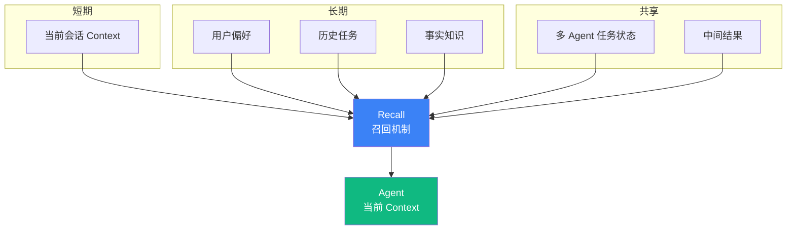

# 5.9 Memory 模式：短期 / 长期 / 共享三层记忆

> 🟡 进阶

> **本节钩子**：Memory **不等于"无限 Context"**——Memory 的本质是"**选择性召回**"（哪些进 Context / 哪些淘汰），而非"全部保留"。MemGPT / Letta 的"虚拟 Context"思想就是分层 Memory：磁盘上"看似无限"，实际 Context 中"只放当下相关"。

## 正文大纲

1. **一句话定义**：Memory 是 Agent 的"记忆系统"——**短期**（当前会话 Context）/ **长期**（跨会话知识）/ **共享**（多 Agent 共享状态）三层架构。**关键观察**：L2 上下文工程讲"如何压缩 Context"，L5 Memory 讲"**哪些进 Context**"——视角不同但目标一致（让 LLM 看到最有用的信息）。
2. **适用场景**（3 个典型 + 2 个反例）
   - **典型 1**：个人助手（记住用户偏好 / 历史任务）—— 长期 Memory 存 PostgreSQL / Vector DB。
   - **典型 2**：多 Agent 协作（共享任务状态 / 共享中间结果）—— 共享 Memory 用 Redis / 共享 Checkpointer。
   - **典型 3**：长会话（小时级对话的"摘要"）—— 短期 Memory 用滚动摘要 + 关键节点保留。
   - **反例 1**：单轮对话（"今天天气如何"）—— 无需 Memory，直接 LLM 调用。
   - **反例 2**：任务 < 5 步—— Memory 引入的检索成本 > 任务本身成本。
3. **关键机制**（3 个要点）
   - **短期 Memory = 当前 Context**——本质是 LLM 的 context window；超过 window 需 L2 上下文工程（截断 / 摘要 / 检索增强）。
   - **长期 Memory = 外部存储**——PostgreSQL（结构化）/ Vector DB（语义检索）/ 文件系统；用 RAG 模式"按需召回"进 Context。
   - **共享 Memory = 分布式状态**——多 Agent 协作时需要共享中间结果 / 任务状态；常用 Redis / LangGraph Checkpointer（PostgresSaver）。
4. **代码示例**：Memory 三层最小循环。
5. **常见误区**：
   - ❌ "Memory = 无限 Context"——错；LLM context window 物理上限（GPT-4 = 128k，Claude = 200k）；Memory 是"按需召回"而非"全塞 Context"。
   - ❌ "全部保留"——错；Memory 需淘汰机制（LRU / 时间窗口 / 重要度评分），否则存储成本爆炸。
6. **与其他模式对比**：Memory vs Context Engineering（L2 讲 Context 压缩 / L5 讲"哪些进 Context"）/ Memory vs ReAct（ReAct 是单次任务循环 / Memory 跨任务持久化）。

## 图



> Source: Letta Docs (2024); Packer et al., *MemGPT: Towards LLMs as Operating Systems* (2023).

## 代码

```python
# memory_pattern.py
"""
Memory 三层最小循环（伪代码）
"""
class MemoryLayer:
    def __init__(self, store):
        self.store = store  # PostgreSQL / Vector DB / Redis

    def recall(self, query: str, top_k: int = 5) -> list:
        """按 query 召回 top_k 条"""
        return self.store.search(query, top_k)

    def store(self, content: str, metadata: dict = None):
        """存一条"""
        self.store.insert(content, metadata or {})

# 三层实例化
short_term = MemoryLayer(in_context_store)   # 当前 session 的 context
long_term = MemoryLayer(vector_db)           # 跨 session 的 vector DB
shared = MemoryLayer(redis_client)            # 多 Agent 共享

# Agent 使用 Memory
def agent_with_memory(user_input: str, session_id: str) -> str:
    # 1) 短期: 取当前 session 的 context
    session_ctx = short_term.store.get(session_id)
    # 2) 长期: 召回相关历史
    long_term_ctx = long_term.recall(user_input, top_k=3)
    # 3) 共享: 拿其他 Agent 的状态
    shared_ctx = shared.store.hgetall(f"session:{session_id}")
    # 4) 拼成完整 context
    full_ctx = session_ctx + long_term_ctx + shared_ctx
    # 5) 调 LLM
    response = llm.invoke(full_ctx + [{"role": "user", "content": user_input}])
    # 6) 写回
    short_term.store.append(session_id, response)
    long_term.store(response.content, {"session_id": session_id})
    return response.content
```

实战要点：

1. **长期 Memory 用 RAG 召回**——不是"全塞 Context"；用 embedding 相似度检索 top_k 进 Context；k=3-5 是经验值。
2. **淘汰机制**——长期 Memory 需 LRU / 时间窗口（>30 天自动归档）/ 重要度评分（用户标记 / 高频访问加分），否则存储成本爆炸。
3. **共享 Memory 需考虑并发**——多 Agent 写共享 Memory 时用乐观锁 / 版本号；否则"两个 Agent 同时改同一状态"会丢失更新。

## 实战片段

生产 Memory 经常用 Letta / MemGPT 风格"分层 + 工具调用"——下面是 50 行 LangGraph Checkpointer + Vector DB 实现：

```python
# memory_production.py
from typing import TypedDict
from langgraph.graph import StateGraph, START, END
from langgraph.checkpoint.postgres import PostgresSaver
from langchain_openai import OpenAIEmbeddings
from langchain_community.vectorstores import Chroma

# ========== 1. 短期: LangGraph Checkpointer ==========
checkpointer = PostgresSaver.from_conn_string("postgresql://localhost/agent")
# 每次 invoke 自动存 session state,可断点恢复

# ========== 2. 长期: Vector DB 召回 ==========
embeddings = OpenAIEmbeddings(model="text-embedding-3-small")
long_term_store = Chroma(
    collection_name="user_memory",
    embedding_function=embeddings,
    persist_directory="./chroma_db",
)

def long_term_recall(query: str, user_id: str, k: int = 3) -> str:
    """从长期 Memory 召回与 query 相关的 top_k 条"""
    docs = long_term_store.similarity_search(
        query, k=k, filter={"user_id": user_id}
    )
    return "\n".join([d.page_content for d in docs])

def long_term_store_memory(content: str, user_id: str):
    """把 Memory 写回长期存储"""
    long_term_store.add_texts(
        texts=[content],
        metadatas=[{"user_id": user_id, "ts": time.time()}],
    )

# ========== 3. 共享: Redis 状态 ==========
import redis
r = redis.Redis(host="localhost", port=6379, db=0)

def shared_set(key: str, value: str, ttl: int = 3600):
    r.setex(key, ttl, value)  # 1 小时过期

def shared_get(key: str) -> str | None:
    val = r.get(key)
    return val.decode() if val else None

# ========== 4. Agent 节点 ==========
class AgentState(TypedDict):
    user_id: str
    session_id: str
    user_input: str
    long_term_ctx: str
    shared_ctx: str
    response: str

def agent_node(state: AgentState):
    # 召回三层 Memory
    long_ctx = long_term_recall(state["user_input"], state["user_id"])
    shared_ctx = shared_get(f"session:{state['session_id']}") or ""
    # 调 LLM(注入三层 context)
    response = llm.invoke(
        f"长期记忆:{long_ctx}\n共享状态:{shared_ctx}\n"
        f"用户:{state['user_input']}"
    ).content
    # 写回 Memory
    long_term_store_memory(
        f"Q:{state['user_input']}\nA:{response}",
        state["user_id"],
    )
    return {"response": response, "long_term_ctx": long_ctx, "shared_ctx": shared_ctx}

# ========== 5. 图组装 ==========
graph = (
    StateGraph(AgentState)
    .add_node("agent", agent_node)
    .add_edge(START, "agent")
    .add_edge("agent", END)
    .compile(checkpointer=checkpointer)  # 短期 Memory 自动持久化
)
```

实战要点：
- **Checkpointer 关键**——LangGraph `PostgresSaver` 自动持久化每个 session 的 state；不用 checkpointer 就只能跑"分钟级"任务，无法恢复长会话。
- **Vector DB filter by user_id**——`filter={"user_id": user_id}` 防止不同用户 Memory 串台；生产必加。
- **Redis TTL 防膨胀**——`setex(key, 3600, value)` 设置 1 小时过期；长期数据走 PostgreSQL，临时状态走 Redis。

## 框架映射

| 框架 | API 入口 | 备注 |
|---|---|---|
| LangGraph | `PostgresSaver` / `RedisSaver` Checkpointer | **推荐**——短期 Memory 自动持久化 |
| Letta | `client.agents.create` + `memory_blocks` | 原生分层 Memory（短期 / 长期 / 档案） |
| MemGPT | 自托管 `letta.server` + 工具调用 | 论文级实现，分层 + 虚拟 Context |
| LangChain | `langchain.memory` + `ConversationBufferMemory` | 1.x 简化风格 |
| Claude Agent SDK | `query()` 内置 session 续接 | 原生支持跨调用记忆 |

## 自测题

1. **概念辨析**：Memory 与"无限 Context"有什么本质差异？MemGPT / Letta 的"虚拟 Context"思想解决了什么问题？
2. **场景判断**：下面哪个任务**最需要**长期 Memory？
   - A. "今天北京天气如何？"
   - B. "根据我上周的写作风格,给我一篇新文章"
   - C. "1+1 等于多少"
   - D. "把这段中文翻译成英文"
3. **代码补全**：补全下面长期 Memory 的"按 user 过滤"逻辑：
   ```python
   def long_term_recall(query, user_id, k=3):
       docs = long_term_store.similarity_search(query, k=k, ???)
       return "\n".join([d.page_content for d in docs])
   ```
4. **反直觉题**：有人说"Memory 越多越好,把用户所有历史都塞进 Context"。这种说法的根本问题是什么？Memory 的"淘汰机制"为什么重要？
5. **对比题**：L5 Memory vs L2 Context Engineering 在"信息选择"上的差异是什么？两者是替代关系还是互补关系？

**答案**：

1. **本质差异**："无限 Context"是"全塞 LLM"（物理上限 = LLM context window，如 128k/200k token），Memory 是"按需召回"（存储无限 + 召回有限）。**MemGPT / Letta 解决**：突破 LLM context window 物理上限——磁盘上存储"无限"信息，Context 中"按相关性"召回 top_k；类似操作系统的"虚拟内存"思想（磁盘无限 + 内存有限 + 按需分页）。
2. **B 最需要**——"根据我上周的写作风格"必须从长期 Memory 召回"上周的写作历史"，是典型的"跨会话知识"应用。A、C、D 都是单轮任务，无需长期 Memory。
3. `filter={"user_id": user_id}`——Chroma / Pinecone 等 Vector DB 都支持 metadata filter；不加 filter 会召回所有用户的 Memory，导致"用户 A 看到用户 B 的历史"隐私事故。
4. **根本问题**：① **成本爆炸**——Context 满 = LLM API 成本翻 N 倍；② **注意力分散**——LLM 在长 Context 上注意力会显著下降，召回的 100 条历史中可能 95 条无关；③ **超 context window**——超出 LLM 物理上限直接报错。**淘汰机制重要**：① 控制存储成本；② 提升召回精度（top_k 内都是"重要的"）；③ 保护隐私（旧数据及时删除）。**经验阈值**：长期 Memory 保留 30-90 天 + 用户标记"重要" + 淘汰访问频率 < 1/月的。
5. **信息选择差异**：L2 Context Engineering 讲"**如何压缩 / 摘要 / 检索**"已有 Context（输入端处理）；L5 Memory 讲"**哪些存 / 哪些删 / 如何召回**"（存储端设计）。**互补关系**：L2 处理"Context 太长怎么办"，L5 处理"如何让 Context 总是有用"；两者是 Memory 系统的"读取侧"和"写入侧"——L2 负责"如何把 Memory 塞进 Context"，L5 负责"如何管理 Memory 本身"。

> 📚 本节参考
> - [S 级] Letta 官方文档 — https://docs.letta.com/
> - [S 级] Packer et al., *MemGPT: Towards LLMs as Operating Systems* (2023) — https://arxiv.org/abs/2310.08560
> - [S 级] LangGraph Checkpointer 文档 — https://langchain-ai.github.io/langgraph/concepts/persistence/
> - [A 级] L2.6 / L2.7 上下文工程 — `handbook/l2-context/2.6-context-compression.md`、`2.7-context-rag.md`
