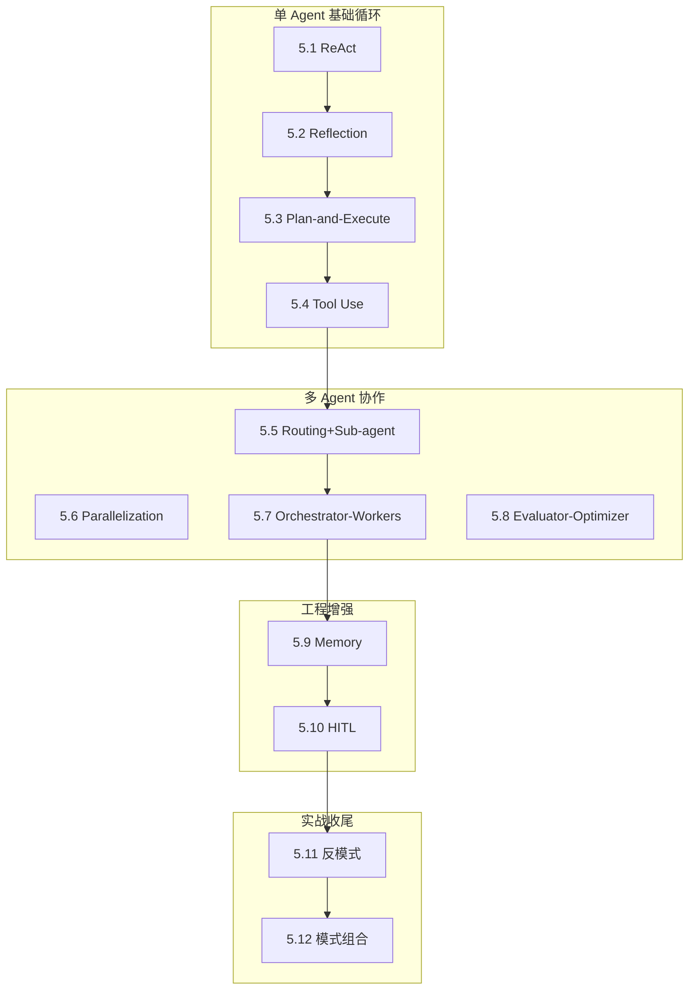

# L5 · 设计模式层（12 节 / 1.3 万字）

> 🟢🟡 核心+进阶

> **本层定位**：跨框架的"**模式词汇表**"——用 12 个模式快速分类任意 Agent 系统。读完 L5 后,看到任何 Agent 框架都能说"这是 ReAct 风格" / "这是 Orchestrator-Workers 风格",而非从零理解。

## 模式全景图

## 12 节一句话导览

| 节 | 模式 | 一句话 |
|---|---|---|
| 5.1 | ReAct | 边想边做,工具调用循环 |
| 5.2 | Reflection | 自批评迭代提质量 |
| 5.3 | Plan-and-Execute | 先规划后执行,省 token |
| 5.4 | Tool Use | LLM 调外部工具的协议模式 |
| 5.5 | Routing+Sub-agent | Supervisor 分发 + 子 Agent 委派 |
| 5.6 | Parallelization | 并行加速 + 投票提质 |
| 5.7 | Orchestrator-Workers | 动态委派,LangGraph 主战场 |
| 5.8 | Evaluator-Optimizer | 外部裁判迭代 |
| 5.9 | Memory | 短期/长期/共享三层记忆 |
| 5.10 | HITL | 关键决策点人工审批 |
| 5.11 | 反模式 | 多 Agent 8 大踩坑 |
| 5.12 | 模式组合 | 从单 Agent 到多 Agent 演化 |

## 学习路径

- **必读路径**（🟢 核心 / 4 节）：5.1 → 5.4 → 5.11 → 5.12
- **进阶路径**（🟡 / 6 节）：5.2 → 5.3 → 5.5 → 5.7 → 5.9 → 5.10
- **速读路径**（4 节精华）：5.1 → 5.5 → 5.7 → 5.12

## 与其他层衔接

| 层 | 衔接点 |
|---|---|
| **L1 基础理论** | 5.1 ReAct 引用 L1.4 ReAct 论文精读;5.12 模式组合根植于 L1 Agentic 概念 |
| **L2 上下文** | 5.9 Memory 引用 L2.6 压缩 + L2.7 RAG(读取侧互补) |
| **L3 协议** | 5.4 Tool Use 引用 L3.1 Function Calling + L3.3 MCP;5.5 Routing 引用 L3.5 A2A |
| **L4 框架** | 5.7 Orchestrator-Workers 主战场是 L4.3 LangGraph;5.10 HITL 引用 L4.3 interrupt |
| **L6 可观测** | 5.11 反模式"调试噩梦"指向 L6 trace 工具;5.8 Evaluator-Optimizer 引用 L6 LLM-as-Judge |
| **L7 生产** | 5.10 HITL 的安全/合规意义在 L7 详细展开;5.9 Memory 持久化关联 L7 部署 |
| **L8 案例** | 5.12 模式组合在 L8 端到端落地(8.2 Coding Agent) |

## 关键判断速查

- **< 5 步任务** → 单 Agent 串行(5.1 ReAct),不要堆多 Agent(5.11 反模式)
- **质量优先** → 5.2 Reflection(自我批评)或 5.8 Evaluator-Optimizer(外部裁判)
- **多领域分流** → 5.5 Routing+Sub-agent
- **复杂研究** → 5.7 Orchestrator-Workers
- **高风险操作** → 5.10 HITL 关键决策点打断
- **跨会话** → 5.9 Memory 长期 + 共享
- **生产级** → 4-5 模式叠加(5.12 演化路径)

## 字数与图数

- 总字数:约 1.38 万字(12 节 + README)
- 总图数:14 张 mermaid
- 引用规范:每节 ≥ 3 条 S/A 级,主推 Anthropic 5 模式 + LangGraph 官方文档 + ReAct/Reflexion/Plan-and-Execute 经典论文

> 📚 本层参考
> - [S 级] Anthropic, *Building Effective Agents* (2024-10) — https://www.anthropic.com/research/building-effective-agents
> - [S 级] Anthropic, *How we built our multi-agent research system* (2025) — https://www.anthropic.com/engineering/built-multi-agent-research-system
> - [S 级] LangGraph 官方文档 — https://langchain-ai.github.io/langgraph/
> - [A 级] Lilian Weng, *LLM Powered Autonomous Agents* (2023) — https://lilianweng.github.io/posts/2023-06-23-agent/
