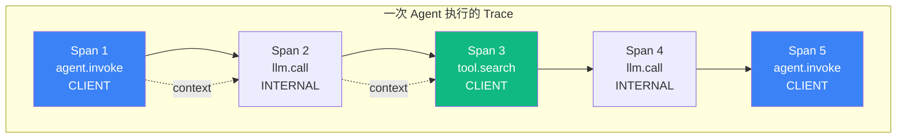

# 6.1 Tracing 基础：Span / Trace / Context Propagation

> 🟡 进阶

> **本节钩子**：Tracing ≠ 日志——日志是"事件流"，Trace 是"调用树"。Agent 系统 90% 的 bug 用日志查不到，必须用 Trace 才看得见。

## 正文大纲

1. **一句话定义**：Tracing 是 OpenTelemetry 标准的"调用链记录"——一次 Agent 执行（Trace）由多个 Span 组成，Span 间通过 Context 传递。**关键观察**：Trace 关注"调用顺序 + 耗时分布"，日志关注"事件内容"；两者互补，不能互相替代。
2. **适用场景**（3 典型 + 2 反例）
   - **典型 1**：多步 Agent 工具调用链——一次 `agent.invoke` 内部多次 LLM + 多次 tool，需看清每步耗时。
   - **典型 2**：多 Agent 协作（5.5 Routing / 5.4 Supervisor）——多个子 Agent 各自产生 Trace，需在父 Trace 中按"树状"组织。
   - **典型 3**：长任务调试（>30s、>10 步）——日志只能看开始/结束，Trace 可定位"第 7 步卡了 25s"。
   - **反例 1**：单次 LLM 调用——无跨服务/跨步骤，开 Trace 是过度工程。
   - **反例 2**：无工具 Agent（纯 Chat）——单次调用内部不需拆 Span。
3. **关键概念**（7 个核心术语）
   - **Span**：一个工作单元（一次 LLM call、tool call、agent 决策），有 start/end 时间、name、attributes。
   - **Trace**：Span 的 DAG，共享同一个 `trace_id`，表示端到端请求的完整调用树。
   - **Context Propagation**：跨服务/异步边界传递的元数据（trace_id、span_id、baggage）。
   - **SpanKind**：5 种——`INTERNAL` / `CLIENT` / `SERVER` / `PRODUCER` / `CONSUMER`。
   - **Attributes**：Span 上的键值元数据（如 `gen_ai.system=anthropic`），用于检索和聚合。
   - **Events**：Span 内部的时间戳事件，不带持续时间。
   - **Status**：`OK` / `ERROR`，用于快速过滤失败 Span。
4. **代码示例**：OpenTelemetry SDK 最小 Span 创建（5-15 行）。
5. **常见误区**：（1-2 个常见错用）
6. **与其他节对比**：6.1 vs 6.2 概念 vs 协议 / 6.1 vs 6.3 通用 vs 平台。

## 图



> Source: W3C Trace Context, OpenTelemetry Specification (2024).

## 代码

```python
# tracing_foundation.py
"""
最小 OTel Span 创建（10 行）
"""
from opentelemetry import trace

tracer = trace.get_tracer(__name__)

def agent_invoke(question: str) -> str:
    with tracer.start_as_current_span("agent.invoke") as span:
        span.set_attribute("gen_ai.system", "anthropic")
        span.set_attribute("gen_ai.request.model", "claude-opus-4-7")
        span.set_attribute("agent.question", question)
        # ... LLM call + tool calls
        return answer
```

实战要点：

1. **每个 Span 必须有语义属性**——`gen_ai.system` / `gen_ai.request.model` 是 OTel GenAI 语义约定，让 Langfuse / Phoenix 自动识别 LLM 调用并统计 token。
2. **Context 跨异步边界自动传播**——`asyncio` / `ThreadPool` 通过 `contextvars` 自动传递当前 Trace Context，无需手动传参。
3. **Span 嵌套深度控制在 5-7 层**——超过 10 层会出"观测黑洞"：后端存储 / 查询 / UI 渲染全部变慢。

## 反模式

- **❌ "Tracing = 日志"**——错。日志是"事件流"，Trace 是"调用树"。日志查不到耗时分布和调用层级；Trace 查不到事件内容。**两者必须同时存在**。
- **❌ "Span 越多越好"**——错。10000 Span/Trace 是"观测黑洞"——Collector 写不动、后端查不动、UI 崩盘。**经验值**：单次 Agent 20-50 Span 健康；超过 100 必用 tail-based sampling。

## 节对比

| 维度 | 6.1 Tracing 基础 | 6.2 OpenTelemetry | 6.3 平台选型 |
|---|---|---|---|
| 视角 | 概念（Span / Trace） | 协议（OTel SDK） | 平台（Langfuse / LangSmith） |
| 抽象度 | W3C 标准 | 实现层 | 应用层 |
| 工具 | OTel API | OTel SDK + Collector | Langfuse / LangSmith / Phoenix |
| 读者 | 想理解概念的人 | 想自建管线的团队 | 想快速上线的团队 |

## 工具映射

| 工具 | 用途 | 备注 |
|---|---|---|
| OpenTelemetry | Tracing 协议 | W3C 标准，跨平台 |
| Langfuse | Trace + Eval | 开源 + 自托管 |
| LangSmith | Trace + Debug | LangChain 官方 |
| Arize Phoenix | Trace + Drift | 评估强项 |

## 自测题

1. **概念辨析**：Span vs Trace 的关系是什么？一个 Trace 必须包含几个 Span？能否一个 Span 单独构成 Trace？
2. **场景判断**：下面哪个场景**最适合**用 SpanKind = `CLIENT`？
   - A. Agent 内部推理 LLM 调用的 Span
   - B. Agent 调用外部搜索 API 的 Span
   - C. Agent 接收用户 HTTP 请求的 Span
   - D. 消息队列投递消息的 Span
3. **代码补全**：补全下面的 OTel Span 代码，给 LLM 调用加上 token 统计属性：
   ```python
   from opentelemetry import trace
   tracer = trace.get_tracer(__name__)

   def llm_call(prompt: str) -> str:
       with tracer.start_as_current_span("llm.call") as span:
           span.set_attribute("gen_ai.system", "anthropic")
           # 缺什么？
           response = client.messages.create(...)
           return response.content[0].text
   ```
4. **反直觉**：为什么"全打 Trace（100% 采样）"比"完全不打 Trace"更危险？给出 2 个具体原因。
5. **对比**：6.1（概念）vs 6.2（OTel 协议）vs 6.3（平台）的视角差异是什么？团队在不同阶段应如何选型？

**答案**：

1. **Trace 是 Span 的 DAG**——共享同一个 `trace_id`，Span 间通过 `parent_span_id` 形成父子。**一个 Span 可单独构成 Trace**（如单次 LLM 调用），但通常 Trace 对应"业务请求边界"（一次 `agent.invoke`）。
2. **B 最适合**——`CLIENT` 表示"当前进程主动调外部"，Agent 调外部搜索 API 是典型。A 是 `INTERNAL`；C 是 `SERVER`；D 是 `PRODUCER`。**口诀**：谁主动发请求 = CLIENT；谁被动接请求 = SERVER。
3. 补 `gen_ai.usage.input_tokens` / `gen_ai.usage.output_tokens`：
   ```python
   response = client.messages.create(...)
   span.set_attribute("gen_ai.usage.input_tokens", response.usage.input_tokens)
   span.set_attribute("gen_ai.usage.output_tokens", response.usage.output_tokens)
   ```
   OTel GenAI 语义约定标准字段，Langfuse / Phoenix 自动聚合 token 成本。
4. **两个原因**：① **存储爆炸**——100% 采样 × 高 QPS × 多 Span = Collector 写不动 / S3 费用爆表（实测 1000 QPS × 50 Span × 4KB ≈ 200MB/s）；② **查询崩溃**——全量数据下 trace_id 索引从毫秒变分钟级，UI 加载卡死。**工程经验**：head-based 1-10% 采样 + tail-based 100% 采样失败/慢请求（>2s）。
5. **视角差异**：6.1 概念层（Span/Trace/Context 是什么）；6.2 协议层（OTel SDK 怎么用、Collector 怎么配）；6.3 应用层（Langfuse / LangSmith / Phoenix 怎么选）。**选型路径**：早期原型期直接用 Langfuse Cloud（跳过 6.2）；规模 10+ 人、需自建合规时回 6.2 接 OTel + 自托管。

> 📚 本节参考
> - [S 级] OpenTelemetry GitHub — https://github.com/open-telemetry/opentelemetry-specification
> - [S 级] OpenTelemetry GenAI Semantic Conventions — https://github.com/open-telemetry/semantic-conventions
> - [S 级] Anthropic Engineering, "Building Effective Agents" (2024) — https://www.anthropic.com/engineering/building-effective-agents
> - [A 级] Lilian Weng, "LLM Powered Autonomous Agents" (2023) — https://lilianweng.github.io/posts/2023-06-23-agent/
> - [A 级] Eugene Yan, "Patterns for Building LLM-based Systems & Products" (2023) — https://eugeneyan.com/writing/llm-patterns/
