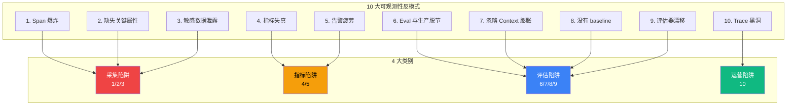

# 6.10 可观测性反模式：10 大血泪清单

> 🟡 进阶

> **本节钩子**：可观测性 ≠ "全打"——**信息过载比没有观测更危险**。10000 Span/Trace 不如 100 个精心设计的 Span；**有效信号原则**：每个 Span 必须回答"我想知道什么"，否则不打。

## 正文大纲

1. **一句话定义**：可观测性的"血泪清单"——10 大反模式按四大类别：**采集陷阱**（1/2/3）/ **指标陷阱**（4/5）/ **评估陷阱**（6/7/8/9）/ **运营陷阱**（10）。每条都附"症状 + 根因 + 修复"三段式。
2. **适用场景**：所有 Agent 项目——本节是"避坑地图"。
3. **10 大反模式详情**：
   - **1. Span 爆炸**——症状：UI 卡死 / 10000+ Span/Trace。根因：每个 token 一个 Span。修复：head 1-10% 采样 + tail 100% 失败/慢。
   - **2. 缺失关键属性**——症状：无法按模型筛选。根因：手动 set_attribute 漏写。修复：OTel 自动 instrument + 模板（`gen_ai.system` / `gen_ai.request.model` / `gen_ai.usage.*`）。
   - **3. 敏感数据泄露**——症状：Trace 含 PII，合规风险。根因：直接 set_attribute(user_input)。修复：脱敏处理器 + 关键词过滤。
   - **4. 指标失真**——症状：P95 恶化但"平均 OK"。根因：用 average() 而非 P95/P99。修复：Histogram + 百分位。
   - **5. 告警疲劳**——症状：100+ 告警全 Critical 被忽略。根因：告警级别滥用。修复：分 P1/P2/P3 + Critical ≤5。
   - **6. Eval 与生产脱节**——症状：Eval 通过生产失败。根因：Golden Dataset 是合成数据。修复：生产 Trace 采样建业务 Eval Set（≥50% 真实）。
   - **7. 忽略 Context 膨胀**——症状：成本失控 + 延迟劣化。根因：不主动压缩。修复：定期摘要 + sliding window。
   - **8. 没有 baseline**——症状：优化后不知好坏。根因：缺首次基准。修复：发布前采 1000 Trace 建 baseline。
   - **9. 评估器漂移**——症状：LLM-as-Judge 评分不一致。根因：Judge Prompt 没版本化。修复：每月跑校准集 + Prompt 版本控制。
   - **10. Trace 黑洞**——症状：投入采集但无人看。根因：观测 ≠ 决策。修复：每月 Trace 复盘会 + 行动项。
4. **有效信号原则**：每个 Span 必须回答"我想知道什么"，否则不打。**核心判断**：① 这个 Span 能定位哪个故障？② 这个指标能触发哪个决策？两个都答不上来——删掉。
5. **常见误区**：（本节本身就是反模式合集，跳过误区 block）
6. **与其他节对比**：6.9 A/B 决策 vs 6.10 反思；L5.11 模式反模式 vs L6.10 观测反模式——一正一反、一内一外。

## 图



> Source: Lilian Weng, *LLM Powered Autonomous Agents* (2023), Chip Huyen, *AI Engineering* (2024, Ch.7), Anthropic Engineering, *Building Effective Agents* (2024).

## 实战检查清单

本节为反模式清单类章节，代码段豁免；用以下 10 题自检替代：

- [ ] Trace P95 < 30s？（否则 Span 爆炸）
- [ ] 每个 LLM Span 有 `gen_ai.system` / `gen_ai.request.model` / `gen_ai.usage.*`？
- [ ] Trace 过滤后无 PII 关键词（邮箱/手机/身份证）？
- [ ] 监控用 P95/P99 而非 average？
- [ ] 告警分 P1/P2/P3，Critical ≤5 条？
- [ ] Eval 数据集 ≥50% 来自生产 Trace？
- [ ] Context 长度有上限 + 自动压缩？
- [ ] 每个新功能有 baseline Trace 快照？
- [ ] LLM-as-Judge 每月跑校准集？
- [ ] 每月有 Trace 复盘会 + 行动项？

**评分**：≤6 个 yes = 高风险 / 7-8 个 yes = 中风险 / 9-10 个 yes = 低风险。

## 反模式

本节本身就是反模式合集——10 大反模式见正文大纲"症状 + 根因 + 修复"三段式。**最常见 3 个**（按生产出现频率）：① **Span 爆炸**（80% 团队中招，OTel 默认不打采样）；② **缺失关键属性**（90% 自研 Trace 漏写 `gen_ai.usage.*`）；③ **Trace 黑洞**（采集 100% 但无人看，浪费 50%+ 存储成本）。**根因共性**：① 过度自信"打全比没打好"；② 缺工程纪律（没 Trace 规范 + Code Review）；③ 评估/运营脱节。

## 节对比

| 维度 | 6.9 A/B 与灰度 | 6.10 反模式 | L5.11 Multi-Agent 反模式 |
|---|---|---|---|
| 视角 | 实验设计 | 可观测性反模式 | 多 Agent 反模式 |
| 抽象度 | 决策层 | 反思层 | 反思层 |
| 反模式数 | 0（讲方法） | 10 | 8 |
| 读者 | 想做实验的人 | 想避坑的人 | 想避坑的人 |
| 工具 | Statsig / Eppo | OTel Sampler / PII Filter | LangGraph / LangSmith |
| 输出 | 实验显著性 | 避坑清单 | 避坑清单 |
| 与 L5.11 关系 | 无 | 互补（观测 vs 模式） | 互补（模式 vs 观测） |

**L5.11 vs L6.10**：L5.11 是"**模式**反模式"——多 Agent 架构怎么搭容易踩坑；L6.10 是"**观测**反模式"——可观测系统怎么搭容易踩坑。两者构成"**内 + 外**"双重防御。

## 工具映射

| 工具 | 用途 | 备注 |
|---|---|---|
| OTel Sampler | 控制采样率 | head-based 1-10% + tail-based 100% 失败/慢 |
| Langfuse PII 脱敏器 | 敏感数据过滤 | 内置 regex + 自定义 hook |
| Prometheus Histogram | P95/P99 指标 | `histogram_quantile(0.95, ...)` |
| 校准集 (Calibration Set) | Judge 漂移检测 | 100 个 ground truth 每月回归 |

**自测题答案参考**：
- ① Span 爆炸用 OTel Sampler——`ParentBasedTraceIdRatioBased(0.05)` 配 TailSamplingProcessor。
- ② PII 脱敏用 Langfuse 隐私模式——配置 `piiRedaction` 关键词。
- ③ 百分位用 Histogram——非 Summary（不可聚合）。
- ④ Judge 漂移——每月 1 号跑校准集写入 dashboard。

## 自测题

1. **概念辨析**：可观测性 10 大反模式中"采集陷阱 / 指标陷阱 / 评估陷阱 / 运营陷阱"各举 1 例。
2. **场景判断**：生产环境单 Trace 的 Span 数从 100 涨到 10000，首要排查哪个反模式？怎么修？
3. **代码补全**：本节豁免代码——补全"自检清单"逻辑（用 dataclass 列出 10 项并提供 diagnose 函数）。
4. **反直觉**：为什么"全打 Trace"比"不打"更危险？举出 2 个具体危害。
5. **对比**：6.10 vs L5.11 反模式的视角差异？两者怎么互补？

**答案**：

1. **四类反模式举例**：① 采集陷阱——Span 爆炸。② 指标陷阱——指标失真（用 average() 而非 P95）。③ 评估陷阱——Eval 与生产脱节。④ 运营陷阱——Trace 黑洞。
2. **首要排查反模式 1：Span 爆炸**。**修复**：① **立即止血**——OTel `ParentBasedTraceIdRatioBased(0.05)` 头采样丢 95%；② **尾采样兜底**——TailSamplingProcessor 保留 100% 失败/慢 Trace（>10s）+ 5% 随机；③ **长期**——审计 Span top10 接口逐个评估。**核心**：head 控制成本 + tail 保证可观测。
3. ```python
   from dataclasses import dataclass
   @dataclass
   class Check:
       name: str
       question: str
       passed: bool = False
   CHECKS = [Check("span_explosion", "Trace P95 < 30s?"),
             Check("missing_attr", "LLM Span 有 model/usage?"),
             Check("pii_leak", "Trace 无 PII?"),
             Check("metric_distortion", "用 P95/P99?"),
             Check("alert_fatigue", "Critical ≤5?"),
             Check("eval_production_gap", "Eval ≥50% 生产数据?"),
             Check("context_bloat", "Context 有上限+压缩?"),
             Check("no_baseline", "有 baseline Trace?"),
             Check("judge_drift", "Judge 每月校准?"),
             Check("trace_blackhole", "每月 Trace 复盘?")]
   def diagnose(passed: list[bool]) -> str:
       yes = sum(passed)
       return "高风险" if yes <= 6 else "中风险" if yes <= 8 else "低风险"
   ```
4. **两个具体危害**：① **存储成本爆炸**——10000 Span/Trace × 100 万次/天 × 30 天 = 3 万亿 Span，1KB/Span = 3PB 存储，月成本数十万；② **查询性能崩塌**——UI 加载 10000 Span 树状图 30s+，MTTR 翻 6 倍（5min→30min）。**根本**：观测核心是"**快速定位故障**"不是"打全数据"——打全是"数据囤积"，**反可观测性**。
5. **视角差异 + 互补**：① **差异**——L5.11 关注"**Agent 架构内部**"（多 Agent 模式避坑），L6.10 关注"**观测系统外部**"（可观测避坑）。② **互补**——5.11 解决"少踩架构坑"（踢皮球/错误放大），6.10 解决"少踩观测坑"（Span 爆炸/Trace 黑洞）。**关键差异**：5.11 反模式**相互独立**，6.10 反模式**强耦合**——治理 6.10 要"**按类别批量修**"。

> 📚 本节参考
> - [A 级] Lilian Weng, *LLM Powered Autonomous Agents* (2023) — https://lilianweng.github.io/posts/2023-06-23-agent/
> - [A 级] Chip Huyen, *AI Engineering* (2024, O'Reilly, Ch.7) — https://github.com/chiphuyen/aie-book
> - [S 级] Anthropic Engineering, *Building Effective Agents* (2024) — https://www.anthropic.com/engineering/building-effective-agents
> - [S 级] Eugene Yan, *Patterns for Building LLM-based Systems & Products* (2023) — https://eugeneyan.com/writing/llm-patterns/
