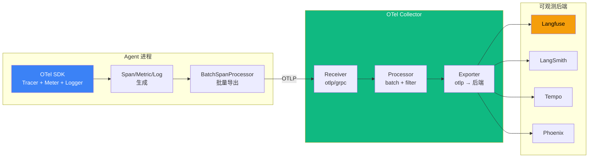

# 6.2 OpenTelemetry 落地：OTel SDK + GenAI 语义约定

> 🟡 进阶

> **本节钩子**：OpenTelemetry 不是"只为 Tracing"——它是 Traces + Metrics + Logs 三件套的统一协议；Agent 应该 **OTel-first**（用 OTel 协议），而不是被 Langfuse 等平台绑定。

## 正文大纲

1. **一句话定义**：OpenTelemetry（OTel）是 CNCF 毕业的可观测性标准——为 Traces / Metrics / Logs 提供统一的 API、SDK、Collector 和语义约定；Agent 系统通过 OTel SDK 输出标准化数据，被任何支持 OTel 协议的后端（Langfuse / LangSmith / Tempo / Jaeger）消费。
2. **适用场景**（3 典型 + 2 反例）：
   - **典型 1**：多语言 Agent 系统统一观测——Python / TypeScript / Go 多进程协同，全部走 OTel 协议 + Collector 中转，避免每语言一套 SDK。
   - **典型 2**：合规自建管线——金融 / 医疗场景不允许数据出网，OTel Collector 自托管 + 自建后端是必经之路。
   - **典型 3**：跨平台迁移——先用 OTel 协议输出，后期可在 Langfuse / LangSmith / Tempo 之间切换，无需重写 instrumentation 代码。
   - **反例 1**：单文件 demo——直接用 Langfuse Cloud SDK 更省事，OTel + Collector 自建是过度工程。
   - **反例 2**：纯前端 Chat 应用——无后端跨服务调用，Simple console.log 即可。
3. **关键概念**：
   - **OTel 三件套**：Traces（调用链）+ Metrics（指标如 token 速率）+ Logs（事件）——三者在同一 SDK / Resource 下统一。
   - **OTel SDK**：每个语言一份实现（Python `opentelemetry-sdk` / JS `@opentelemetry/sdk-node`），负责生成 Span / Metric / LogRecord 并通过 Exporter 发送。
   - **OTel Collector**：独立二进制，作为"接收 → 处理 → 导出"中转，支持 batch、filter、tail sampling 等 Processor。
   - **GenAI 语义约定**：`gen_ai.system`（anthropic / openai / vertex_ai）/ `gen_ai.request.model` / `gen_ai.usage.input_tokens` / `gen_ai.usage.output_tokens`——让任何 OTel 后端自动识别 LLM 调用。
   - **Resource 属性**：`service.name` / `service.version` / `deployment.environment`——标识"哪个服务、哪个版本"，必须在 SDK 初始化时一次性设置（immutable）。
   - **BatchSpanProcessor**：异步批量导出，生产必备；SimpleSpanProcessor 同步阻塞，仅 debug 用。
4. **代码示例**：OTel SDK + GenAI 语义约定完整示例（Resource + BatchSpanProcessor + OTLP Exporter + Span Attributes）。
5. **常见误区**：（1-2 个常见错用）
6. **与其他节对比**：6.2 vs 6.1 协议 vs 概念 / 6.2 vs 6.3 SDK vs 平台。

## 图



> Source: OpenTelemetry Specification (2024), CNCF OTel Project (https://www.cncf.io/projects/opentelemetry/).

## 代码

```python
# opentelemetry_agents.py
"""
OTel SDK + GenAI 语义约定完整示例（15 行）
"""
from opentelemetry import trace
from opentelemetry.sdk.trace import TracerProvider
from opentelemetry.sdk.resources import Resource
from opentelemetry.sdk.trace.export import BatchSpanProcessor, OTLPSpanExporter

# 1. 设置 Resource（标识服务，immutable）
resource = Resource.create({"service.name": "agent-api", "service.version": "1.0.0"})
trace.set_tracer_provider(TracerProvider(resource=resource))

# 2. 配置 OTLP Exporter（发到 Collector / 后端）
trace.get_tracer_provider().add_span_processor(
    BatchSpanProcessor(OTLPSpanExporter(endpoint="http://collector:4317"))
)

tracer = trace.get_tracer(__name__)

def llm_call(prompt: str) -> str:
    with tracer.start_as_current_span("llm.call") as span:
        span.set_attribute("gen_ai.system", "anthropic")
        span.set_attribute("gen_ai.request.model", "claude-opus-4-7")
        # ... 调用 LLM
        return answer
```

实战要点：

1. **OTel-first 原则**——输出 OTel 协议数据，不要被任何平台 SDK 绑定（Langfuse v3 / LangSmith 都原生支持 OTel）。
2. **Resource 属性必须在 SDK 初始化时设置**——后期修改无效，因为 Resource 是 immutable。
3. **BatchSpanProcessor 是生产必备**——SimpleSpanProcessor 同步阻塞，仅用于 debug。

## 反模式

- **❌ "OTel 只为 Tracing"**——错。OTel 是 Traces + Metrics + Logs 三件套的统一协议，只用 Trace 是浪费（漏掉 token 速率 / 错误率等聚合指标）。
- **❌ "用 Langfuse SDK 不用 OTel"**——错。Langfuse SDK 内部就是 OTel 包装，直接用 OTel SDK 更通用、可移植；后期换后端零成本。

## 节对比

| 维度 | 6.1 Tracing 基础 | 6.2 OpenTelemetry | 6.3 平台选型 |
|---|---|---|---|
| 视角 | 概念（Span / Trace） | 协议（OTel SDK / Collector） | 平台（Langfuse / LangSmith / Phoenix） |
| 抽象度 | W3C 标准 | CNCF 实现 | 应用层 |
| 工具 | OTel API | OTel SDK + Collector + OTLP | Langfuse / LangSmith / Phoenix / Tempo |
| 读者 | 想理解概念的人 | 想自建合规管线的团队 | 想快速上线的团队 |

## 工具映射

| 工具 | 用途 | 备注 |
|---|---|---|
| OpenTelemetry SDK | Traces + Metrics + Logs | CNCF 毕业，跨语言 |
| OTel Collector | 接收 + 处理 + 导出 | 中转组件 |
| OTLP 协议 | 数据传输 | gRPC + HTTP 双协议 |
| GenAI 语义约定 | LLM 调用标准化 | `gen_ai.*` 命名空间 |

## 自测题

1. **概念辨析**：OTel 三件套是什么？只使用 Traces 有什么问题？
2. **场景判断**：何时必须用 BatchSpanProcessor 而非 SimpleSpanProcessor？
3. **代码补全**：补全 OTel Resource 设置，添加 service.name 和 service.version。
4. **反直觉**：为什么"用 Langfuse SDK 而不用 OTel SDK"是反模式？
5. **对比**：6.1 vs 6.2 vs 6.3 的视角差异？

**答案**：

1. **Traces + Metrics + Logs 三件套**——Traces 记录调用链，Metrics 记录聚合指标（如每秒 token 数、错误率），Logs 记录离散事件。**只用 Traces 的问题**：漏掉"哪些模型最贵 / 错误率趋势"等聚合视图，必须再叠 Prometheus + Loki 才能补齐。
2. **生产环境必须用 BatchSpanProcessor**——SimpleSpanProcessor 每条 Span 同步发送 OTLP，会阻塞 Agent 主线程（一次 LLM call + tool call 至少 10+ Span = 10+ 次同步网络 IO）。**BatchSpanProcessor 异步批量**（默认 512 条 / 5s 触发），吞吐高 10-100 倍。**口诀**：SimpleSpanProcessor 仅 debug；生产一律 Batch。
3. 补 `Resource.create(...)`：
   ```python
   from opentelemetry.sdk.resources import Resource
   resource = Resource.create({
       "service.name": "agent-api",
       "service.version": "1.0.0",
       "deployment.environment": "production"
   })
   trace.set_tracer_provider(TracerProvider(resource=resource))
   ```
   Resource 必须在 `TracerProvider` 构造时传入——后续 `set_attribute` 不能改 Resource（immutable）。
4. **三个原因**：① **可移植性差**——Langfuse SDK 输出的是 Langfuse 私有格式（即使内部走 OTel），迁到 LangSmith / Tempo 需重写；② **绑定云服务**——Langfuse SDK 默认上报到 Langfuse Cloud，断网即崩；③ **错失三件套**——多数平台 SDK 只覆盖 Traces，Metrics / Logs 仍需单独接入。**正解**：直接用 OTel SDK + OTLP 协议，平台后端只是"一个 Exporter 目标"。
5. **视角差异**：6.1 概念层（Span/Trace/Context 是什么）；6.2 协议层（OTel SDK 怎么用、Collector 怎么配）；6.3 应用层（Langfuse / LangSmith / Phoenix 怎么选）。**选型路径**：早期原型直接用 Langfuse Cloud（跳过 6.2）；规模 10+ 人 / 需合规自建时回 6.2 接 OTel + Collector + 自托管后端。

> 📚 本节参考
> - [S 级] OpenTelemetry Specification — https://github.com/open-telemetry/opentelemetry-specification
> - [S 级] OpenTelemetry GenAI Semantic Conventions — https://github.com/open-telemetry/semantic-conventions
> - [S 级] CNCF OTel Project (Graduated 2025-01) — https://www.cncf.io/projects/opentelemetry/
> - [A 级] Lilian Weng, "LLM Powered Autonomous Agents" (2023) — https://lilianweng.github.io/posts/2023-06-23-agent/
> - [A 级] Eugene Yan, "Patterns for Building LLM-based Systems & Products" (2023) — https://eugeneyan.com/writing/llm-patterns/