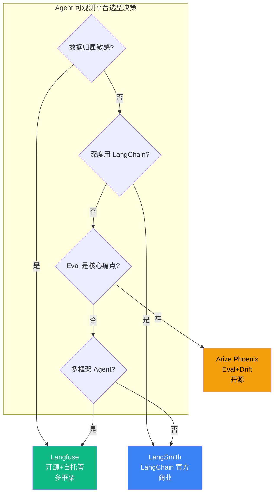

# 6.3 平台选型：Langfuse / LangSmith / Arize Phoenix 横向对比

> 🟡 进阶

> **本节钩子**：选平台不是"看 UI 好看"——核心决策点是**数据归属**（自托管 vs 商业）+ **评估能力**（Eval 集成深度）+ **开源友好**（SDK 是否开源）。LangChain 用户的"自然选择"是 LangSmith，但 Langfuse 在多框架场景下更通用。

## 正文大纲

1. **一句话定义**：三大 Agent 可观测平台横向对比——Langfuse（开源 + 自托管友好）、LangSmith（LangChain 官方 + 商业集成）、Arize Phoenix（评估 + 漂移检测强项）。
2. **适用场景**（3 典型 + 2 反例）：
   - **典型 1**：金融 / 医疗合规自建——Langfuse 自托管版（数据不出网）+ MIT 协议可改源码。
   - **典型 2**：LangChain 团队原型阶段——LangSmith 一行代码接入，无需自建任何组件。
   - **典型 3**：Eval 驱动型团队——Arize Phoenix 在漂移检测与 LLM-as-Judge 评分上最强。
   - **反例 1**：单文件 demo——直接 print + JSON dump 即可，接入平台是过度工程。
   - **反例 2**：纯前端 Chat——无后端 trace 流，浏览器 console 已够用。
3. **核心决策维度**（5 个）：**数据归属**（自托管 vs 仅云）/ **评估能力**（Eval + Dataset + Drift）/ **开源 SDK**（MIT / Apache vs 商业闭源）/ **多框架支持**（是否仅绑定 LangChain）/ **价格成本**（按 trace 计费 vs 免费自托管）。
4. **决策矩阵**：按场景给出"应该选谁"的明确建议（详见图）。
5. **反模式**：（1-2 个常见错用，详见下文）。
6. **与其他节对比**：6.2 协议层（OTel SDK）vs 6.3 应用层（平台）vs 6.4 方法论层（Eval）。

## 图



> Source: Langfuse GitHub (https://github.com/langfuse/langfuse), LangGraph GitHub (https://github.com/langchain-ai/langgraph), Arize Phoenix GitHub (https://github.com/Arize-ai/phoenix).

## 代码

```python
# platform_selection.py
"""
选型决策伪代码（10 行）
"""
def select_platform(requirements: dict) -> str:
    if requirements["data_residency"] == "self_host":
        return "Langfuse"  # 唯一原生支持自托管的开源平台
    if requirements["framework"] == "langchain":
        return "LangSmith"  # LangChain 官方，集成最深
    if requirements["primary_need"] == "eval":
        return "Arize Phoenix"  # Eval + Drift 检测最强
    if requirements["framework_count"] >= 3:
        return "Langfuse"  # 多框架场景最通用
    return "LangSmith"  # 默认推荐（生态最成熟）
```

实战要点：

1. **三大平台都支持 OTel 协议接入**（详见 6.2）——意味着可以"先用 Langfuse 后期切 LangSmith 不丢数据"。
2. **LangSmith 商业版定价高**（按 trace 量计费）——自建 Langfuse 可显著降本。
3. **Arize Phoenix 强项是漂移检测**——监控 Eval 模型随时间衰减的趋势，Eval 驱动型团队首选。

## 反模式

- **❌ "看 UI 好看选 LangSmith"**——错；LangSmith 商业版昂贵，多框架场景下 Langfuse 更优。
- **❌ "自建 ELK 替代平台"**——错；Agent Trace 数据有特殊语义（GenAI attributes），ELK 通用检索效率低。

## 节对比

| 维度 | 6.2 OpenTelemetry | 6.3 平台选型 | 6.4 Eval 三件套 |
|---|---|---|---|
| 视角 | 协议（OTel SDK / Collector） | 平台（Langfuse / LangSmith / Phoenix） | 测试（单元 / 集成 / 端到端） |
| 抽象度 | CNCF 实现 | 应用层 | 方法论 |
| 工具 | OTel SDK + OTLP | Langfuse / LangSmith / Phoenix / Tempo | pytest + Langfuse Eval + Benchmarks |
| 读者 | 想自建管线的团队 | 想快速上线的团队 | 想建立 Eval 体系的团队 |

## 工具映射

| 工具 | 数据归属 | 评估能力 | 开源 SDK | 多框架 | 价格 |
|---|---|---|---|---|---|
| Langfuse | 自托管 / 云 | Eval + Dataset | ✅ MIT | ✅ 4+ 框架 | 免费自托管 / 云按量 |
| LangSmith | 仅云 | Eval + Debug | ❌ 商业 | ✅ LangChain 深度 | 按 trace 计费（较贵） |
| Arize Phoenix | 自托管 / 云 | Eval + Drift | ✅ Apache 2.0 | ✅ 4+ 框架 | 免费自托管 |
| 自建 OTel + Grafana | 自托管 | 需自研 | ✅ Apache 2.0 | ✅ 通用 | 运维成本高 |

## 自测题

1. **概念辨析**：Langfuse vs LangSmith vs Arize Phoenix 的核心定位差异？
2. **场景判断**：自托管 + 多框架 + 数据敏感 → 选什么？
3. **代码补全**：补全 select_platform 决策函数。
4. **反直觉**：为什么"看 UI 选 LangSmith"是反模式？
5. **对比**：6.2 vs 6.3 vs 6.4 的视角差异？

**答案**：

1. **核心定位差异**：**Langfuse** = 开源 + 自托管 + 多框架通用（MIT 协议，GitHub 22k+ stars），定位"可观测的开源标准件"；**LangSmith** = LangChain 官方 + 商业闭源 + 仅云，定位"LangChain 生态深度集成"；**Arize Phoenix** = 评估 + 漂移检测 + Apache 2.0，定位"Eval 驱动型可观测"——三者交集是 Trace 展示，分歧在数据归属和 Eval 能力深度。
2. **自托管 + 多框架 + 数据敏感 → Langfuse**——它是三选项中**唯一原生支持完整自托管**的开源平台（MIT 协议可改源码），且 SDK 覆盖 LangChain / LlamaIndex / Haystack / OpenAI Agents 等 4+ 框架；LangSmith 仅云、闭源；Phoenix 自托管体验弱于 Langfuse。
3. 补 select_platform：
   ```python
   def select_platform(requirements: dict) -> str:
       if requirements["data_residency"] == "self_host":
           return "Langfuse"
       if requirements["framework"] == "langchain":
           return "LangSmith"
       if requirements["primary_need"] == "eval":
           return "Arize Phoenix"
       if requirements["framework_count"] >= 3:
           return "Langfuse"
       return "LangSmith"
   ```
   关键决策顺序：数据归属 > 框架深度 > 评估需求 > 多框架 > 默认兜底。
4. **三个原因**：① **价格反噬**——LangSmith 按 trace 计费，月活 1M+ trace 约 $300-500/月，Langfuse 自托管边际成本接近 0；② **多框架陷阱**——LangSmith 对 LangChain 深度优化，但 LlamaIndex / Haystack / 原生 OpenAI SDK 体验差很多；③ **数据黑箱**——LangSmith 仅云，无法自托管，金融 / 医疗合规场景直接出局。**正解**：先看数据归属约束，再看框架深度，UI 是末位因素。
5. **视角差异**：6.2 协议层（CNCF OTel SDK / Collector / OTLP 协议，跨语言跨平台）→ 6.3 应用层（Langfuse / LangSmith / Phoenix 三大商业 / 开源平台，对 OTel 协议的实现 + 包装）→ 6.4 方法论层（如何用这些平台跑 Eval 测试 + LLM-as-Judge 评分）。**选型路径**：早期原型直接 LangSmith Cloud（最快）；规模 10+ 人且需合规自建 → OTel + Langfuse 自托管（6.2 + 6.3）；Eval 体系成熟 → 加 Phoenix 做漂移监控（6.4）。

> 📚 本节参考
> - [S 级] Langfuse GitHub — https://github.com/langfuse/langfuse
> - [S 级] LangGraph GitHub (LangSmith 集成参考) — https://github.com/langchain-ai/langgraph
> - [S 级] Arize Phoenix GitHub — https://github.com/Arize-ai/phoenix
> - [A 级] Lilian Weng, "LLM Powered Autonomous Agents" (2023) — https://lilianweng.github.io/posts/2023-06-23-agent/
> - [A 级] Eugene Yan, "Patterns for Building LLM-based Systems & Products" (2023) — https://eugeneyan.com/writing/llm-patterns/