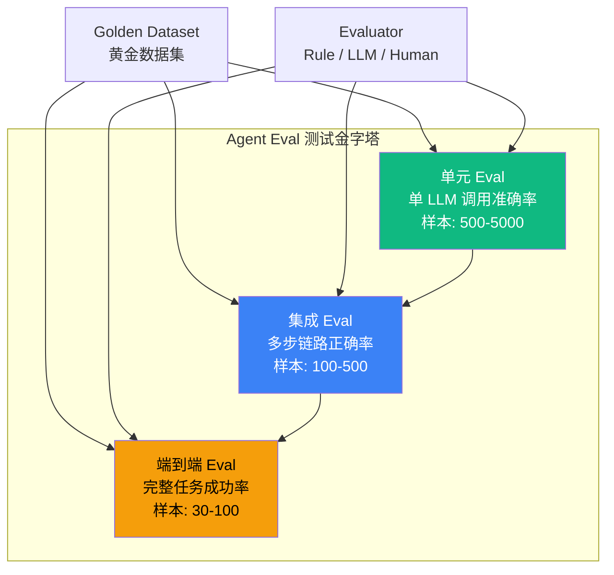

# 6.4 Eval 三件套：单元 / 集成 / 端到端测试金字塔

> 🟡 进阶

> **本节钩子**：Agent Eval ≠ 传统软件单元测试——传统测试是"确定性"的（1 == 1），Agent Eval 是"概率性"的（95% 答对算过）；必须设计"**统计上有意义的样本量**"（≥30 case），而非"全过"。

## 正文大纲

1. **一句话定义**：Agent Eval 的"测试金字塔"——单元 Eval（单 LLM 调用准确率）/ 集成 Eval（多步链路正确率）/ 端到端 Eval（完整任务成功率），三层互补共同构成 Agent 质量保障。
2. **适用场景**（3 典型 + 2 反例）：
   - **典型 1**：Prompt 改版回归——单元 Eval 跑 golden dataset，验证单调用准确率 ≥95%（详见 L4.3）。
   - **典型 2**：多步 Agent 链路稳定性——集成 Eval 测 Tool 路由 + 状态机切换成功率。
   - **典型 3**：完整业务任务（如客服 Agent 解决率）——端到端 Eval 在影子流量或 A/B 中跑。
   - **反例 1**：单文件 demo——直接肉眼评审即可，上 Eval 是过度工程。
   - **反例 2**：冷启动无样本——需先积累 100+ 真实用户 query 才有 Eval 意义。
3. **关键概念**：
   - **Golden Dataset（黄金数据集）**：人手标注的输入-期望输出对，是 Eval 的"标准答案"。
   - **Evaluator（评估器）**：三类——**rule-based**（字符串匹配 / JSON schema）/ **LLM-as-Judge**（用 GPT-4 当裁判，详见 6.5）/ **Human**（专家打分）。
   - **评估指标**：accuracy / pass@k / latency / cost / task_completion_rate。
   - **统计显著性**：样本量 ≥30 + 95% 置信区间是下限，生产推荐 ≥100。
4. **代码示例**：pytest + Langfuse Eval 最小骨架（见下文代码块）。
5. **常见误区**：（1-2 个常见错用，详见反模式段）。
6. **与其他节对比**：6.4 vs 6.3 测试 vs 平台 / 6.4 vs 6.5 套件 vs 评估器。

## 图



> Source: MT-Bench Paper (Zheng et al. 2023) — https://arxiv.org/abs/2306.05685, Langfuse Eval Documentation — https://github.com/langfuse/langfuse.

## 代码

```python
# eval_suite.py
"""
pytest + Langfuse Eval 最小示例（15 行）
"""
from langfuse import Langfuse
from langfuse.evaluation import evaluate

langfuse = Langfuse()  # 自动读环境变量 LANGFUSE_PUBLIC_KEY / SECRET_KEY

# 1. 定义 Golden Dataset（黄金数据集）
dataset = langfuse.create_dataset("agent-eval-v1")
for item in [
    {"input": "北京天气", "expected_output": "晴"},
    {"input": "上海天气", "expected_output": "多云"},
]:
    dataset.create_item(input=item["input"], expected_output=item["expected_output"])

# 2. 定义 Evaluator（评估器）
def exact_match_eval(output: str, expected: str) -> bool:
    return output.strip() == expected.strip()

# 3. 跑 Eval 并设置阈值
result = evaluate(
    dataset="agent-eval-v1",
    task=my_agent_run,  # 你的 Agent 函数
    evaluators=[exact_match_eval],
    min_score=0.95,  # 95% 答对算过
)
assert result.passes, f"Eval 失败: {result.score}"
```

实战要点：

1. **样本量是关键**——30 case 是统计显著性下限，< 30 不可信；生产推荐 ≥100。
2. **三层互补**——单元 Eval 测 prompt / 单工具，集成 Eval 测多步链路，端到端 Eval 测业务指标。
3. **Langfuse Eval 自动 trace 关联**——每次 Eval 运行的所有 Trace 都可在 Langfuse UI 复盘。

## 反模式

- **❌ "Agent Eval = 传统单元测试"**——错；Agent 输出是概率性的，必须用样本量 + 阈值（如 95% pass），而非"全过"。
- **❌ "5 个 case 下结论"**——错；样本量不足，统计上无意义，结果纯属巧合（噪声大于信号）。

## 节对比

| 维度 | 6.3 平台选型 | 6.4 Eval 三件套 | 6.5 LLM-as-Judge |
|---|---|---|---|
| 视角 | 平台（Langfuse / LangSmith / Phoenix） | 测试金字塔（单元 / 集成 / 端到端） | 评估器（LLM-as-Judge） |
| 抽象度 | 应用层 | 方法论 | 实现层 |
| 工具 | 三大平台 | pytest + Langfuse Eval + Benchmarks | MT-Bench prompt + Judge LLM |
| 读者 | 想快速上线的人 | 想建立 Eval 体系的人 | 想用 LLM 当裁判的人 |

## 工具映射

| 工具 | 用途 | 备注 |
|---|---|---|
| pytest | 测试框架 | Python 标准 |
| Langfuse Eval | Eval 平台 | 支持 Dataset + Evaluator + Trace |
| DeepEval | Eval 框架 | 13+ 评估指标，开源 |
| Phoenix Eval | Eval + Drift | Arize 开源 |

## 自测题

1. **概念辨析**：单元 / 集成 / 端到端 Eval 的职责差异？
2. **场景判断**：5 case vs 100 case 的 Eval 结果哪个更可信？
3. **代码补全**：补全 Langfuse Eval 的 Evaluator 函数（精确匹配）。
4. **反直觉**：为什么"全过"不是 Agent Eval 的目标？
5. **对比**：6.3 vs 6.4 vs 6.5 的视角差异？

**答案**：

1. **职责差异**：**单元 Eval** 测单 LLM 调用准确率（500-5000 case），适合 prompt 微调回归；**集成 Eval** 测多步链路正确率（100-500 case），验证 Tool 路由 + 状态机切换；**端到端 Eval** 测完整任务成功率（30-100 case），最贴近业务指标但成本最高——三者自下而上样本递减、复杂度递增。
2. **100 case 更可信**——30 case 是 95% 置信区间的统计下限，5 case 远低于此，结果完全可能被随机波动主导；生产推荐 ≥100 才能稳定区分 90% vs 95% 的差距。
3. 精确匹配 Evaluator：
   ```python
   def exact_match_eval(output: str, expected: str) -> bool:
       return output.strip() == expected.strip()
   ```
   关键点：先 `.strip()` 去除首尾空白（LLM 输出常带 `\n` 或空格），再用 `==` 比较。
4. **三个原因**：① **LLM 输出概率性**——同一 prompt 不同采样可能不同结果，"全过"在数学上几乎不可能；② **目标应该是"统计意义上的可靠性"**——如 95% case 通过 + 置信区间收窄，而非 100% 通过；③ **过度追求"全过"会牺牲模型能力**——为覆盖最后 1% case 而过拟合，反而损害泛化——**正解**：设阈值（95%）+ 监控回归 + 接受"不完美但可控"。
5. **视角差异**：6.3 应用层（三大平台横向对比，选"用哪个"）→ 6.4 方法论层（测试金字塔，定义"怎么测"）→ 6.5 实现层（LLM-as-Judge 细节，回答"用什么当裁判"）。**落地路径**：先用 6.3 选平台（如 Langfuse）→ 用 6.4 设计三层 Eval → 用 6.5 实现复杂 Evaluator（如 GPT-4 打分）。

> 📚 本节参考
> - [S 级] MT-Bench / Vicuna Paper (Zheng et al. 2023) — https://arxiv.org/abs/2306.05685
> - [S 级] Langfuse GitHub — https://github.com/langfuse/langfuse
> - [A 级] Lilian Weng, "LLM Powered Autonomous Agents" (2023) — https://lilianweng.github.io/posts/2023-06-23-agent/
> - [A 级] Chip Huyen, "AI Engineering" (2024, O'Reilly) — https://github.com/chiphuyen/aie-book