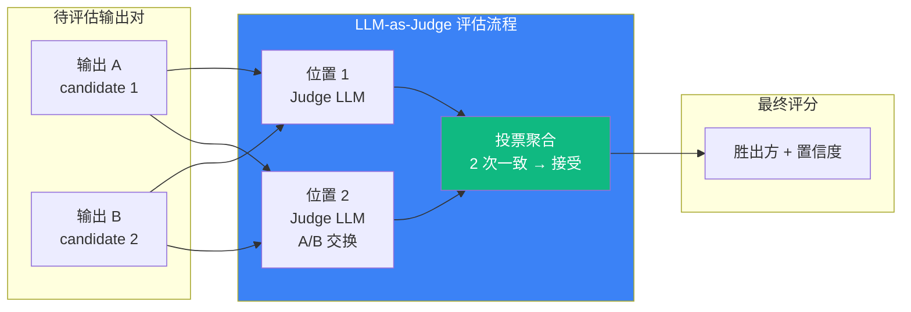

# 6.5 LLM-as-Judge：评估的元层

> 🟡 进阶

> **本节钩子**：LLM-as-Judge ≠ 完美——Judge LLM 自身有偏差（长度偏差 / 位置偏差 / 自我偏好），可靠性上限 ≈ 70-85%；超过必须用 **"两两对比 + 位置交换 + 多 Judge 投票"** 缓解，必要时配合人工校准。

## 正文大纲

1. **一句话定义**：LLM-as-Judge 是用 LLM 当"裁判"评估其他 LLM 输出——比规则匹配灵活、比人工评测便宜 100x；核心论文是 MT-Bench（Zheng et al. 2023）。
2. **适用场景**（3 典型 + 2 反例）：
   - **典型 1**：开放问答质量——人工评测成本不可承受时，用 GPT-5 / Claude Opus 4-7 打分。
   - **典型 2**：两两对比（A/B Test）——模型迭代时快速判断"新版本 vs 旧版本"是否更优。
   - **典型 3**：风格类指标（语气 / 礼貌度 / 创造性）——规则匹配写不出来，只能用 LLM 评估。
   - **反例 1**：客观事实题（数学 / SQL / 引用）——直接规则匹配即可，LLM-as-Judge 反而引入误差。
   - **反例 2**：高风险决策（医疗 / 法律 / 金融）——可靠性 70-85% 远不够，必须人审。
3. **关键概念**：
   - **Judge Prompt**：结构化评估 prompt，明确"评分维度 + 1-10 分 + 胜出方"。
   - **两两对比（Pairwise Comparison）**：A vs B 输出对比，比"绝对打分"稳定 15-20%（Zheng 2023）。
   - **位置交换（Position Bias 缓解）**：A/B 顺序调换跑两次，两次一致才接受。
   - **多 Judge 投票（Ensemble）**：3 个不同 Judge LLM 投票，缓解单一 Judge 偏好。
   - **可靠性上限**：人类一致性 Cohen's Kappa ≈ 0.8，LLM-as-Judge 上限 70-85% 接近人类水平。
   - **校准数据集（Calibration Set）**：100 个 ground truth 样本，定期验证 Judge 准确率。
4. **4 大偏差**：
   - **长度偏差**：长答案（即使冗余）得分高于短答案——> 用"内容密度"评分修正。
   - **位置偏差**：先出现的位置胜率高 5-10%——> 位置交换缓解。
   - **自我偏好**：Judge LLM 偏好自己风格的输出（GPT-5 偏好 GPT-5、Claude 偏好 Claude）——> 跨家族投票。
   - **格式偏差**：Markdown / 列表 / 加粗 得分高于纯文本——> 提示词显式忽略格式。
5. **代码示例**：MT-Bench 风格 Judge + 位置交换（见下文代码块）。
6. **与其他节对比**：6.5 vs 6.4 评估器 vs 测试套 / 6.5 vs 6.6 主观 vs 客观。

## 图



> Source: Zheng et al., *Judging LLM-as-a-Judge with MT-Bench and Chatbot Arena*, 2023 — https://arxiv.org/abs/2306.05685.

## 代码

```python
# llm_as_judge.py
"""
MT-Bench 风格 Judge + 位置交换（15 行）
"""
from anthropic import Anthropic

client = Anthropic()
JUDGE_PROMPT = """你是一位严格的评分员。下面有两个 AI 回答 A 和 B。
请按以下维度评分（1-10 分）：
- 准确性：事实是否正确
- 有用性：是否解决用户问题
- 清晰度：表达是否清晰

请先分别打分，然后给出胜出方（A / B / 平局）。
不要受答案长度或位置影响。"""

def judge_pair(output_a: str, output_b: str) -> dict:
    # 1. 位置 1 评估（A 在前）
    pos1 = client.messages.create(
        model="claude-opus-4-7",
        max_tokens=1024,
        messages=[{"role": "user", "content": f"{JUDGE_PROMPT}\n\nA: {output_a}\n\nB: {output_b}"}],
    )
    # 2. 位置 2 评估（A/B 交换，缓解位置偏差）
    pos2 = client.messages.create(
        model="claude-opus-4-7",
        max_tokens=1024,
        messages=[{"role": "user", "content": f"{JUDGE_PROMPT}\n\nA: {output_b}\n\nB: {output_a}"}],
    )
    # 3. 两次一致才接受（位置偏差缓解）
    pos1_winner = extract_winner(pos1.content[0].text)
    pos2_winner = "A" if extract_winner(pos2.content[0].text) == "B" else "B"
    return {"winner": pos1_winner if pos1_winner == pos2_winner else "uncertain",
            "confidence": 0.9 if pos1_winner == pos2_winner else 0.5}
```

实战要点：

1. **位置交换是关键**——单次 Judge 受位置偏差影响（先出现的位置胜率多 5-10%）。
2. **多 Judge 投票**——3 个不同 Judge LLM 投票，缓解单一 Judge 的"偏好"。
3. **校准数据集**——准备 100 个已知 ground truth 的样本，验证 Judge 准确率。

## 反模式

- **❌ "LLM-as-Judge 替代人工"**——错；可靠性上限 70-85%，关键决策仍需人工校准（参考 6.4 三类 Evaluator 中 Human 仍是金标准）。
- **❌ "单次 Judge 足够"**——错；单次受位置/长度偏差影响，必须位置交换 + 多次投票；与 L5.8 Evaluator-Optimizer 模式（详见 `5.8-evaluator-optimizer-pattern.md`）不同——后者是"用 Evaluator 优化输出"，6.5 是"用 Evaluator 评估质量"。

## 节对比

| 维度 | 6.4 Eval 三件套 | 6.5 LLM-as-Judge | 6.6 评测基准 |
|---|---|---|---|
| 视角 | 测试金字塔（单元 / 集成 / 端到端） | 评估器（LLM 当裁判） | 业界基准（SWE-bench / GAIA） |
| 抽象度 | 方法论 | 实现层 | 数据集 + 评分 |
| 工具 | pytest + Langfuse Eval | MT-Bench prompt + Judge LLM | SWE-bench / GAIA / AgentBench |
| 读者 | 想建 Eval 体系的人 | 想用 LLM 当裁判的人 | 想对比 SOTA 的人 |
| 成本 | 低（规则匹配为主） | 中（每次评测调 2-6 次 LLM） | 高（千级 task 跑完整流程） |

## 工具映射

| 工具 | 用途 | 备注 |
|---|---|---|
| Claude Opus 4-7 | Judge LLM | Anthropic 旗舰，强推理 |
| GPT-5 | Judge LLM | OpenAI 旗舰 |
| Prometheus-2 | 开源 Judge LLM | 7B/8B，自托管 |
| MT-Bench Prompt | 评估模板 | Zheng et al. 2023 |

## 自测题

1. **概念辨析**：LLM-as-Judge 的 4 大偏差是什么？
2. **场景判断**：单次 Judge vs 位置交换 + 投票，哪个更可靠？
3. **代码补全**：补全 `extract_winner` 函数（从 Judge 文本提取胜出方 A/B/平局）。
4. **反直觉**：为什么 LLM-as-Judge 的可靠性上限是 70-85% 而非 95%？
5. **对比**：6.4 vs 6.5 vs 6.6 的视角差异？

**答案**：

1. **4 大偏差**：① **长度偏差**——长答案得分高（即使冗余）；② **位置偏差**——先出现位置胜率高 5-10%；③ **自我偏好**——Judge 偏好自己家族模型；④ **格式偏差**——Markdown / 列表 / 加粗得分高。**缓解**：长度显式归一化 + 位置交换 + 跨家族投票 + 提示词显式"忽略格式"。
2. **位置交换 + 多 Judge 投票更可靠**——单次 Judge 一致性 ≈ 65-70%，位置交换后提升到 ≈ 75-80%，3 Judge 投票可到 ≈ 80-85%；成本是 2-6x LLM 调用，但相比人工评测仍便宜 50-100x。
3. `extract_winner` 骨架：
   ```python
   def extract_winner(judge_text: str) -> str:
       """从 Judge 文本提取胜出方 A / B / tie。"""
       text = judge_text.upper()
       if "WINNER: A" in text or "A 胜" in text:
           return "A"
       if "WINNER: B" in text or "B 胜" in text:
           return "B"
       return "tie"  # 兜底：模糊不清按平局处理
   ```
   关键点：先 `.upper()` 大小写不敏感；用 `in` 匹配胜出方关键字；未识别按平局处理（不强行猜测）。
4. **三个原因**：① **Judge LLM 自身是概率模型**——同一对输出两次跑可能不同结果，"确定性 95%" 在数学上不成立；② **人类评测一致性上限 ≈ 80%**（Cohen's Kappa）——LLM 接近但难超人类；③ **训练数据中的偏见被 Judge 继承**——长度/位置/自我偏好是模型内生的，无法 100% 消除。**正解**：接受 70-85% 可靠性 + 位置交换 + 投票 + 关键 case 人工校准。
5. **视角差异**：6.4 方法论层（怎么测——测试金字塔）→ 6.5 实现层（怎么评——LLM 当裁判）→ 6.6 数据集层（用什么评——业界基准）。**落地路径**：先用 6.4 设计 Eval 体系 → 用 6.5 实现复杂 Evaluator（主观质量）→ 用 6.6 对齐业界 SOTA（横向对比）。

> 📚 本节参考
> - [S 级] Zheng et al., "Judging LLM-as-a-Judge with MT-Bench and Chatbot Arena" (2023) — https://arxiv.org/abs/2306.05685
> - [S 级] Anthropic Engineering, "Building Effective Agents" (2024) — https://www.anthropic.com/engineering/building-effective-agents
> - [A 级] Lilian Weng, "LLM Powered Autonomous Agents" (2023) — https://lilianweng.github.io/posts/2023-06-23-agent/
> - [A 级] Eugene Yan, "Patterns for Building LLM-based Systems & Products" (2023) — https://eugeneyan.com/writing/llm-patterns/
