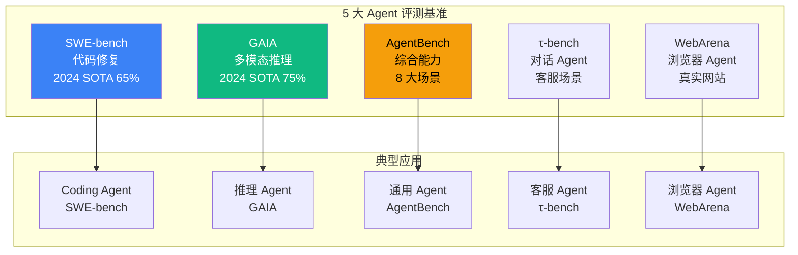

# 6.6 Agent 评测基准：SWE-bench / GAIA / AgentBench / τ-bench / WebArena

> 🟡 进阶

> **本节钩子**：评测基准 ≠ 业务指标——SWE-bench 90% 准确率不意味着你的 Coding Agent 在生产能达到 90%；基准是"上限测试"（selection），不是"性能预测"（evaluation）。**必须有自己的业务 Eval 数据集**。

## 正文大纲

1. **一句话定义**：5 大主流 Agent 评测基准——SWE-bench（代码修复）/ GAIA（多模态推理）/ AgentBench（综合能力）/ τ-bench（对话 Agent）/ WebArena（浏览器 Agent）。
2. **适用场景**（3 典型 + 2 反例）：
   - **典型 1**：模型选型——新模型发布时，跑 5 大基准看 SOTA 排名（对比 Claude / GPT / Gemini）。
   - **典型 2**：能力对齐——自研 Agent 与业界 SOTA 的能力差距（"我的 Coding Agent 比 SWE-bench SOTA 差多少"）。
   - **典型 3**：回归基线——Agent 重大升级前用基准跑一遍，确认没退化。
   - **反例 1**：用基准预测业务表现——SWE-bench 65% 不等于生产业务 65%，必须建业务 Eval。
   - **反例 2**：用单一基准评估一切——SWE-bench 只测代码修复，不测对话能力；多能力 Agent 需多基准组合。
3. **5 大基准详情**：
   - **SWE-bench**：从 GitHub Issue 提取的真实代码修复任务，评估 Coding Agent 能力（Python，2024 SOTA 约 65%）。
   - **GAIA**：多模态推理（文件 + 网页 + 图像），评估 Agent 综合推理（2024 SOTA 约 75%）。
   - **AgentBench**：8 大场景综合（OS / DB / Web / Game / 等），评估通用 Agent。
   - **τ-bench**：客服对话 Agent 评测（Sierra 2024），多轮对话 + 工具调用。
   - **WebArena**：浏览器 Agent 评测（CMU 2023），真实网站交互。
4. **关键概念**：基准数据集 / Pass@1 评分 / SOTA 排名 / 局限分析。
5. **代码示例**：SWE-bench 评估流程伪代码（见代码块）。
6. **与其他节对比**：6.5 vs 6.6 主观 vs 业界 / 6.6 vs 6.7 准确率 vs 成本。

## 图



> Source: SWE-bench Paper (Jimenez et al. 2024, https://arxiv.org/abs/2310.06770), GAIA Paper (Mialon et al. 2023, https://arxiv.org/abs/2311.12983), AgentBench GitHub (https://github.com/THUDM/AgentBench).

## 代码

```python
# benchmark_runner.py
"""
SWE-bench 评估流程伪代码（10 行）
"""
from swebench import SWEBenchDataset, run_evaluation

# 1. 加载 SWE-bench 数据集（500 个真实 GitHub Issue + 修复）
dataset = SWEBenchDataset(split="verified", instance_count=500)

# 2. 跑 Coding Agent 评估（生成 patch + 跑测试）
results = run_evaluation(
    agent=my_coding_agent,  # 你的 Coding Agent 函数
    dataset=dataset,
    timeout=1800,  # 单个任务 30 分钟超时
)

# 3. 输出报告（Pass@1 准确率 + 单任务耗时分布）
print(f"SWE-bench Pass@1: {results.pass_at_1 * 100:.1f}%")
print(f"平均耗时: {results.avg_duration:.0f}s")
print(f"P95 耗时: {results.p95_duration:.0f}s")
```

实战要点：

1. **基准是上限测试**——SWE-bench 65% 意味着"在 SWE-bench 风格的 GitHub Issue 上"，不是"你的业务代码"。
2. **必须有自己的业务 Eval**——把 SWE-bench 当"参考"，建自己的 golden dataset 才反映业务。
3. **2025 SOTA 变化快**——本文数据截至 2024 Q4，引用时标注"截至 YYYY-MM"。

## 反模式

- **❌ "SWE-bench 90% = 我的 Coding Agent 90%"**——错；基准是上限测试，不预测业务表现；业务代码有自己的语言/框架/上下文。
- **❌ "只跑基准不建业务 Eval"**——错；没有业务数据集，基准数据无业务价值；SOTA 排名只能横向对比，不能纵向指导迭代。

## 节对比

| 维度 | 6.5 LLM-as-Judge | 6.6 评测基准 | 6.7 成本监控 |
|---|---|---|---|
| 视角 | 评估器（LLM 当裁判） | 业界基准（数据集 + 评分） | 成本分解（Token + 工具 + 缓存） |
| 抽象度 | 实现层 | 数据集层 | 监控层 |
| 工具 | MT-Bench + Judge LLM | SWE-bench / GAIA / AgentBench | OTel + Langfuse cost tracking |
| 读者 | 想用 LLM 当裁判的人 | 想对比 SOTA 的人 | 想控制成本的人 |
| 成本 | 中（每次评测调 2-6 次 LLM） | 高（千级 task 跑完整流程） | 低（聚合已有 trace） |

## 工具映射

| 基准 | GitHub | 用途 | 数据规模 |
|---|---|---|---|
| SWE-bench | `github.com/SWE-bench/SWE-bench` | 代码修复 | 500 issues |
| GAIA | `github.com/gaia-benchmark/gaia` | 多模态推理 | 450 tasks |
| AgentBench | `github.com/THUDM/AgentBench` | 综合能力 | 8 场景 |
| τ-bench | `github.com/sierra-research/tau-bench` | 对话 Agent | 客服场景 |
| WebArena | `github.com/web-arena-x/webarena` | 浏览器 Agent | 真实网站 |

## 自测题

1. **概念辨析**：SWE-bench vs GAIA vs AgentBench 的核心差异？
2. **场景判断**：Coding Agent 应该用哪个基准评估？
3. **代码补全**：补全 SWE-bench 评估的超时参数（30 分钟 = ? 秒）。
4. **反直觉**：为什么 SWE-bench 高分不等于业务表现好？
5. **对比**：6.5 vs 6.6 vs 6.7 的视角差异？

**答案**：

1. **核心差异**：① **SWE-bench**——单任务类型（代码修复），输入是 GitHub Issue + 仓库，输出是 patch，跑单元测试验证。② **GAIA**——多模态输入（文件 + 网页 + 图像），多步推理，输出是文本答案。③ **AgentBench**——8 大场景（OS / DB / Web / Game / 等），覆盖最广但单场景深度浅。**选型建议**：Coding 选 SWE-bench；多模态选 GAIA；通用 Agent 选 AgentBench。
2. **SWE-bench**——专为代码修复设计，从真实 GitHub Issue 提取，包含单元测试验证。GAIA 多模态推理不适合纯代码任务；AgentBench 虽包含代码但深度不足；τ-bench 对话场景不适用；WebArena 浏览器场景不适用。
3. `timeout=1800`（30 × 60 = 1800 秒）——SWE-bench 单任务常涉及"读仓库 + 改文件 + 跑测试"，30 分钟是经验值；太短会误杀复杂任务，太长会拖慢评估；与 6.2 OpenTelemetry 的 span timeout 概念一致（详见 `6.2-opentelemetry-agents.md`）。
4. **三个原因**：① **任务分布差异**——SWE-bench 是公开 Python 项目的通用 Issue，业务代码是私有仓库 + 特定框架（React / Go / 内部库），模型没见过。② **上下文深度**——SWE-bench 任务描述短（Issue + 几个文件），业务任务往往涉及跨服务依赖 + 业务规则。③ **评估标准**——SWE-bench 用单元测试通过率，业务看"用户是否满意 + 是否转化"。**正解**：把 SWE-bench 当"能力上限参考"，必须建业务 golden dataset。
5. **视角差异**：6.5 主观质量（LLM 当裁判评开放输出）→ 6.6 业界对齐（公开数据集横向对比 SOTA）→ 6.7 成本可控（把 eval 跑得起、跑得便宜）。**落地路径**：6.5 评"我的 Agent 输出质量"→ 6.6 看"业界 SOTA 在哪"→ 6.7 控"评测成本别爆"。

> 📚 本节参考
> - [S 级] Jimenez et al., "SWE-bench: Can Language Models Resolve Real-World GitHub Issues?" (2024) — https://arxiv.org/abs/2310.06770
> - [S 级] Mialon et al., "GAIA: A Benchmark for General AI Assistants" (2023) — https://arxiv.org/abs/2311.12983
> - [S 级] AgentBench GitHub — https://github.com/THUDM/AgentBench
> - [A 级] Lilian Weng, "LLM Powered Autonomous Agents" (2023) — https://lilianweng.github.io/posts/2023-06-23-agent/
