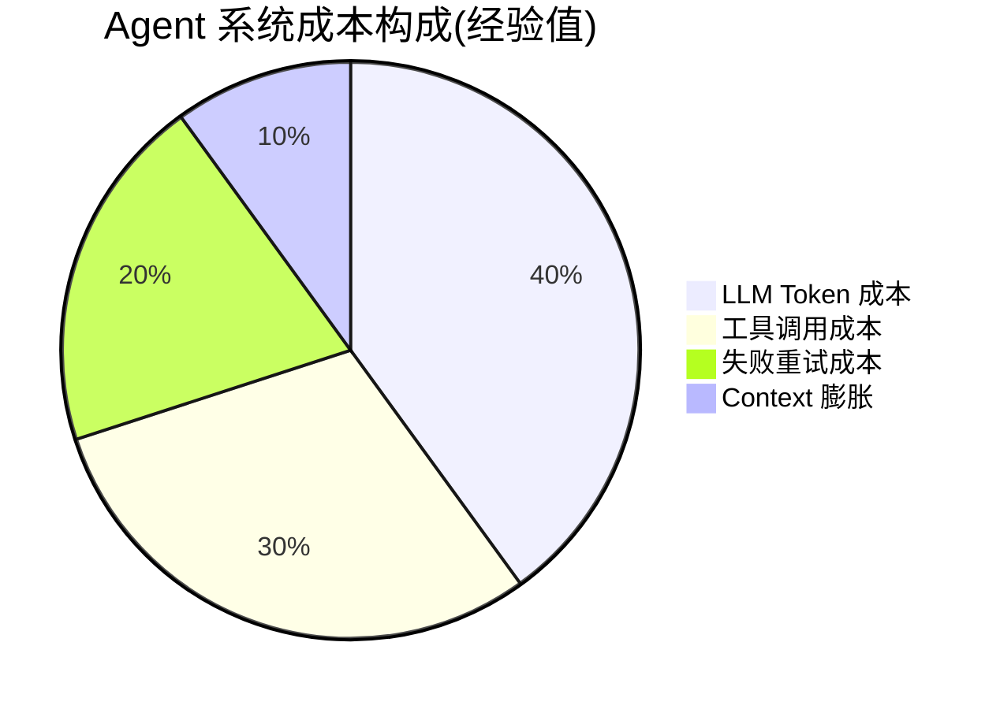

# 6.7 成本监控：Token × 工具调用 × 缓存命中率

> 🟡 进阶

> **本节钩子**：Agent 成本 ≠ LLM Token 成本——实际生产中，**工具调用次数 + 失败重试 + Context 膨胀**往往占 60% 成本，LLM Token 只占 40%。优化 Agent 成本必须从 Trace 而非账单看。

## 正文大纲

1. **一句话定义**：Agent 系统的"成本仪表盘"——按 Trace 维度统计 4 类成本（LLM Token / 工具调用 / 失败重试 / 缓存命中率），用 OTel Span attribute + Langfuse cost tracking 实现归因。
2. **适用场景**（3 典型 + 2 反例）：
   - **典型 1**：成本归因——CTO 问"为什么这个功能成本翻倍"时，按 Trace 定位"哪个 Span 贵"。
   - **典型 2**：预算告警——设"单次 Trace > $0.1 告警"，提前发现异常（如 Loop / 死循环）。
   - **典型 3**：模型选型——对比 Claude Opus 4-7 vs Sonnet 4-6 的实际 Trace 成本而非标价。
   - **反例 1**：把账单当监控——账单是汇总，无法定位"哪个 Span 贵"，必须从 Trace 看。
   - **反例 2**：只算 Token——工具调用 + 失败重试占 50%+ 成本，必须全维度核算。
3. **4 类成本**：
   - **LLM Token 成本**：input / output / cache 三类 token × 模型单价（按 Span attribute `gen_ai.usage.input_tokens` 等聚合）。截至 2025-Q4，Claude Opus 4-7 input $15/MTok，output $75/MTok。
   - **工具调用成本**：每次工具调用的 API 费用 + 时间成本（如 Exa 搜索 $1/1k 次、Tavily $1/1k 次）。
   - **失败重试成本**：错误率 × 平均重试次数 × 单次成本——一次网络抖动可能放大 3x。
   - **Context 膨胀成本**：多轮对话 / RAG 检索累积的 input token，单次 Trace 可能膨胀 5-10x。
4. **关键概念**：OTel cost attribute / Langfuse 归因 / Prompt Cache（5min TTL, 命中 90% 折扣）/ Semantic Cache（自定义命中率 30-60%）。
5. **代码示例**：OTel cost attribute + Langfuse 成本归因（见代码块）。
6. **与其他节对比**：6.7 vs 6.6 成本 vs 准确率 / 6.7 vs 6.8 成本 vs 延迟。

## 图



> Source: OpenTelemetry GenAI Semantic Conventions (https://github.com/open-telemetry/semantic-conventions), Eugene Yan "Patterns for Building LLM-based Systems & Products" (2023, https://eugeneyan.com/writing/llm-patterns/).

## 代码

```python
# cost_monitoring.py
"""
OTel cost attribute + Langfuse 成本归因（15 行）
"""
from opentelemetry import trace

tracer = trace.get_tracer(__name__)
# 模型单价（USD / 1K tokens，截至 2025-Q4）
MODEL_PRICING = {
    "claude-opus-4-7": {"input": 0.015, "output": 0.075},
    "claude-sonnet-4-6": {"input": 0.003, "output": 0.015},
}

def llm_call(prompt: str, model: str) -> str:
    with tracer.start_as_current_span("llm.call") as span:
        span.set_attribute("gen_ai.system", "anthropic")
        span.set_attribute("gen_ai.request.model", model)
        # 假设调用 LLM
        response = call_llm(prompt, model)
        # 1. 记录 token 用量
        input_tokens = response.usage.input_tokens
        output_tokens = response.usage.output_tokens
        span.set_attribute("gen_ai.usage.input_tokens", input_tokens)
        span.set_attribute("gen_ai.usage.output_tokens", output_tokens)
        # 2. 计算并记录成本（OTel cost 约定）
        pricing = MODEL_PRICING[model]
        cost_usd = (input_tokens * pricing["input"] + output_tokens * pricing["output"]) / 1000
        span.set_attribute("gen_ai.usage.cost", cost_usd)
        return response.content
```

实战要点：

1. **必须按 Trace 而非账单看**——账单是汇总，Trace 能定位"哪个 Span 贵"。
2. **Prompt Cache 90% 折扣**——Anthropic 5min cache，重复 prompt 命中后只算 10% 价格。
3. **预算告警**——Langfuse 可设"单次 Trace 成本 > $0.1 自动告警"，提前发现异常。

## 反模式

- **❌ "看账单优化成本"**——错；账单是汇总，无法定位"哪个 Span 贵"，必须从 Trace 看。
- **❌ "只算 Token 成本"**——错；工具调用 + 失败重试占 50%+ 成本，必须全维度核算。

## 节对比

| 维度 | 6.6 评测基准 | 6.7 成本监控 | 6.8 延迟分析 |
|---|---|---|---|
| 视角 | 业界基准（SWE-bench / GAIA） | 成本分解（4 类成本） | 延迟分解（TTFT / TPOT / P95） |
| 抽象度 | 数据集层 | 监控层 | 监控层 |
| 工具 | SWE-bench / GAIA / AgentBench | OTel cost + Langfuse | OTel latency + Langfuse |
| 读者 | 想对比 SOTA 的人 | 想控制成本的人 | 想优化延迟的人 |
| 输出 | Pass@1 准确率 | 单次 Trace 成本 | P95 延迟 |

## 工具映射

| 工具 | 用途 | 备注 |
|---|---|---|
| OpenTelemetry cost attribute | Span cost 记录 | `gen_ai.usage.cost` 字段 |
| Langfuse cost tracking | 成本归因 + 告警 | 按 Trace / 用户 / 功能归因 |
| Anthropic Prompt Cache | 缓存 90% 折扣 | 5min TTL |
| Semantic Cache | 自定义缓存 | 命中率 30-60% 经验值 |

## 自测题

1. **概念辨析**：Agent 系统的 4 类成本是什么？
2. **场景判断**：账单显示"本月成本翻倍"——应该从哪个维度排查？
3. **代码补全**：补全成本计算函数（含缓存折扣）。
4. **反直觉**：为什么 Agent 成本只算 Token 是错的？
5. **对比**：6.6 vs 6.7 vs 6.8 的视角差异？

**答案**：

1. **4 类成本**：① **LLM Token 成本**——input / output / cache 三类 token × 模型单价。② **工具调用成本**——每次调用的 API 费用（Exa / Tavily 等） + 时间成本。③ **失败重试成本**——错误率 × 平均重试次数 × 单次成本。④ **Context 膨胀成本**——多轮对话 / RAG 检索累积的 input token。
2. **从 Trace 维度排查**——账单只给汇总数字（"本月 $1000"），无法定位"哪个 Span 贵"。正确做法：用 Langfuse 按 Trace 聚合，看 P99 成本 Span 是什么；常见根因是某个循环未收敛（死循环调用 50 次工具）或 Context 膨胀（10 轮对话累积 50k tokens）。
3. ```python
   def calc_cost(input_tokens, output_tokens, cache_hit, model):
       p = MODEL_PRICING[model]
       # cache 命中：input 只算 10% 价格
       effective_input = input_tokens * (0.1 if cache_hit else 1.0)
       return (effective_input * p["input"] + output_tokens * p["output"]) / 1000
   ```
4. **三方面原因**：① **工具调用成本常被低估**——Exa / Tavily 每次 $0.001-0.01，多步 Agent 一次任务调 10-20 次工具轻松到 $0.1。② **失败重试放大 3-5x**——网络抖动 / 工具超时触发重试，错误率 5% × 平均 3 次重试 = 实际调用 1.15 次。③ **Context 膨胀**——多轮对话累积 10-50k tokens 的历史消息，单次成本 5x 增长。**正解**：必须 4 类成本分别核算，从 Trace 维度归因。
5. **视角差异**：6.6 业界对齐（看 SOTA 在哪）→ 6.7 成本可控（看跑得起跑不起）→ 6.8 性能可控（看用户等得起等不起）。**落地路径**：先用 6.6 选模型 → 用 6.7 控制单次 Trace 成本 → 用 6.8 控制 P95 延迟。三者构成"Agent 生产化的三维评估"：质量 / 成本 / 性能。

> 📚 本节参考
> - [S 级] OpenTelemetry GenAI Semantic Conventions — https://github.com/open-telemetry/semantic-conventions
> - [S 级] Anthropic Prompt Caching Documentation — https://docs.anthropic.com/en/docs/build-with-claude/prompt-caching
> - [S 级] Langfuse GitHub (cost tracking) — https://github.com/langfuse/langfuse
> - [A 级] Eugene Yan, "Patterns for Building LLM-based Systems & Products" (2023) — https://eugeneyan.com/writing/llm-patterns/
