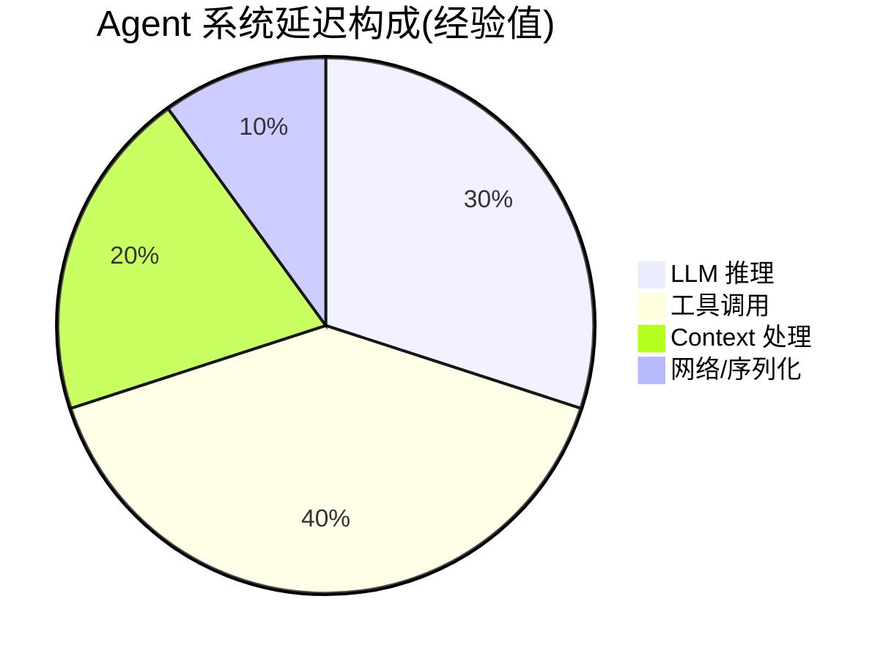

# 6.8 延迟分析：TTFT / TPOT / 端到端 P95

> 🟡 进阶

> **本节钩子**：Agent 延迟 ≠ LLM 延迟——**工具调用 + 多步链路 + Context 处理** 往往占 70%+ 延迟，LLM 推理只占 30%。优化 Agent 延迟必须 Trace 而非 API latency 看。

## 正文大纲

1. **一句话定义**：Agent 系统的"延迟分解"——按 Trace 维度统计 4 类延迟（TTFT 首 token / TPOT 每 token / 端到端 P95 / 工具调用分布），用 OTel Span attribute + Langfuse latency view 实现归因。
2. **适用场景**（3 典型 + 2 反例）：
   - **典型 1**：SLO 制定——"P95 < 3s"是用户可接受阈值（P99 会让 1% 用户失望，平均值掩盖长尾）。
   - **典型 2**：卡顿排查——用户投诉"Agent 卡顿"时，从慢 Trace Top-N 定位"哪个 Span 慢"。
   - **典型 3**：模型选型——对比 Claude Opus 4-7 vs Sonnet 4-6 的 TPOT（Opus 慢 2-3x 但质量高 5%）。
   - **反例 1**：用 LLM API latency 优化——只看到 LLM 部分，工具调用 + Context 占 70%。
   - **反例 2**：用平均延迟做 SLO——平均 800ms 掩盖了 P95 5s 的卡顿。
3. **4 类延迟**：
   - **TTFT**（Time To First Token）：从请求发出到第一个 token 返回的耗时（经验值 < 500ms），决定 Agent 体感"快不快"——>2s 用户开始焦虑。
   - **TPOT**（Time Per Output Token）：每生成一个 token 的平均耗时（经验值 20-50ms），决定"输出流畅度"——流式打字机效果。
   - **端到端 P50 / P95 / P99**：完整请求耗时的百分位，P95 是 SLO 关键——>3s 用户放弃。
   - **工具调用延迟分布**：单次工具调用的耗时分布（搜索 API 100ms / DB 查询 50ms / LLM call 800ms）。
4. **关键概念**：OTel latency attribute / Langfuse 延迟视图 / 流式 vs 非流式 / P95 而非平均 / 慢 Trace Top-N。
5. **代码示例**：OTel Span latency attribute + P95 计算 + 慢 Trace Top-N（见代码块）。
6. **与其他节对比**：6.7 vs 6.8 成本 vs 延迟 / 6.8 vs 6.9 监控 vs 实验。

## 图



> Source: OpenTelemetry GenAI Semantic Conventions (https://github.com/open-telemetry/semantic-conventions), Eugene Yan "Latency Numbers Every Engineer Should Know" (2023, https://eugeneyan.com/writing/llm-patterns/).

## 代码

```python
# latency_analysis.py
"""
OTel Span latency attribute + P95 计算（15 行）
"""
import time
from opentelemetry import trace

tracer = trace.get_tracer(__name__)

def llm_call(prompt: str) -> str:
    start = time.perf_counter()
    ttft_start = start
    first_token_received = False

    with tracer.start_as_current_span("llm.call") as span:
        # 流式调用，逐 token 记录 TTFT 和 TPOT
        full_response = ""
        for token in stream_llm(prompt):
            if not first_token_received:
                ttft = (time.perf_counter() - ttft_start) * 1000  # ms
                span.set_attribute("gen_ai.latency.ttft_ms", ttft)
                first_token_received = True
            full_response += token

        # 记录 TPOT（平均每 token 耗时）
        total_time = (time.perf_counter() - start) * 1000
        output_tokens = len(full_response.split())
        tpot = total_time / output_tokens if output_tokens else 0
        span.set_attribute("gen_ai.latency.tpot_ms", tpot)
        span.set_attribute("gen_ai.latency.total_ms", total_time)
        return full_response

def calculate_p95(latencies: list[float]) -> float:
    """从延迟样本列表计算 P95"""
    sorted_latencies = sorted(latencies)
    p95_index = int(len(sorted_latencies) * 0.95)
    return sorted_latencies[p95_index]
```

实战要点：

1. **TTFT 是 Agent 体感关键**——用户等待"首字"决定是否继续等；>2s 体验下降。
2. **P95 而非平均值**——平均值掩盖长尾问题，P95 反映真实最差 5% 用户体验。
3. **慢 Trace Top-N**——每天跑 1 次，找出 P95 中 Top-10 的 Trace 优化，单点优化收益最大。

## 反模式

- **❌ "看 LLM API latency 优化延迟"**——错；LLM 推理只占 30%，必须从 Trace 看全局。
- **❌ "用平均延迟做 SLO"**——错；平均延迟掩盖长尾，P95 才是关键指标。

## 节对比

| 维度 | 6.7 成本监控 | 6.8 延迟分析 | 6.9 A/B 与灰度 |
|---|---|---|---|
| 视角 | 成本分解（Token + 工具 + 缓存） | 延迟分解（TTFT + TPOT + P95） | 实验设计（A/B + 灰度 + 显著性） |
| 抽象度 | 监控层 | 监控层 | 决策层 |
| 工具 | OTel cost + Langfuse | OTel latency + Langfuse | Statsig / Eppo + Langfuse |
| 读者 | 想控制成本的人 | 想优化延迟的人 | 想做实验决策的人 |
| 输出 | 单次 Trace 成本 | P95 延迟 | 实验显著性 |

## 工具映射

| 工具 | 用途 | 备注 |
|---|---|---|
| OpenTelemetry latency | Span 时间记录 | `gen_ai.latency.*` 字段 |
| Langfuse latency view | 延迟分布 + 慢 Trace | P50 / P95 / P99 视图 |
| Prometheus histogram | 延迟指标聚合 | 自建监控常用 |
| 慢 Trace Top-N | 单点优化 | 每日巡检 |

## 自测题

1. **概念辨析**：TTFT vs TPOT vs P95 的含义？
2. **场景判断**：用户投诉"Agent 卡顿"——应该从哪个指标排查？
3. **代码补全**：补全 P95 计算函数。
4. **反直觉**：为什么平均延迟不能反映真实体验？
5. **对比**：6.7 vs 6.8 vs 6.9 的视角差异？

**答案**：

1. **三组概念**：① **TTFT**（Time To First Token）——从请求发出到第一个 token 返回的耗时，决定"快不快"的体感。② **TPOT**（Time Per Output Token）——每生成一个 token 的平均耗时，决定"输出流畅度"。③ **端到端 P95**——完整请求耗时的 95 分位，是 SLO 制定的关键指标（>3s 用户放弃）。
2. **从慢 Trace Top-N 排查**——用户投诉卡顿，说明 P95 退化。正确做法：① 用 Langfuse 拉"过去 24h P95 Top-10 Trace"；② 看每个 Trace 的 Span 树，找"耗时最长的 Span"；③ 常见根因是某工具慢（搜索 API 5s）/ Context 膨胀（10 轮 50k tokens，序列化慢）/ LLM 限流（重试 3 次）。
3. ```python
   def calculate_p95(latencies: list[float]) -> float:
       """从延迟样本列表计算 P95"""
       if not latencies:
           return 0.0
       sorted_lat = sorted(latencies)
       # 95 分位索引（向下取整）
       p95_index = int(len(sorted_lat) * 0.95)
       return sorted_lat[min(p95_index, len(sorted_lat) - 1)]
   ```
4. **长尾问题**：平均延迟会被"快速样本"拉低（多数请求 800ms），但"慢请求 5s"被淹没。例：100 个请求，95 个 800ms + 5 个 5000ms，平均 1030ms，但 P95 = 5000ms——真实最差 5% 用户等了 5s。**正解**：用 P95 / P99 做 SLO，告警阈值基于分位数。
5. **视角差异**：6.7 成本可控（看跑得起跑不起）→ 6.8 性能可控（看用户等得起等不起）→ 6.9 决策可控（看 A/B 选哪个版本）。**落地路径**：先用 6.7 控制单次 Trace 成本 → 用 6.8 控制 P95 延迟 → 用 6.9 决定哪个版本上线。三者构成"Agent 生产化的三维治理"：成本 / 性能 / 实验。

> 📚 本节参考
> - [S 级] OpenTelemetry GenAI Semantic Conventions — https://github.com/open-telemetry/semantic-conventions
> - [S 级] Anthropic Prompt Caching (latency impact) — https://docs.anthropic.com/en/docs/build-with-claude/prompt-caching
> - [S 级] Langfuse GitHub (latency tracking) — https://github.com/langfuse/langfuse
> - [A 级] Eugene Yan, "Patterns for Building LLM-based Systems & Products" (2023) — https://eugeneyan.com/writing/llm-patterns/
> - [A 级] Lilian Weng, "LLM Powered Autonomous Agents" (2023) — https://lilianweng.github.io/posts/2023-06-23-agent/
