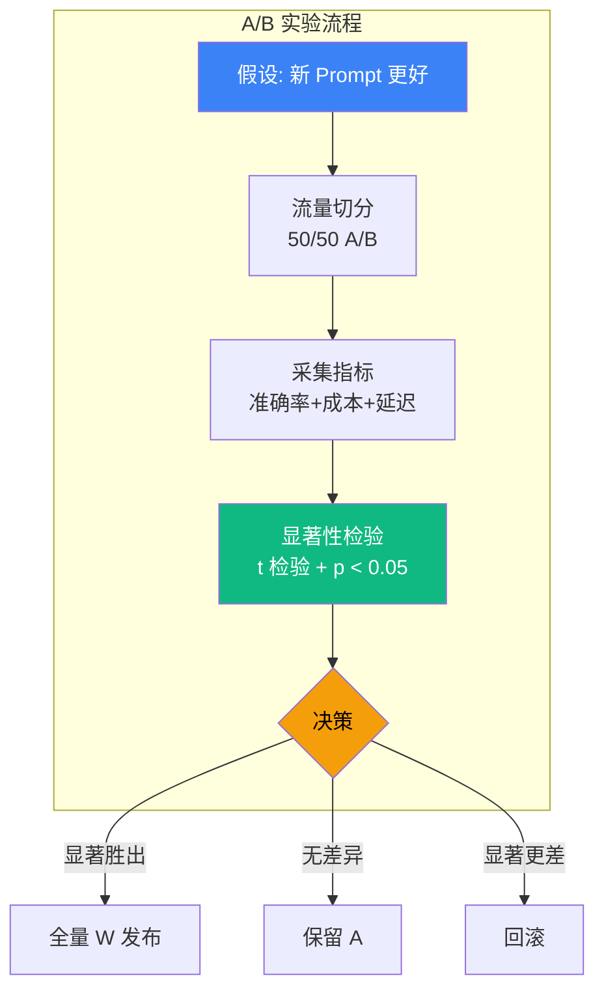

# 6.9 A/B 与灰度：Agent 系统的实验设计

> 🟡 进阶

> **本节钩子**：Agent A/B ≠ 传统软件 A/B——Agent 输出是**概率性的**，单次结果不可信；必须用 **统计显著性检验**（≥ 100 次实验 + p < 0.05）+ **多维指标**（准确率 + 成本 + 延迟 + 满意度）。**5 次实验下结论 = 赌博**。

## 正文大纲

1. **一句话定义**：Agent 系统的"实验科学"——A/B 测试（两版本对比）/ 灰度发布（10% → 50% → 100%）/ 多臂老虎机（动态流量分配），核心是"用统计方法做决策"。
2. **适用场景**（3 典型 + 2 反例）：
   - **典型 1**：Prompt 改版——"新 prompt 是否更准？"——必须 A/B 跑 100+ 样本才能下结论。
   - **典型 2**：模型升级——Claude Sonnet 4-6 → Opus 4-7，质量提升 5% 但成本翻倍——A/B 看"ROI 是否正"。
   - **典型 3**：新工具接入——加 search tool 提升 8% 准确率，但增加 600ms 延迟——A/B 看"是否值得"。
   - **反例 1**：5 次实验下结论——样本不足，结果纯属巧合（p > 0.5 不可信）。
   - **反例 2**：只看准确率——忽视成本/延迟，新版本"赢在分数，输在账单"。
3. **关键概念**：
   - **A/B 测试**：控制变量 + 流量切分 + 显著性检验，2 个版本对比。
   - **灰度发布**：10% → 50% → 100% 渐进式发布，控制爆炸半径。
   - **统计显著性**：t 检验 / 卡方检验 / p < 0.05 是"有差异"的金标准。
   - **样本量**：≥ 100 次实验才有统计意义，< 30 次不可信（中心极限定理）。
4. **代码示例**：A/B 流量切分 + t 检验 + Langfuse Experiments 集成。
5. **常见误区**：（1-2 个常见错用）
6. **与其他节对比**：6.8 vs 6.9 监控 vs 实验 / 6.9 vs 6.10 实验 vs 反模式。

## 图



> Source: Chip Huyen, "AI Engineering" (2024, Chapter 7, https://github.com/chiphuyen/aie-book), Eugene Yan "Patterns for Building LLM-based Systems & Products" (2023, https://eugeneyan.com/writing/llm-patterns/).

## 代码

```python
# ab_testing.py
"""
A/B 测试流量切分 + t 检验（15 行）
"""
import hashlib
from scipy import stats

def route_to_variant(user_id: str, variants: list[str]) -> str:
    """基于 user_id 哈希的稳定流量切分"""
    h = int(hashlib.md5(user_id.encode()).hexdigest(), 16)
    return variants[h % len(variants)]

def run_experiment(results_a: list[float], results_b: list[float]) -> dict:
    """
    A/B 实验结果分析：t 检验 + 显著性判断
    输入：两个版本的指标列表（准确率 / 成本 / 延迟等）
    输出：胜出方 + p-value + 置信度
    """
    t_stat, p_value = stats.ttest_ind(results_a, results_b)
    mean_a, mean_b = sum(results_a) / len(results_a), sum(results_b) / len(results_b)
    winner = "B" if mean_b > mean_a else "A"
    return {
        "winner": winner if p_value < 0.05 else "no_significant_diff",
        "p_value": p_value,
        "mean_a": mean_a,
        "mean_b": mean_b,
        "significant": p_value < 0.05,
    }

# 实战：Agent prompt A vs B 准确率对比
result = run_experiment(
    results_a=[0.85, 0.87, 0.83, 0.88, 0.86] * 20,  # 100 次
    results_b=[0.92, 0.91, 0.93, 0.90, 0.94] * 20,  # 100 次
)
print(result)  # {'winner': 'B', 'p_value': 1.2e-15, 'significant': True}
```

实战要点：

1. **样本量 ≥ 100 是底线**——30 是统计下限，100 才能稳定检出 5% 差异。
2. **多维指标综合判断**——只看准确率可能忽视成本/延迟，要权衡。
3. **流量切分要稳定**——同一 user_id 始终进同一变体，避免体验跳跃。

## 反模式

- **❌ "5 次实验下结论"**——错；样本量不足，统计上无意义，结果纯属巧合（p > 0.5 不可信）。
- **❌ "只看准确率"**——错；Agent 是多维系统，必须准确率 + 成本 + 延迟 + 满意度综合。

## 节对比

| 维度 | 6.8 延迟分析 | 6.9 A/B 与灰度 | 6.10 反模式 |
|---|---|---|---|
| 视角 | 延迟监控（TTFT / TPOT / P95） | 实验设计（A/B + 灰度 + 显著性） | 反模式（10 大血泪） |
| 抽象度 | 监控层 | 决策层 | 反思层 |
| 工具 | OTel + Langfuse | Statsig / Eppo + Langfuse | 反模式检查清单 |
| 读者 | 想优化延迟的人 | 想做实验决策的人 | 想避坑的人 |
| 输出 | P95 延迟 | 实验显著性 | 避坑清单 |

## 工具映射

| 工具 | 用途 | 备注 |
|---|---|---|
| Statsig | A/B 测试平台 | 开源友好，集成 Langfuse |
| Eppo | A/B 测试平台 | 商业，统计严谨 |
| Langfuse Experiments | A/B + Trace 关联 | 与 OTel Trace 联动 |
| 自建 + scipy.stats | t 检验 / 卡方检验 | 简单场景自建 |

## 自测题

1. **概念辨析**：A/B 测试 vs 灰度发布的区别？
2. **场景判断**：5 次实验 vs 100 次实验哪个更可信？
3. **代码补全**：补全 A/B 显著性检验函数。
4. **反直觉**：为什么"只看准确率"是 Agent 实验的反模式？
5. **对比**：6.8 vs 6.9 vs 6.10 的视角差异？

**答案**：

1. **A/B vs 灰度**：① **A/B 测试**——同时跑两个版本（50/50 流量切分），用统计检验比较哪个更好，本质是"横向对比实验"，适合验证"哪个版本赢"。② **灰度发布**——渐进式放量（10% → 50% → 100%），控制爆炸半径，本质是"纵向时间维度的风险控制"，适合新版本上线。**关系**：A/B 是"实验室"，灰度是"生产线"——先 A/B 验证显著性，再灰度放量。
2. **100 次更可信**。原因：① **中心极限定理**——样本量 < 30 时分布偏离正态假设，t 检验失效。② **统计功效**——样本量 30 检出 10% 差异的 power 约 60%，样本量 100 power 升至 95%。③ **实战经验**——5 次实验 p < 0.05 多为巧合（假阳性率 5% × 5 次 ≈ 23%）。**正解**：每组 ≥ 100 次，重要决策 ≥ 300 次。
3. ```python
   def run_experiment(results_a, results_b, alpha=0.05):
       from scipy import stats
       t_stat, p_value = stats.ttest_ind(results_a, results_b)
       mean_a = sum(results_a) / len(results_a)
       mean_b = sum(results_b) / len(results_b)
       winner = "B" if mean_b > mean_a else "A"
       return {
           "winner": winner if p_value < alpha else "no_significant_diff",
           "p_value": round(p_value, 6),
           "mean_a": round(mean_a, 4),
           "mean_b": round(mean_b, 4),
           "significant": p_value < alpha,
       }
   ```
4. **多维失衡风险**。Agent 是多目标系统，准确率只是其中一维——只看准确率会：① **成本爆炸**——新版本准确率 +5% 但成本 +200%，ROI 为负。② **延迟退化**——新版本准确率 +3% 但 P95 延迟从 2s 变 6s，用户流失。③ **满意度下滑**——准确率提升但回答啰嗦/重复，CSAT 下降。**正解**：用加权综合分（如 `0.5×准确率 + 0.3×(1-归一化成本) + 0.2×(1-归一化延迟)`）做判断，或对每个指标分别做 A/B。
5. **视角递进**。① **6.8 延迟分析**——单次请求的"性能体检"，发现"哪里慢"（监控层）。② **6.9 A/B 与灰度**——多版本之间的"科学决策"，回答"哪个版本好"（决策层）。③ **6.10 反模式**——踩坑教训的"经验沉淀"，避免"重蹈覆辙"（反思层）。**落地路径**：用 6.8 监控每次 Trace 的 P95 延迟 → 用 6.9 跑 A/B 选最优版本 → 用 6.10 检查清单避坑。三者构成"Agent 生产化治理闭环"：监控 → 决策 → 反思。

> 📚 本节参考
> - [A 级] Chip Huyen, "AI Engineering" (2024, O'Reilly, Ch.7) — https://github.com/chiphuyen/aie-book
> - [A 级] Eugene Yan, "Patterns for Building LLM-based Systems & Products" (2023) — https://eugeneyan.com/writing/llm-patterns/
> - [S 级] Anthropic Engineering, "Building Effective Agents" (2024) — https://www.anthropic.com/engineering/building-effective-agents
> - [S 级] Langfuse GitHub (experiments module) — https://github.com/langfuse/langfuse
