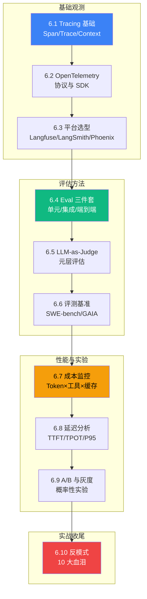

# L6 · 可观测与评估层（10 节 / 1.16 万字）

> 🟡 进阶

> **本层定位**：从"**能跑**"到"**跑得对、跑得稳、跑得起**"——质量保证层。L4 讲"框架怎么用",L5 讲"模式怎么搭",L6 讲"搭好的 Agent 怎么**度量、评估、观测**"。读完 L6 后,能为任意 Agent 系统接入 Tracing + Eval + 监控,回答"这个 Agent 在生产环境到底表现如何"。

## 可观测全景图



> Source: 基于 OpenTelemetry 语义约定 + MT-Bench 论文 + Lilian Weng "LLM Powered Autonomous Agents" 整合。

## 10 节一句话导览

| 节 | 主题 | 一句话 |
|---|---|---|
| 6.1 | Tracing 基础 | Span / Trace / Context Propagation 概念与调用树 |
| 6.2 | OpenTelemetry 落地 | OTel SDK + GenAI 语义约定,跨平台可观测协议 |
| 6.3 | 平台选型 | Langfuse / LangSmith / Arize Phoenix 横向对比决策 |
| 6.4 | Eval 三件套 | 单元 / 集成 / 端到端测试金字塔 + CI 集成 |
| 6.5 | LLM-as-Judge | LLM 当裁判 + 4 大偏差(长度/位置/自我偏好/格式)缓解 |
| 6.6 | 评测基准 | SWE-bench / GAIA / AgentBench / τ-bench / WebArena 横评 |
| 6.7 | 成本监控 | Token × 工具调用 × 缓存命中率三维成本归因 |
| 6.8 | 延迟分析 | TTFT / TPOT / 端到端 P95 分解 + 慢 Trace Top-N |
| 6.9 | A/B 与灰度 | 概率性实验 + 显著性检验 + 灰度流量切分 |
| 6.10 | 反模式 | 10 大可观测性血泪清单(采集/指标/评估/运营 4 类) |

## 学习路径

- **必读路径**(🟡 核心 / 4 节):6.1 → 6.4 → 6.5 → 6.7
  - 7 天接入 OpenTelemetry + 写 3 类 Eval + 成本仪表盘
- **进阶路径**(🟡 进阶 / 6 节):6.2 → 6.3 → 6.6 → 6.8 → 6.9 → 6.10
  - 30 天建完整可观测体系(协议+平台+基准+性能+实验+避坑)
- **速读路径**(4 节精华):6.1 → 6.5 → 6.7 → 6.10
  - 1 小时掌握 Agent 度量骨架

## 与其他层衔接

| 层 | 衔接点 |
|---|---|
| **L4 框架** | L4.3 LangGraph StateGraph + Checkpoint 是 6.1 Tracing 的天然数据源;6.2 OTel SDK 是 L4 框架原生导出 |
| **L5 模式** | L5.8 Evaluator-Optimizer(模式)与 6.5 LLM-as-Judge(评估器)是"模式 vs 评估器"正反对照;L5.11 Multi-Agent 反模式 与 6.10 可观测性反模式形成"模式 + 观测"双重血泪清单 |
| **L7 生产** | 6.9 A/B 与灰度是 L7.7 容量评估的实验基础;6.10 反模式是 L7.9 SLA 的"避坑地图";6.7/6.8 成本延迟是 L7.1-7.5 防护的直接输入 |
| **L8 案例** | L8.2 Coding Agent 与 L8.3 DB Agent 是 L6 真实落地案例——Langfuse + LangSmith + Phoenix 在两类系统中的实际配置 |

## L6 关键概念地图

```
可观测性(Observability)
├── Tracing(分布式追踪):Span / Trace / Context Propagation
│   ├── 协议:OpenTelemetry (Traces + Metrics + Logs 三件套)
│   └── 平台:Langfuse(开源自托管) / LangSmith(商业) / Arize Phoenix(评估强项)
├── Evaluation(评估)
│   ├── 测试金字塔:单元(单 LLM)/ 集成(多步)/ 端到端(任务)
│   ├── 评估器:Rule-based / LLM-as-Judge / Human
│   └── 基准:SWE-bench / GAIA / AgentBench / τ-bench / WebArena
├── 性能(Performance)
│   ├── 成本:Token × 工具调用 × 缓存命中率
│   └── 延迟:TTFT / TPOT / P95 / P99 + 工具调用延迟
└── 实验(Experimentation)
    ├── A/B 测试:统计显著性(p < 0.05,样本量 ≥100)
    └── 灰度发布:10% → 50% → 100% 流量切分
```

> 📚 本章参考
> - [S 级] OpenTelemetry Semantic Conventions for GenAI — https://github.com/open-telemetry/semantic-conventions
> - [S 级] Zheng et al., *Judging LLM-as-a-Judge with MT-Bench* (2023) — https://arxiv.org/abs/2306.05685
> - [A 级] Lilian Weng, *LLM Powered Autonomous Agents* (2023) — https://lilianweng.github.io/posts/2023-06-23-agent/