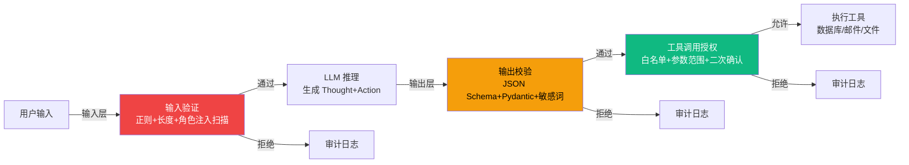

# 7.1 Guardrails:输入/输出/工具三层防护

> 🟡 进阶

> **本节钩子**:Guardrails 不是"加更多规则"——而是**默认拒绝 + 白名单**比黑名单安全 10x;规则越多越脆弱。

## 正文大纲

1. **意图**:Guardrails 是 L7 的"骨架"——**输入验证 + 输出校验 + 工具调用授权** 三层防护栏。
2. **适用场景**:
   - **典型 1**:用户输入面大的对话 Agent——输入长度限制 + 角色注入拦截。
   - **典型 2**:调外部工具的 Agent(数据库/邮件)——工具白名单 + 输出结构化校验。
   - **典型 3**:多租户 SaaS Agent——租户级隔离 + 危险操作二次确认。
   - **反例**:Prompt 实验阶段只需输入 + 输出层,工具层留空。
3. **关键机制**:
   - **输入验证(Pre-LLM)**:正则白名单、长度上限(8k token)、角色注入词清单。
   - **输出校验(Post-LLM)**:结构化输出(JSON Schema 强制)、Pydantic schema 校验。
   - **工具调用授权(Pre-Tool)**:工具白名单、参数范围校验、危险操作二次确认。
4. **代码骨架**:**三层决策矩阵**作为配置骨架:
   - 输入层默认 `reject`(拒绝 + 400 + 审计)。
   - 输出层默认 `retry-once`(失败 → 修正 → 再失败 reject)。
   - 工具层默认 `allowlist-only`(注册过 + 参数白名单才放行)。
5. **反模式**:
   - ❌ **黑名单 + 字符串匹配**——同形字/零宽空格可绕过。**必须**白名单 + 结构化校验。
   - ❌ **规则越加越多**——规则间冲突概率上升。**正确做法**:规则 ≤ 20 条 + 命中即 hard reject。
6. **与其他节对比**:

| 维度 | 7.1 Guardrails | 7.2 Prompt Injection | 7.3 工具权限 | 7.5 鉴权 |
|---|---|---|---|---|
| 视角 | 通用防护概念 | 特定攻击类型 | 工具权限设计 | 用户态/工具态分离 |
| 触发时机 | 全程(输入/输出/工具三层) | 输入污染 + 工具结果回灌 | 工具调用前授权 | 用户登录/会话开始 |
| 维护成本 | 中(规则 ≤ 20 条) | 高(攻击向量持续演进) | 中(RBAC/ABAC 配置) | 中(token 轮换 + 审计) |
| 攻击面 | 全部(LLM 决策的所有出口) | 上下文污染 | 越权调用 | 身份伪造 |

## 图



> 三层防护对应颜色:🔴 红=输入层 / 🟠 橙=输出层 / 🟢 绿=工具层;任一层 reject 都写入审计日志,供 L6.x 关联分析。

## 代码

实战要点(本节豁免大段代码):

1. **三层独立部署**:输入层用 nginx/WAF(快),输出层用 Pydantic(中速),工具层用 OPA(慢)。**不要**让 LLM 上下文判断三件事。
2. **白名单优于黑名单**:工具白名单注册 5-10 个,危险词清单 ≤ 20 条。允许列表比拒绝列表安全 10x。
3. **二次确认不替代白名单**:`delete user` 类操作必须既在白名单又触发二次确认(看 SQL + 输入 yes/no)。

## 工具映射

| 工具 | 用途 | 备注 |
|---|---|---|
| Open Policy Agent (OPA) | 策略引擎 | Rego + 白名单 |
| LangChain Output Parser | 输出校验 | Pydantic 结构化 |
| Guardrails AI | 输入输出校验 | 商业+开源双轨 |
| NeMo Guardrails | 对话级护栏 | NVIDIA 开源 |
| Pydantic v2 | 输出结构化 | 底层依赖 |

## 自测题

1. **概念辨析**:三层防护各自的触发时机?为什么工具层放在"最后一次拦截"而不是 LLM 推理后立即拦截?
2. **场景判断**:下面哪些场景**必须**用 Guardrails?(多选)
   - A. 公司内部跑批的 ETL Agent,只读 MySQL,无外部用户
   - B. 对外客服 Agent,接 Slack/邮件,需调订单系统
   - C. 个人写的一次性脚本,跑完就删
   - D. 多租户 SaaS 数据分析 Agent,用户可上传 CSV
3. **代码补全**:补全下面的工具白名单校验逻辑:
   ```python
   ALLOWED_TOOLS = {"db.read", "db.count", "search.web"}

   def authorize_tool(tool_name: str, args: dict) -> bool:
       # 缺什么?
       pass
   ```
4. **反直觉题**:为什么"规则越多,系统越脆弱"?给出 2 个具体原因。
5. **对比题**:Guardrails 与 Prompt Injection 防护是什么关系?7.1 是不是"包含" 7.2?

**答案**:

1. **触发时机**:输入层——LLM 推理**前**;输出层——LLM 推理**后**、工具调用**前**;工具层——工具调用**前**的最后拦截。**独立原因**:LLM 可能输出格式正确但语义危险的调用(如 `db.execute("DROP TABLE users")`),输出校验只验结构;工具层做语义/参数校验。
2. **B、D 必须用**。A 只读无外部输入;C 一次性脚本没必要。
3. 缺**两段检查**:`if tool_name not in ALLOWED_TOOLS: return False`(白名单)+ `if not validate_args(args): return False`(参数范围)。**关键**:先白名单再参数。
4. **两个原因**:① **规则冲突**——加一条新规则要把所有旧规则相互作用重测,O(n²) 成本;② **攻击面扩大**——每条规则是潜在绕过点。**做法**:规则 ≤ 20 条 + 默认 reject + 命中即 hard fail。
5. **包含关系**:7.1 是"通用防护"(三层骨架),7.2 是"特定攻击的纵深"。**7.2 防护完全落在 7.1 三层里**:输入层加角色注入词清单、输出层加结构化校验、工具层加"工具结果回灌时再校验"(防间接注入)。**结论**:7.2 ⊂ 7.1。

> 📚 本节参考
> - [S 级] Open Policy Agent (OPA) GitHub — https://github.com/open-policy-agent/opa
> - [S 级] OWASP Top 10 for LLM Applications — https://github.com/OWASP/www-project-top-10-for-large-language-models-applications
> - [A 级] Lilian Weng, *LLM Powered Autonomous Agents* (2023) — https://lilianweng.github.io/posts/2023-06-23-agent/
> - [A 级] Anthropic, *Building Effective Agents* (2024) — https://anthropic.com/engineering/building-effective-agents
