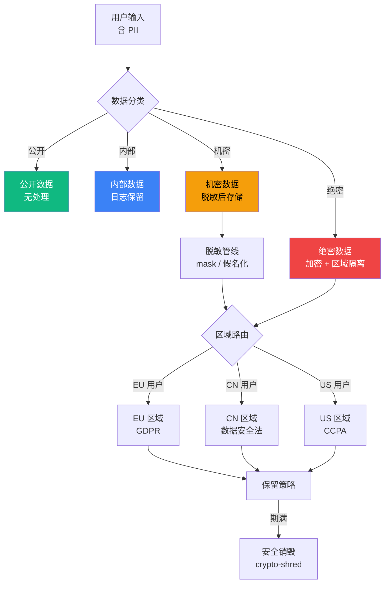

# 7.10 合规与审计：日志保留/数据脱敏/区域合规

> 🔴 专家

> **本节钩子**(反直觉):合规 ≠ "日志全留"——必须**分层保留 + 自动脱敏 + 区域隔离**;GDPR/CCPA "被遗忘权"触发时找不到数据删除才是真合规;**全留 = 合规风险**(持有越多越危险)。

## 正文大纲

1. **意图**:Agent 系统进入生产后,合规风险来自三个层面——**日志保留周期**(保留多久销毁)、**数据脱敏**(PII 是否落地)、**区域合规**(GDPR/CCPA/中国《数据安全法》的跨境要求)。**核心理念**:**数据是 liability 而非 asset**——持有越多,合规风险越大,GDPR 罚款按营业额高比例计算,数据最小化才是合规最优解。

2. **适用场景**(3 典型 + 2 反例):
   - **典型 1**:企业级 Agent——GDPR(欧盟)/ 等保 2.0(国内)/ SOC2(美国)。
   - **典型 2**:医疗 Agent——HIPAA 强约束,病历单独加密 + 严格保留期 + 访问审计。
   - **典型 3**:跨国 Agent——同服务承载多国用户,数据落地必须 region-aware,跨境需 consent + 合规评估。
   - **反例 1**:日志全留 PII 不脱敏——GDPR 触发时无法定位删除,法律风险。
   - **反例 2**:数据跨区不隔离——中国用户传到境外,违反《数据安全法》重要数据出境要求。

3. **关键定义**(5 个核心概念):
   - **数据分类分级**:公开 / 内部 / 机密 / 绝密,越敏感保留期越短。
   - **PII**:个人可识别信息,含姓名/邮箱/手机号/地址/IP/身份证号。
   - **GDPR**:欧盟通用数据保护条例,**"被遗忘权"**核心,响应窗口 30 天。
   - **数据脱敏**:三粒度——**掩码**(中间星号)/ **假名化**(hash 替换)/ **差分隐私**(加噪声)。
   - **区域隔离**:数据存储在指定地理区域,跨境调用需 consent + 合规评估。

4. **代码骨架**:本节豁免(合规策略多由配置 + 中间件实现,无统一代码范式;PII 识别示例见自测题)。

5. **反模式**(症状 + 根因 + 修复):
   - ❌ **"日志全留 PII 不脱敏"**——**症状**:GDPR 删数据触发时无法定位全量副本,响应超时或漏删。**根因**:缺脱敏管线 + 保留一刀切。**修复**:**分层保留 + 自动脱敏**(写入 mask,期满销毁);按分级差异化(公开 1 年 / 内部 90 天 / 机密 30 天 / 绝密 7 天)。
   - ❌ **"数据跨区不隔离"**——**症状**:CN 用户传到 EU 触发《数据安全法》违规,EU 用户传到 US 触发 GDPR 违规。**根因**:缺 region-aware 路由。**修复**:**区域隔离 by 设计**(`user.region` 决定落地)+ 跨境走 consent 网关 + 出境前合规评估。

6. **与其他节对比**:
   - **7.10 vs 7.1-7.9**:7.10 是**长期合规层**,贯穿 7.1(Guardrails 内容审计)/ 7.2(注入防护日志)/ 7.5(鉴权审计)/ 7.9(SLA 降级日志)。
   - **7.10 vs 6.10**:6.10 是"工程反模式"(故障可恢复),7.10 是"合规反模式"(故障不可逆——罚款 + 品牌损毁)。
   - **7.10 vs 7.9**:7.9 关注**短期实时可用性**,7.10 关注**长期数据生命周期**;两者通过审计日志串联(SLA 事件 + 合规事件统一入审计通道)。

## 主图:数据分类分级 + 区域合规架构

> 流程解读:**输入 → 分类 → 脱敏 → 区域路由 → 保留 → 销毁**。**🔴 绝密**强加密 + 严格保留期(7 天内 crypto-shred);**🟠 机密**脱敏后存储(30 天);**🔵 内部**直接日志(90 天);**🟢 公开**无处理(1 年)。**关键闭环**:分类在写入侧完成,脱敏管线自动 mask PII,区域路由决定落地位置,保留策略期满自动销毁。**对齐 L6.1**:所有数据访问与销毁事件统一入审计通道,合规审计时可直接拉取。

## 实战要点

1. **写入即脱敏,不存原始 PII**——输入侧用 regex / NER 自动识别 + mask,从源头避免泄漏;Microsoft Presidio 是生产级 NER 方案,在标准 PII 数据集上的 F1 通常优于纯正则方案。
2. **分层保留 + 自动销毁**——公开 1 年 / 内部 90 天 / 机密 30 天 / 绝密 7 天,期满自动 crypto-shred(加密密钥销毁 = 数据不可恢复);避免一刀切永久保留。
3. **区域隔离 by 设计**——`user.region` 决定数据落地 region,跨境调用需 explicit consent + 合规评估;基础设施层 region-aware,避免业务代码硬编码 region。
4. **审计日志 append-only**——谁在何时调了什么工具、看到什么数据,不可篡改,合规审计时是关键证据;通常用 WORM 存储(Write Once Read Many)或独立审计库。
5. **合规 ≠ 阻碍业务**——数据脱敏 + 区域隔离会增加成本,但**不做的成本更高**(GDPR 罚款上限可达全球年营业额 4% + 品牌损毁不可逆);合规前置而非事后补丁。

## 工具映射

| 工具 | 用途 | 备注 |
|---|---|---|
| Microsoft Presidio | PII 检测 + 脱敏 | github.com/microsoft/presidio,生产级 NER,支持自定义识别器 |
| OpenDP (Harvard) | 差分隐私库 | github.com/opendp/opendp,统计意义隐私保护 |
| Vault (HashiCorp) | 密钥 + 凭证管理 | github.com/hashicorp/vault,dynamic secrets + 加密即销毁 |
| OpenSSF | 安全合规框架 | github.com/ossf,SLSA / S2C2F 供应链安全 |
| OWASP Cheat Sheets | 安全实践清单 | github.com/OWASP/CheatSheetSeries,合规参考 |
| 区域合规清单 | GDPR/CCPA/HIPAA 条款 | 参考 ArXiv "GDPR compliance for ML" 综述(见下方引用)了解合规要求,具体法规原文以官方文本为准 |

## 自测题

1. **概念辨析**:GDPR "被遗忘权"是什么?如果 Agent 系统的 PII 未脱敏存储,如何响应用户删除请求?
2. **场景判断**:中国用户输入含身份证号 + 病历,应存储在哪?如何脱敏?
3. **代码补全**:PII 自动识别 + 脱敏的最小实现(用 regex 识别手机号/邮箱)如何写?
4. **反直觉**:为什么"全留 = 合规风险"?持有越多数据为什么越危险?
5. **对比**:7.10 合规、6.10 反模式、7.9 SLA 三者如何协作?

**答案要点**:
(1) 被遗忘权 = 用户要求删除个人数据时,30 天内响应;未脱敏存储需要找到原始数据删除,成本极高;脱敏后存储则只需删除用户索引,响应更快更彻底。
(2) 存储在 CN 区域(《数据安全法》要求),身份证号 mask 中段 18 位中保留首尾,病历单独加密 + 单独保留策略;跨境调用需 explicit consent + 安全评估。
(3) 用 `re.compile(r'\d{11}')` 匹配手机号,`re.sub(r'(\d{3})\d{4}(\d{4})', r'\1****\2', phone)` 脱敏;邮箱用 `r'^[a-zA-Z0-9_.+-]+@[a-zA-Z0-9-]+\.[a-zA-Z0-9-.]+$'` 匹配后,本地部分 mask 首字母外。
(4) 数据是 liability 不是 asset,GDPR 罚款按营业额高比例计算,持有数据越多潜在罚款越大;数据泄漏时影响面也越大,品牌损毁不可逆。
(5) 6.10 防工程反模式 + 7.10 防合规反模式 + 7.9 保短期 SLA,形成"工程 + 合规 + 服务"三道防线;三者通过审计日志统一串联。

> 📚 本节参考
> - [S 级] ArXiv "GDPR compliance for ML" 论文 — https://arxiv.org/abs/2008.04144
> - [S 级] Microsoft Presidio GitHub — https://github.com/microsoft/presidio
> - [A 级] Eugene Yan, "Patterns for Building LLM-based Systems" — https://eugeneyan.com/writing/llm-patterns/
> - [S 级] Anthropic Engineering "Building Effective Agents" — https://www.anthropic.com/engineering/building-effective-agents

> **前向引用**:8.2 Coding Agent 案例将展示 SaaS Agent 在 GDPR 合规模板下的实际落地路径——用户删除请求触发脱敏数据索引清理 + 审计日志追加 + 30 天响应窗口计时(P8 章节待落地)。
