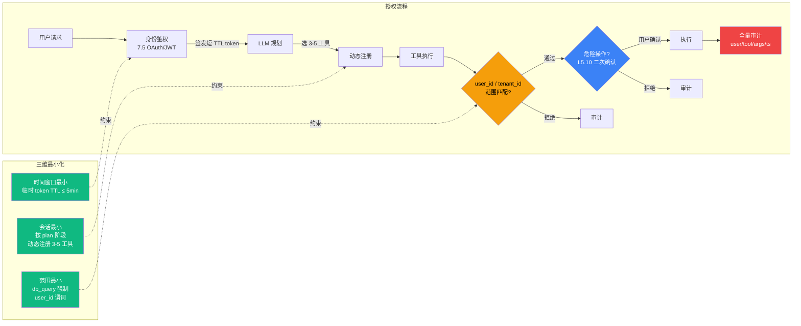

# 7.3 工具权限：最小化原则与沙箱

> 🟡 进阶

> **本节钩子**：工具权限最小化 ≠ "少给工具"——是**单次会话最小 + 时间窗口最小 + 范围最小**三维约束；"一次给所有权限"是经验值 80% 事故的主因。工程师为图方便一次性授予所有工具，token 泄露后攻击者即可调全部 API（删库 / 转账 / 发邮件）。

## 正文大纲

1. **意图**：Agent 调用外部工具（数据库 / API / 文件系统）时如何**最小化授权**——避免 token 泄露即全线失守。本节把"最小权限原则"在 Agent 场景拆成三维。
2. **适用场景**：
   - **典型 1**：多工具 Agent（数据库 + 邮件 + 文件系统）——必须按工具拆 token。
   - **典型 2**：多租户 SaaS（用户 A 调 db_query 不能查 B 数据）——范围最小是底线。
   - **典型 3**：长任务 Agent（持续数小时）——时间窗口最小防 token 长期暴露。
   - **反例**：单工具只读、单用户小工具——授权可简化但仍需白名单。
3. **关键机制**：**三维最小化 + 四类机制**。
   - **会话最小**：单次对话只给当前任务所需工具，**禁止**"注册即全开"。动态工具注册（按 plan 裁剪到 3-5 个），见 7.1 工具层。
   - **时间窗口最小**：临时 token TTL ≤ 5 分钟（经验值；AWS STS 默认 1 小时偏宽松），长任务用 refresh token + 续签。
   - **范围最小**：工具只能访问"用户授权范围"——db_query 内部强制 `WHERE user_id = :current_user` 谓词；API 工具按 tenant_id 隔离。
   - **四类配套机制**：① **RBAC**（按角色分，经验值 ≤ 10 角色）——粗粒度但简单；② **ABAC**（按属性 + 时间 + 资源标签）——灵活但规则多易冲突（参见 7.1）；③ **临时 token**（短 TTL + audience claim）——单次会话最佳实践；④ **审计**（`user/tool/args/decision/ts` 写日志）+ 危险操作触发 L5.10 HITL 二次确认。
4. **关键原则**：**事故主因 = 一次给所有权限**——工程师为"调用方便"颁发宽作用域 token，泄露后攻击者调全部 API。**正确做法**：独立 token + 短 TTL + 范围谓词 + 审计四件套缺一不可。
5. **反模式**（症状 + 根因 + 修复）：
   - ❌ **"一次注册所有工具"**——**症状**：启动时 20 工具一次性注册，token 泄露即任意调用。**根因**：图省事 + 缺按 plan 裁剪机制。**修复**：动态工具注册（每轮 ReAct 选 3-5 个）+ 短期 token 轮换。
   - ❌ **"长期 token 不轮换"**——**症状**：同一 token 用 90 天不换，被截获后 90 天窗口可滥用。**根因**：缺 TTL 治理。**修复**：TTL ≤ 5 分钟 + refresh token + 异常强制轮换。
   - ❌ **"无审计 = 无追溯"**——**症状**：事故后无法回答"谁在何时调了哪个工具"。**根因**：日志只记 LLM 输入输出。**修复**：结构化日志（`{user, tool, args_hash, decision, ts}`）+ L6.x 链路追踪。

## 与其他节对比

| 维度 | 7.1 Guardrails | 7.2 Prompt Injection | 7.3 工具权限 | 7.4 代码沙箱 | 7.5 鉴权 |
|---|---|---|---|---|---|
| 视角 | 通用防护概念（骨架） | 特定攻击类型（纵深） | 权限设计（防御） | 执行环境隔离 | 身份层 |
| 触发时机 | 全程（三层） | 输入污染 + 工具结果回灌 | 工具调用前授权 | 代码执行前 | 登录/会话开始 |
| 维护成本 | 中（规则 ≤ 20 条） | 高（攻击向量演进） | 中（RBAC/ABAC 配置） | 中（沙箱选型 + 冷启动） | 中（token 轮换 + 审计） |
| 关系 | 包含 7.2 | ⊂ 7.1 | 7.1 工具层细化 | 与 7.3 互补 | 与 7.3 互补 |

## 图：三维最小化 + 工具调用授权流程



> 三维约束对应颜色：🟢 绿=三维约束 / 🟠 橙=范围校验闸门 / 🔵 蓝=HITL 二次确认（L5.10）/ 🔴 红=全量审计。约束分布：会话最小约束工具注册、时间窗口最小约束 token 签发、范围最小约束调用前校验。

## 实战要点（本节豁免大段代码，决策图为主）

1. **动态工具注册**——按 plan 阶段裁剪到 3-5 个；LangGraph 用 `tools` 参数动态传，或 `ToolRegistry.filter(plan=current_plan)`。
2. **临时 token 短 TTL**——经验值 5 分钟（AWS STS 默认 1 小时偏宽松）；长任务用 refresh token + 续签时重新校验范围。
3. **范围谓词下推到工具**——db_query 内部强制 `WHERE user_id = :current_user`，**不要**在 Agent 层拼 SQL——LLM 可能拼错谓词绕过。
4. **审计结构化**——日志字段 `{user_id, tool, args_hash, decision, ts}`，args_hash 存参数哈希避免敏感落盘。
5. **HITL 联动**——危险操作（删 / 改 / 发）必须触发 L5.10 interrupt；权限解决"能不能调"，HITL 解决"该不该调"。

## 工具映射

| 工具 | 用途 | 备注 |
|---|---|---|
| Kong RBAC | API 网关层权限 | github.com/Kong/kong |
| Open Policy Agent (OPA) | 策略引擎（Rego DSL） | github.com/open-policy-agent/opa |
| Cerbos | 细粒度权限决策服务 | github.com/cerbos/cerbos |
| AWS IAM | 云资源权限（GitHub 镜像参考） | github.com/aws-samples |
| LangGraph Tool Registry | 动态工具注册（按 plan 裁剪） | LangChain 官方框架 |

## 自测题

1. **概念辨析**：三维最小化（会话 / 时间窗口 / 范围）各自的目标？任一缺失的后果？
2. **场景判断**：以下哪些场景**必须**用临时 token（短 TTL）？（多选）
   - A. 内部 ETL 批处理 Agent，每天跑一次只读
   - B. 对客服 Agent 调订单系统，需查 + 改订单
   - C. 公开 API 文档查询 Agent，只读无副作用
   - D. Coding Agent 调 `git push` 到用户仓库
3. **代码补全**：补全下面的 RBAC 范围检查逻辑：
   ```python
   def check_scope(tool_name: str, args: dict, user_ctx: dict) -> bool:
       # 缺什么? 至少两段检查
       pass
   ```
4. **反直觉题**：为什么"一次给所有权限"是事故主因？2 个场景。
5. **对比题**：RBAC vs ABAC 取舍——什么场景用 RBAC，什么场景必须 ABAC？

**答案**：

1. **三维目标**：会话最小——按 plan 裁剪工具，避免宽作用域 token；时间窗口最小——TTL ≤ 5 分钟，token 泄露后窗口极短；范围最小——db_query 强制 user_id 谓词，防越权查他人数据。**缺失后果**：会话缺 → token 泄露调全部 API；时间缺 → 长期可滥用；范围缺 → 横向越权（用户 A 查 B 数据）。
2. **B、D 必须用**。A 只读批处理可放宽（白名单仍需，但 token 可至 1 小时）；C 只读无副作用可不签 token；B 改订单 + D push 代码必须短 TTL + 范围校验。
3. 缺**两段**：① `if user_ctx["role"] not in ROLE_TOOL_MAP[tool_name]: return False`（RBAC 角色白名单）；② `if not check_resource_ownership(args, user_ctx): return False`（ABAC 资源归属，如 `args["user_id"] == user_ctx["user_id"]`）。**关键**：先 RBAC 再 ABAC。
4. **两个场景**：① **token 泄露**——Agent 一次性注册 20 工具 + 宽作用域 token，攻击者拿到即可删库 / 转账 / 发邮件；② **内部人员滥用**——开发偷懒用生产 token 跑实验，误调 `delete_user` 无任何阻拦。
5. **取舍**：RBAC 适合**角色稳定 + 工具少**（≤ 10 角色 + ≤ 20 工具）；ABAC 适合**多租户 + 时间窗 + 资源标签**。**实践**：核心权限用 RBAC 兜底，细粒度越权用 ABAC 补充；规则 ≤ 20 条（参见 7.1）。

> 📚 本节参考
> - [S 级] Kong API Gateway GitHub — https://github.com/Kong/kong
> - [S 级] Open Policy Agent (OPA) GitHub — https://github.com/open-policy-agent/opa
> - [S 级] Cerbos 权限决策服务 GitHub — https://github.com/cerbos/cerbos
> - [A 级] Lilian Weng, *LLM Powered Autonomous Agents* (2023) — https://lilianweng.github.io/posts/2023-06-23-agent/
