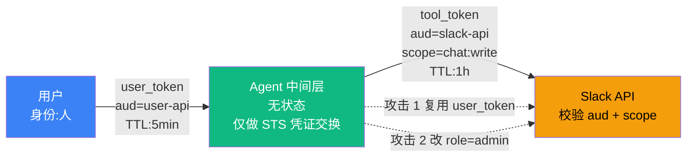

# 7.5 鉴权与会话:用户态/工具态分离

> 🔴 专家

> **本节钩子**:用户态/工具态分离 ≠ 加 auth header——必须**双 token + audience 区分 + 中间层无状态**才能防 confused deputy;单 token + role 字段模式易被攻击者构造 role=user 但实际给 tool token 的请求,代理被欺骗,身份被冒用。

## 正文大纲

1. **意图**:Agent 系统涉及两类独立身份——**用户身份**(人→Agent)和**工具身份**(Agent→第三方 API)。本节讲如何用双 token + audience claim 隔离,避免 **confused deputy** 攻击。
2. **适用场景**:
   - **典型 1**:多租户 Agent 平台——用户 A 调用 Slack 不能影响用户 B 的工作区。
   - **典型 2**:调外部 SaaS(Google Workspace / Slack / GitHub)——需要用户 OAuth 授权 + 工具独立 token。
   - **典型 3**:企业内 Agent(内部 OA / 财务 / 客户系统)——员工身份 vs 系统身份必须区分。
   - **反例 1**:把"权限校验"放在 LLM 提示词里——LLM 可被 prompt injection 绕过(参见 7.1 / 7.2)。
   - **反例 2**:单工具只读 Agent——直接单一 API key 即可,无需双 token 复杂度。
3. **关键定义**(5 个核心概念):
   - **OAuth 2.0**:RFC 6749 协议层,授权码 / 客户端凭据 / 刷新 token 三件套。
   - **JWT (JSON Web Token)**:RFC 7519 自包含 token 格式,内置 `aud` / `iss` / `exp` 等 claim。
   - **OIDC (OpenID Connect)**:在 OAuth 2.0 之上加 `id_token`,提供用户身份层(对比纯授权)。
   - **STS (Security Token Service)**:临时凭证签发,AssumeRole + ExternalId 防 confused deputy。
   - **Session binding**:把 token 绑到 IP / User-Agent / 设备指纹,降低 token 窃取后被重放的风险。
4. **代码骨架**:本节豁免大段代码,概念图与配置为主(决策原则见实战要点)。
5. **反模式**(症状 + 根因 + 修复):
   - ❌ **"单 token + role 字段"**——**症状**:签发一个 token 含 `role=user`,工具调用时复用同一 token。**根因**:攻击者构造请求把 `role=user` 改成 `role=admin`,后端只校验 token 签名不校验 role 来源。**修复**:**双 token + audience 区分**——user_token(`aud=user-api`)与 tool_token(`aud=slack-api`)物理隔离,aud 不匹配即拒。
   - ❌ **"user_token 直接转发给第三方"**——**症状**:Agent 调 Slack 时把 user_token 原封不动塞进 Authorization 头。**根因**:Slack 看到 `aud=user-api` 与本服务不匹配拒绝;或更糟,某些 API 不校验 aud,用户身份被工具身份冒用。**修复**:**STS 换 token**——user_token 仅用于中间层身份校验,工具调用前 STS 用 AssumeRole + ExternalId 换 tool_token。
6. **与其他节对比**:
   - **7.5 身份层**:管"你是谁"(token 身份声明)。
   - **7.3 权限层**:管"你能做什么"(RBAC/ABAC 决策)。
   - **7.4 执行层**:管"代码在哪跑"(沙箱隔离)。
   - 三者构成 Agent 安全"铁三角",任一缺失都让攻击者有可乘之机。
   - **对齐 L4.3**:LangGraph Checkpoint 是 session 的天然载体——`thread_id` 绑用户 + 设备指纹,`checkpoint_ns` 隔离多租户。

## 图:双 token + audience 区分流程(含 confused deputy 攻击链)

> 标注:**🟦 蓝=用户态** / **🟩 绿=中间层(无状态 + STS 换 token)** / **🟧 橙=工具态(校验 aud + scope)**。**双 token + audience 区分**让"攻击 1 复用 user_token"被 Slack 拒(验 aud 失败),"攻击 2 改 role=admin"无意义(根本没有 role 字段,audience 物理隔离)。

## 实战要点

1. **双 token 必加 audience 区分**——`aud=user-api` vs `aud=slack-api`;token 即便被截获也无法跨服务使用(主流 SaaS 普遍采用,API 端验 aud 失败即拒)。
2. **中间层永远无状态 + STS 临时凭证(AssumeRole + ExternalId)**——Agent 本身不存 token,只做凭证交换;**ExternalId** 是 AssumeRole 双方约定的共享密钥(如 `agent-{tenant_id}`),第三方账号 STS 校验该字段后才发临时凭证,降低 token 泄露爆炸半径。
3. **session 绑定用户 + 设备指纹**——绑 IP / User-Agent / 设备 ID,降低 token 窃取后重放风险。
4. **工具调用前后审计**——每次 token 交换写 append-only 日志(`{user_id, tool, aud, ts, decision}`),出问题可追溯。
5. **STS 临时凭证 TTL ≤ 1 小时**——AWS STS AssumeRole 默认 1h 是上限经验值;长任务用 refresh token 续签,每续签重新校验范围(参见 7.3 时间窗口最小)。

## 工具映射

| 工具 | 用途 | 备注 |
|---|---|---|
| OAuth 2.0 / OIDC | 协议层身份认证 | RFC 6749 + OpenID Connect Core 1.0 |
| JWT (JSON Web Token) | Token 格式 + audience claim | RFC 7519, github.com/auth0/java-jwt |
| AWS STS | 临时凭证服务 | AssumeRole + ExternalId 防 confused deputy |
| Keycloak | 开源 IdP | github.com/keycloak/keycloak |
| Kong | API 网关 + JWT 验签 | github.com/Kong/kong |
| LangGraph Checkpoint | Session 状态载体 | 与 L4.3 衔接,thread_id 绑用户 + 设备指纹 |

## 自测题

1. **概念辨析**:什么是 confused deputy 攻击?为什么单 token + role 字段模式防不住?
2. **场景判断**:Agent 调用第三方 API 时,应该如何传递用户身份?是把 user_token 直接转发,还是换 token?
3. **代码补全**:用 JWT 时,audience claim 的作用是什么?如果 `aud=slack-api` 的 token 被发到 github-api 会怎样?
4. **反直觉题**:为什么 Agent 中间层必须保持无状态?如果 Agent 本身缓存 user_token 短期复用有什么风险?
5. **对比题**:7.5 鉴权、7.3 权限、7.4 执行环境三者如何协作?缺一不可的理由是什么?

**答案要点**:

1. **confused deputy = 用户身份被工具身份冒用,代理(中间层)被欺骗**;单 token + role 字段模式无法阻止攻击者构造 `role=admin` 的恶意请求,后端只验签名不验 role 来源。
2. **必须 STS 换 token**——`user_token` → `tool_token`,user_token 仅用于中间层身份校验,工具调用前用 STS 换出 audience 受限的 tool_token。
3. **`aud` 限定接收方**——`aud=slack-api` 的 token 发到 `github-api` 会被后者**拒收**(aud 不匹配);即便有人拿到 Slack token 也无法用来调 GitHub。
4. **缓存 user_token 增加泄露面**——中间层无状态 + STS 短期凭证最安全;一旦中间层被攻破,缓存的 user_token 全部泄露,STS 模式下无缓存即无此风险。
5. **身份(7.5)→ 权限(7.3)→ 执行(7.4) 纵深防御**——7.5 防 confused deputy,7.3 防越权,7.4 防代码逃逸;任一缺失都让攻击者有可乘之机(例如 7.5 严但 7.4 沙箱薄弱,代码逃逸后 token 仍可被窃取)。

> 📚 本节参考
> - [S 级] Kong API Gateway GitHub — https://github.com/Kong/kong
> - [S 级] Auth0 java-jwt(JWT 实现参考 + aud claim 最佳实践)— https://github.com/auth0/java-jwt
> - [S 级] Keycloak(开源 IdP + OIDC 实现)— https://github.com/keycloak/keycloak
> - [A 级] Lilian Weng, *LLM Powered Autonomous Agents* (2023) — https://lilianweng.github.io/posts/2023-06-23-agent/
