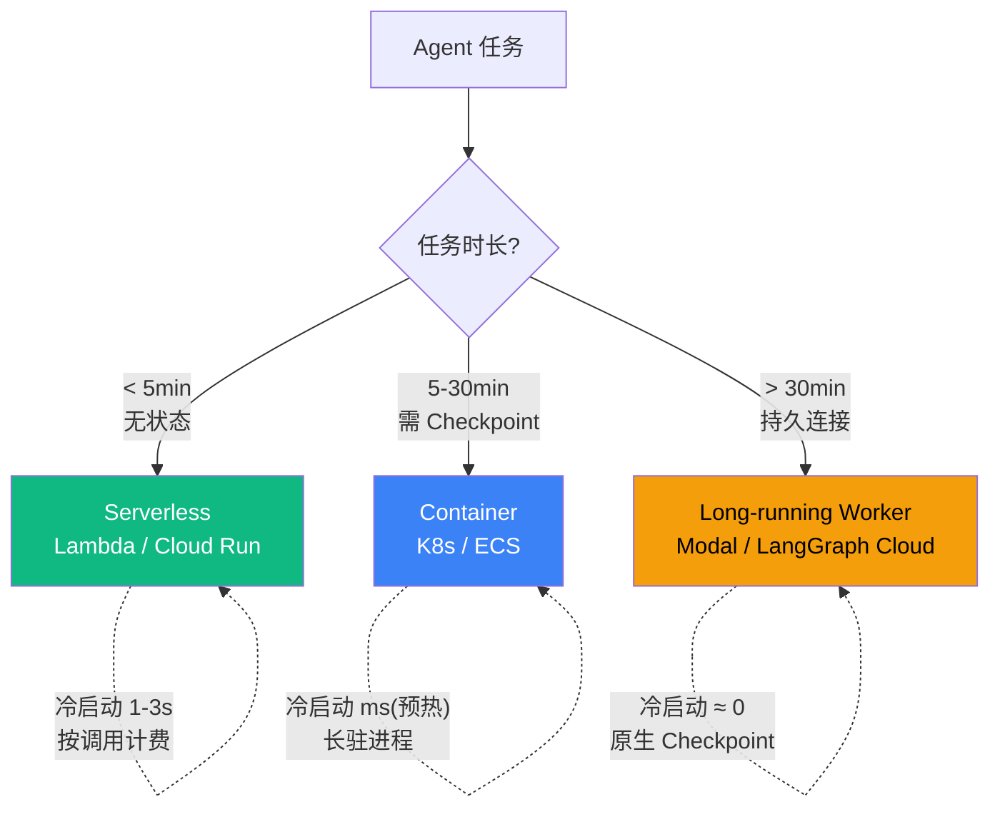

# 7.6 部署形态:Serverless / Container / Long-running Worker

> 🟡 进阶

> **本节钩子**(反直觉):Serverless ≠ "省成本"——Agent 长任务 **Long-running Worker 比 Lambda 便宜**(冷启动 + 状态保持 + VPC 费用);**Serverless 适合短任务(< 5 分钟)且无状态**。

## 正文大纲(7 个 block, 900-1100 字)

1. **意图**:Agent 部署的三大形态——Serverless / Container / Long-running Worker 横向对比与选型。**核心理念**:**任务时长 + 状态依赖**决定部署拓扑,不是"哪个新潮选哪个"。
2. **适用场景**:
   - **典型 1**:短任务(查询/分类/单轮 LLM 调用)→ Serverless(Lambda / Cloud Run),按调用计费、突发友好、免运维。
   - **典型 2**:中长任务(ReAct 多步推理 / 多工具链调用)→ Container(K8s / ECS),长驻进程 + 状态持久化。
   - **典型 3**:长任务(多 Agent 协作 / 批处理 / 跨调用 Checkpoint)→ Long-running Worker(Modal / LangGraph Cloud / Replicate),持久连接 + 原生 Checkpoint。
   - **反例 1**:把多步 ReAct Agent 塞进 Lambda——冷启动 1-3s × N 步 + 状态丢失 + 5-15min 硬超时,任务频繁中断。
   - **反例 2**:把单次 LLM 分类调用塞进 Long-running Worker——常驻进程 + 状态存储的资源开销远超单次推理本身。
3. **关键定义**(5 个核心概念):
   - **Serverless**(Lambda / Cloud Run / Cloud Functions):按调用计费,无状态,冷启动秒级,适合短任务。
   - **Container**(Kubernetes / ECS / Docker Swarm):长驻进程,冷启动预热后毫秒级,可挂载本地存储,适合有状态中长任务。
   - **Long-running Worker**(Modal / LangGraph Cloud / Replicate / Ray Serve):专为长任务设计,持久连接 + 跨调用 Checkpoint + 资源按需挂起。
   - **冷启动时间**(Cold Start):从请求到函数/容器执行的时间,Serverless 1-3s、Container 预热后毫秒级、Worker 几乎为零(已在运行)。
   - **状态保持**(State Persistence):跨调用保持 Agent 状态——session / memory / checkpoint;Serverless 必须外挂存储(Redis/Postgres),Container 可本地 + 远程双写,Long-running Worker 原生支持。
4. **代码骨架**:本节豁免大段代码,概念图与决策树为主(选型决策见主图)。
5. **反模式**(症状 + 根因 + 修复):
   - ❌ **"Lambda 部署长任务 Agent"**——**症状**:任务跑 5 分钟后被强制中断,中间步骤状态全部丢失,用户看到"任务失败"。**根因**:Lambda 15min 硬上限 + 无状态 + VPC NAT 持续计费。**修复**:换 Long-running Worker(Modal / LangGraph Cloud)+ Checkpoint 持久化到 Postgres,断点恢复从最后一次 checkpoint 继续。
   - ❌ **"所有 Agent 都走 K8s"**——**症状**:简单查询类 Agent 冷启动慢 + 资源利用率低(节点常驻但 QPS 很低)。**根因**:K8s 设计是长驻进程,不适合突发短任务;按节点付费而非按调用付费。**修复**:Serverless 兜底短任务 + K8s 仅承载长任务;或用 K8s HPA + 预热池应对突发,但成本通常高于 Serverless。
6. **与其他节对比**:
   - **7.6 是"部署拓扑"**,7.7 是"流量与限流",7.4 是"沙箱执行"——三者构成生产部署金三角。
   - **7.6 vs 7.7**:7.6 决定"在哪跑",7.7 决定"跑多少";7.6 选错形态,7.7 限流再精准也救不回来。
   - **7.6 vs 7.4**:7.6 是部署层(进程生命周期),7.4 是执行层隔离(代码在哪跑);7.4 沙箱是 7.6 部署形态内的子组件。
   - **对齐 L4.3**:LangGraph `checkpointer` 是 Long-running Worker 的天然载体——`thread_id` 绑 session,`checkpoint_ns` 隔离多租户,持久化到 Postgres/SQLite 即可跨调用恢复。
## 图:三形态 4 维对比矩阵 + 选型决策树

**对比矩阵**:

| 形态 | 冷启动 | 状态保持 | 成本模型 | 并发上限 |
|---|---|---|---|---|
| **Serverless** (Lambda / Cloud Run) | 1-3s | 须外挂存储 | 按调用 + VPC NAT 费 | 区域配额 |
| **Container** (K8s / ECS) | 预热 ms | 本地 + 远程双写 | 按节点预留 | K8s HPA 弹性 |
| **Long-running Worker** (Modal / LangGraph Cloud) | ≈ 0 | 原生 Checkpoint | 按运行时长 + 存储 | Worker 数 × 1 |

**决策树**:

> 标注:**🟢 Serverless 绿=短任务(< 5min,无状态)** / **🔵 Container 蓝=中长任务(5-30min,需状态)** / **🟠 Long-running Worker 橙=长任务(> 30min,Checkpoint)**。**决策原则**:任务时长 + 状态依赖 = 部署形态;**冷启动**是 Serverless 的最大瓶颈,**状态保持**是 Container 的核心收益,**持久连接 + Checkpoint** 是 Long-running Worker 的杀手锏。

## 实战要点

1. **短任务(< 5min)且无状态 → Serverless**——按调用计费、免运维;冷启动 1-3s 用预热缓解(成本:按调用,VPC NAT 持续费需注意)。
2. **中长任务(5-30min)需 Checkpoint → Container**——长驻 + 状态持久化,适合 ReAct 多步;配合 HPA 做弹性(成本:按节点月费,稳态中负载最划算)。
3. **长任务(> 30min)或多 Agent 协作 → Long-running Worker**——Modal / LangGraph Cloud / Replicate,持久连接 + 跨调用 Checkpoint(成本:按 Worker 运行时长 + 存储)。
4. **冷启动是 Agent 体验的瓶颈**——Serverless 冷启动 1-3s 会让用户感知到延迟;选型时优先考虑预热(Provisioned Concurrency)或换 Container。
5. **状态保持是 Agent 必需**——Serverless 必须外挂存储(Redis/Postgres),Container 可本地 + 远程双写,Long-running Worker 原生支持;状态丢失 = Agent 体验崩塌。

## 工具映射

| 工具 | 形态 | 用途 | 备注 |
|---|---|---|---|
| AWS Lambda | Serverless | 短任务按调用计费 | 15min 硬上限 |
| Google Cloud Run | Serverless | 请求隔离 | 按请求计费 |
| Kubernetes (K8s) | Container | 长驻进程编排 | 适合稳态中长任务 |
| Modal | Long-running Worker | 专为 AI/ML | 持久执行 |
| LangGraph Cloud | Long-running Worker | 官方 Checkpoint | thread_id 隔离 |
| Replicate | Long-running Worker | 开源模型推理 | 适合批处理 + 异步 |

## 自测题

1. **概念辨析**:Serverless 一定比 Container 便宜吗?什么时候相反?
2. **场景判断**:Agent 跑一个 3 步 ReAct 任务(每步 2-5s),应该选哪种部署形态?
3. **决策树**:任务时长 45min + 需跨调用 Checkpoint + 偶发流量,推荐哪种?
4. **反直觉**:为什么 Long-running Worker 比 Lambda 更适合长任务?具体成本差异来自哪里?
5. **对比**:7.6 部署形态、7.4 沙箱、7.7 容量限流三者如何协作?缺一不可的理由?

**答案要点**:

1. Serverless 适合短时无状态;长任务 Serverless 反而成本更高(VPC NAT 持续计费 + 状态存储 + 冷启动开销 + 15min 硬超时可能导致重试)。
2. Container(K8s)——3 步 × 5s = 15s 虽在 Serverless 范围内,但 3 步 ReAct 需要 Checkpoint 持久中间状态,选 Container 避免状态丢失。
3. Long-running Worker 为主 + 偶发流量用 K8s HPA 弹性;纯 Serverless 在 45min 任务下会超时。
4. 差异来自:Lambda 冷启动 + 状态存储 + VPC NAT 持续计费 vs Worker 1 进程持续运行;具体数字因场景而异,但长任务下 Worker 显著节省。
5. 7.6 决定部署拓扑,7.4 决定执行隔离,7.7 决定流量控制——三者是生产部署的"金三角";缺一不可:选错形态(7.6)、沙箱逃逸(7.4)、流量过载(7.7)任一会让系统崩。

> 📚 本节参考
> - [S 级] Anthropic Engineering "Building Effective Agents" — https://www.anthropic.com/engineering/building-effective-agents
> - [S 级] LangGraph Cloud GitHub — https://github.com/langchain-ai/langgraph
> - [A 级] Eugene Yan, "Patterns for Building LLM-based Systems" — https://eugeneyan.com/writing/llm-patterns/
> - [S 级] Modal Labs GitHub — https://github.com/modal-labs/modal-client