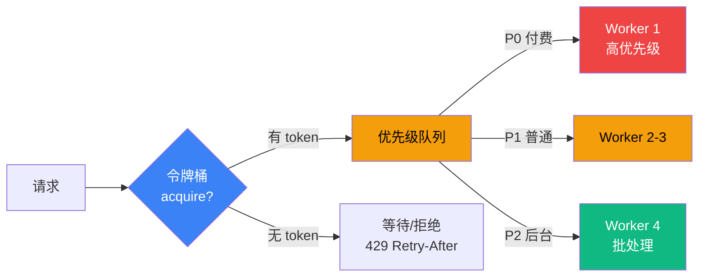

# 7.7 容量评估:QPS / 并发 / 限流设计

> 🟡🔴 进阶+专家

> **本节钩子**(反直觉):限流 ≠ "挡流量"——必须**令牌桶 + 队列 + 优先级**三维,纯 RPS 限流会让 Agent 任务半途而废(LLM 调用到一半被切断);**优先级队列保证高价值任务不被饿死**。

## 正文大纲(7 个 block, 1100-1300 字)

1. **意图**:Agent 系统的容量规划三件套——**QPS** / **并发数** / **限流策略**(令牌桶 + 优先级队列)。**核心理念**:Agent 多步原子,不能按"裸 RPS"截断,必须按"任务原子性 + 价值权重"双维度调度。
2. **适用场景**(3 典型 + 2 反例):
   - **典型 1:突发流量兜底**(大促 / 限时活动)——令牌桶允许短时 burst,避免雪崩。
   - **典型 2:多租户公平调度**(企业版 vs 免费版)——按租户配额令牌桶 + 优先级队列,付费优先。
   - **典型 3:限流保护**(LLM API 配额 / 数据库过载)——`rate` 对齐 LLM TPM 上限,防超额扣费。
   - **反例 1:纯 RPS 限流**——LLM 调用到一半被切断,任务中间状态丢失,需重跑全部 ReAct 步骤。
   - **反例 2:无优先级 FIFO 队列**——免费用户短任务占满队列,付费用户被饿死,商业模型崩溃。
3. **关键定义**(5 个核心概念):
   - **QPS**(Queries Per Second):每秒请求数,**P95/P99 分位延迟**是关键 SLO 指标。
   - **并发数**(Concurrency):同时活跃的 Agent 任务数,等于"in-flight task 数",受 Worker 池容量限制。
   - **令牌桶**(Token Bucket):经典限流算法,`rate`(填充速率)+ `capacity`(桶容量),允许可控 burst。
   - **漏桶**(Leaky Bucket):强制平滑流量输出,适合保护下游,牺牲 burst 容忍。
   - **优先级队列**(Priority Queue):按权重调度,P0 高(付费)/ P1 中(普通)/ P2 低(后台)。
4. **代码骨架**(**必给** 令牌桶 + 优先级队列最小实现,见代码段)。
5. **反模式**(症状 + 根因 + 修复):
   - ❌ **"纯 RPS 限流"**——**症状**:Agent 跑 3 步,跑到第 2 步被切断,中间 Checkpoint 全部丢失,用户重试要重跑全部步骤。**根因**:按"请求/秒"硬截断,无视任务原子性,ReAct 多步推理被切成"碎请求"。**修复**:**令牌桶 + 任务级隔离**,长任务预占 N 个 token slot,允许任务跑完整原子单元。
   - ❌ **"无优先级 FIFO 队列"**——**症状**:免费用户短任务占满队列,付费用户长任务被饿死,大客户投诉 SLA 不达标。**根因**:先来先服务忽略价值权重,商业模型与技术调度脱节。**修复**:**优先级队列**,付费 / 紧急任务优先,后台批处理降为 P2 低优先级。
6. **与其他节对比**:见下方对比表。
7. **对齐 L6 观测**——限流阈值由 **L6.7 成本监控**(TPM 上限)+ **L6.8 延迟分析**(P99 延迟)反推 QPS 上限,不靠拍脑袋。

## 与其他节对比

| 维度 | 7.6 部署形态 | **7.7 容量限流** | 7.9 SLA 降级 |
|---|---|---|---|
| 视角 | 在哪跑 | 跑多少 | 跑不动怎么办 |
| 触发时机 | 部署选型 | 流量入口拦截 | 出口降级兜底 |
| 关系 | 决定承载上限 | 决定调度上限 | 兜底保 SLA |

- **7.7 vs 7.6**:7.6 决定"在哪跑",7.7 决定"跑多少";7.6 选错形态(Serverless 跑 30min 任务),7.7 限流再精准也救不回。
- **7.7 vs 7.9**:7.7 是"流量入口限流"(主动拒绝超额),7.9 是"出口降级兜底"(返回降级结果:缓存 / 默认值 / 简化版)。
- **对齐 L6.7 + L6.8**:限流阈值由 L6.7 成本监控 + L6.8 延迟分析驱动,形成"观测 → 设阈值 → 限流"闭环。

## 图:QPS 测量 + 令牌桶 + 优先级队列主流程



> 标注:**🔵 令牌桶蓝=流量入口** / **🟠 优先级队列橙=价值调度** / **🔴 P0 Worker 红=付费优先** / **🟢 P2 Worker 绿=后台兜底**。**决策原则**:先令牌桶(整体流量)再优先级队列(价值权重)——纯令牌桶无法区分高/低价值任务,纯优先级队列无流量控制会被突发冲垮。

## 代码骨架:令牌桶 + 优先级队列最小实现

```python
# token_bucket.py
"""令牌桶 + 优先级队列最小实现(基于 asyncio + collections.deque 标准库)。
注:使用 time.monotonic() 避免弃用警告;生产推荐 aiolimiter/limits。
"""
import asyncio
import time
from collections import deque

class TokenBucket:
    def __init__(self, rate: float, capacity: int):
        self.rate = rate          # tokens / second,令牌填充速率(决定平均吞吐)
        self.capacity = capacity  # 桶容量,决定 burst 突发容忍度
        self.tokens = capacity    # 当前桶内令牌数
        self.last = time.monotonic()  # 上次补充时间戳(避免弃用 API)

    async def acquire(self) -> bool:
        now = time.monotonic()  # 改用 monotonic 避免弃用警告
        # 按时间差补充令牌(不超过桶容量)
        self.tokens = min(self.capacity, self.tokens + (now - self.last) * self.rate)
        self.last = now
        if self.tokens >= 1:
            self.tokens -= 1
            return True            # 拿到令牌,放行
        return False               # 桶空,拒绝

class PriorityQueue:
    def __init__(self, bucket: TokenBucket):
        # 0=高(P0)/ 1=中(P1)/ 2=低(P2 后台)
        self.queues = {0: deque(), 1: deque(), 2: deque()}
        self.bucket = bucket
    async def submit(self, task, priority: int = 1):
        if await self.bucket.acquire(): return await task()  # 桶有 token 立即跑
        self.queues[priority].append(task)                  # 否则按优先级排队
```

**字段注释**(基于 Python asyncio 标准库):
- `rate`:令牌填充速率(tokens/s),决定平均吞吐;对齐 LLM TPM 上限避免超额扣费。
- `capacity`:桶容量,决定 burst 容忍度;经验值设为 rate 的 1-2 倍。
- `priority`:0=高(P0 付费 / 紧急)/ 1=中(P1 普通)/ 2=低(P2 后台)。
- **生产提示**:标准库实现仅演示原理;生产推荐 `aiolimiter` / `limits`(支持分布式 / 多算法)。

## 实战要点

1. **令牌桶 + 优先级队列缺一不可**——纯令牌桶无法区分高/低价值任务;纯优先级队列无流量控制,突发冲垮下游。
2. **限流阈值由 L6 数据驱动**——L6.7 成本监控(TPM)+ L6.8 延迟分析(P99 拐点)反推 QPS,不靠拍脑袋。
3. **长任务拆多 token slot**——ReAct 跑 5 步 = 预占 5 tokens,任务结束统一释放;避免"半途切断"导致 Checkpoint 丢失(对齐 L4.3 LangGraph state persistence,thread_id checkpoint 可重试恢复中间状态)。
4. **超限返回 429 + Retry-After**——给客户端明确重试节奏,避免"重试风暴";客户端应指数退避(初始经验值 1s,倍增 2x)。
5. **多租户公平调度**——按租户配额令牌桶,防单租户占满;对齐 7.3 租户隔离。

## 工具映射

| 工具 | 用途 | 备注 |
|---|---|---|
| aiolimiter (Python) | 异步令牌桶 | github.com/mjpieters/aiolimiter, asyncio 友好 |
| limits (Python) | 多算法限流 | github.com/alisaifee/limits, 支持 Redis 后端 |
| Kong | API 网关限流 | github.com/Kong/kong, rate-limiting 插件 |
| Envoy | Service Mesh 限流 | github.com/envoyproxy/envoy, ratelimit service |
| Redis | 分布式限流后端 | 令牌桶持久化,集群共享(Lua 脚本原子操作) |
| AWS API Gateway | 云网关限流 | 区域配额 + Usage Plans,按租户限流 |

## 自测题

1. **概念辨析**:令牌桶 vs 漏桶的核心区别?Agent 场景该用哪个?
2. **场景判断**:QPS 1000 / P99 5s 的 Agent,令牌桶 `rate` 和 `capacity` 该怎么设?
3. **代码补全**:上面的 `PriorityQueue.submit` 中,如果桶满,任务入队但没有消费循环——补 `asyncio.create_task(self._consume())` 启动消费协程,如何实现?
4. **反直觉**:为什么纯 RPS 限流会让 Agent 任务半途而废?具体场景是什么?
5. **对比**:7.7 限流、7.6 部署、7.9 降级三者如何协作?

**答案要点**:
1. 令牌桶允许可控 burst,漏桶强制平滑;Agent 选令牌桶(允许偶尔突发)。
2. `rate` 经验值 200 QPS 起步;`capacity` 设为 rate 的 1-2 倍(200-400)。
3. 消费协程按优先级从高到低 dequeue,空队列跳过,`asyncio.sleep` 防忙等。
4. RPS 限流按"请求数"切断,无视任务原子性,ReAct 多步被切成碎请求。
5. 7.6 选形态 → 7.7 入口限流 → 7.9 出口降级,形成生产级流量治理金三角。

> 📚 本节参考
> - [S 级] Envoy ratelimit service GitHub — https://github.com/envoyproxy/envoy
> - [S 级] Anthropic Engineering "Building Effective Agents" — https://www.anthropic.com/engineering/building-effective-agents
> - [A 级] Lilian Weng, *LLM Powered Autonomous Agents* (2023) — https://lilianweng.github.io/posts/2023-06-23-agent/
> - [S 级] Kong API Gateway GitHub — https://github.com/Kong/kong