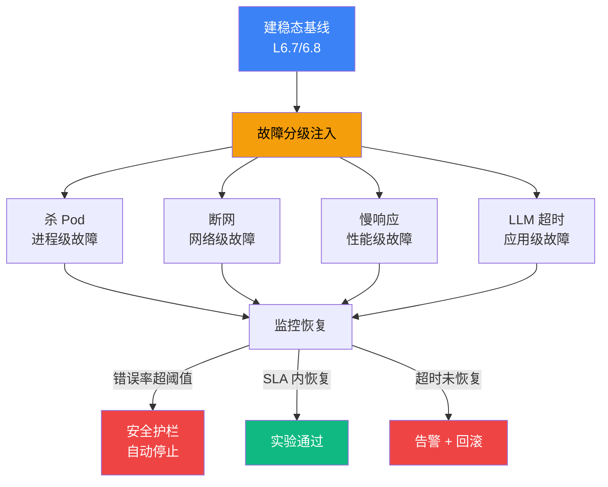

# 7.8 故障注入与混沌工程

> 🔴 专家

> **本节钩子**(反直觉):混沌工程 ≠ "随机 kill pod"——**必须先建 baseline + 故障场景分级 + 自动恢复验证**,否则就是破坏;**先建 SLA 后做混沌**才有意义。

## 正文大纲(7 个 block)

1. **意图**:用混沌工程方法论主动注入故障,验证 Agent 系统容错能力——**杀 Pod / 断网 / 慢响应 / LLM 超时** 四类故障全覆盖。
2. **适用场景**(3 典型 + 2 反例):
   - **典型 1:上线前验收**——新 Agent 部署前,在预发环境跑一遍杀 Pod + LLM 超时,验证告警 / 降级链路通。
   - **典型 2:大促前压测**——限流降级是否触发,自动扩容是否生效;断网模拟验证 region 切换。
   - **典型 3:定期演练**——每季度一次"混沌日",全链路演练,把容错变成肌肉记忆。
   - **反例 1**:生产环境无 baseline 直接注入故障,无法判断"异常 vs 设计内"。
   - **反例 2**:无安全护栏(blast radius),小故障放大成全站事故。
3. **关键定义**:
   - **混沌工程**(Chaos Engineering):Netflix 2010 年提出,主动注入故障验证系统韧性。
   - **稳态假设**(Steady State Hypothesis):系统正常时的可观测指标(P99 延迟 / 错误率 / 吞吐)。
   - **故障场景分级**(Blast Radius):实验影响范围,从小到大逐步扩大。
   - **安全护栏**(Safety Guardrails):实验中自动停止条件(错误率超阈值立即终止)。
   - **自动恢复验证**(Auto-recovery Verification):故障注入后,系统是否能在 SLA 时间内自动恢复。
4. **代码骨架**(**必给** chaos experiment 最小框架,见代码段)。
5. **反模式**:
   - ❌ **"无 baseline 直接注入"**——**症状**:实验后无法判断"系统异常还是设计内"。**根因**:缺少稳态假设量化基线。**修复**:**先建 SLA + 量化稳态**(对齐 L6.7 成本监控 / L6.8 延迟分析)再做混沌。
   - ❌ **"全量 blast_radius=1.0"**——**症状**:小实验演变成全站事故。**根因**:无故障场景分级。**修复**:**从小到大逐步扩大**,每步验证恢复机制。
6. **与其他节对比**:见下方对比表。
7. **对齐 L6 观测**——混沌实验的基线(P99 延迟 / 错误率)与告警阈值都来自 L6.7 / L6.8 的可观测数据,不靠拍脑袋。

## 与其他节对比

| 维度 | **7.8 混沌工程** | 6.10 反模式 | 7.9 SLA 降级 |
|---|---|---|---|
| 视角 | 主动找问题 | 被动防反模式 | 承诺与恢复 |
| 触发时机 | 演练期注入 | 设计期规避 | 运行时降级 |
| 关系 | 7.8 主动注入未知故障 | 6.10 列已知反模式清单 | 7.9 兜底保 SLA |

- **7.8 vs 6.10**:6.10 是"已知反模式清单"(防御),7.8 是"主动注入未知故障场景"(进攻)。
- **7.8 vs 7.9**:7.8 是"演练验证"(实验期),7.9 是"承诺 + 降级兜底"(生产期)。
- **对齐 L6.7 / L6.8**:混沌实验的基线与告警阈值都来自 L6 可观测数据,形成"观测 → 设阈值 → 演练 → 验证"闭环。

## 图:4 类故障 + 混沌实验流程(基线 → 注入 → 监控 → 恢复验证)



> 标注:**🔵 基线蓝=稳态假设** / **🟠 注入橙=四类故障分级** / **🟢 通过绿=SLA 内恢复** / **🔴 终止红=安全护栏触发**。**决策原则**:四类故障必须全覆盖(进程 / 网络 / 性能 / 应用),任何一类缺失都意味着"未验证的假设"留在系统里。

## 代码骨架:混沌实验最小框架

```python
# chaos_experiment.py
"""混沌实验最小框架:稳态基线 + 故障注入 + 自动停止 + 恢复验证。
生产推荐 ChaosBlade / Litmus / Toxiproxy;本伪代码仅演示原理。
"""
import time
from contextlib import contextmanager

class ChaosExperiment:
    def __init__(self, name: str, blast_radius: float = 0.1, safety_threshold: float = 0.2):
        self.name = name                # 实验名,如 "kill_pod_10pct"
        self.blast_radius = blast_radius  # 影响范围(0.0-1.0),从 0.1 起步逐步扩大
        self.safety_threshold = safety_threshold  # 错误率上限(0.2=20%),触发自动停止

    def verify_steady_state(self) -> bool:
        """实验前:确认基线稳定(对比 L6.8 P99 延迟 / 错误率)。
        **前置**:必须在 inject_fault 之前调用,否则 = 无 baseline 反模式。
        """
        return self._current_error_rate() < 0.01  # 基线错误率 < 1%

    def inject_fault(self):
        """注入故障:杀 Pod / 断网 / 慢响应 / LLM 超时"""
        if self._current_error_rate() > self.safety_threshold:
            self.abort()  # 安全护栏触发,自动终止
            return False  # 触发护栏,不注入(防小实验变全站事故)
        return self._fault_handler.trigger(self.blast_radius)

    def verify_recovery(self, sla_seconds: int = 60) -> bool:
        """实验后:验证系统在 SLA 时间内自动恢复"""
        deadline = time.time() + sla_seconds  # SLA 截止时间
        while time.time() < deadline:
            if self._current_error_rate() < 0.01: return True  # 恢复成功
            time.sleep(1)
        return False  # SLA 内未恢复,告警
```

**字段注释**(基于 Python 标准库 `time` + `contextmanager`):
- `blast_radius`:影响范围(0.0-1.0),从 0.1 起步逐步扩大,避免一上来全量。
- `safety_threshold`:错误率上限,触发安全护栏自动 `abort()`,防小实验演变成全站事故。
- `verify_recovery(sla_seconds)`:SLA 时间内未恢复即告警 + 回滚,确保"故障可恢复"是已验证事实而非假设。
- **生产提示**:本伪代码仅演示原理;生产推荐 ChaosBlade(Linux 故障注入) / Litmus(K8s chaos) / Toxiproxy(网络层故障)。

## 实战要点

1. **先建 SLA 后做混沌**——无 P99 / 错误率基线,实验后无法判断"异常 vs 设计内";基线从 L6.7 / L6.8 来。
2. **blast_radius 从小起步**——10% 起步验证恢复,逐步扩大到 30% / 50% / 100%,每步独立验证。
3. **安全护栏是底线**——错误率超阈值自动 `abort()`,避免小实验演变成全站事故。
4. **四类故障都要演练**——杀 Pod / 断网 / 慢响应 / LLM 超时;任何一类缺失都意味着"未验证假设"留在系统里。
5. **混沌日制度化 + 报告留档**——每季度全链路演练,记录 `{experiment, blast_radius, error_rate, recovery_time, sla_met}` 进事故复盘文档,把容错变肌肉记忆。

## 工具映射

| 工具 | 用途 | 备注 |
|---|---|---|
| ChaosBlade | 阿里开源故障注入 | github.com/chaosblade-io/chaosblade,支持 Linux / K8s |
| Litmus | K8s 原生混沌平台 | github.com/litmuschaos/litmus,GitOps 友好 |
| Chaos Monkey | Netflix 经典工具 | github.com/Netflix/chaosmonkey,杀 EC2 实例 |
| Toxiproxy | 网络层故障注入 | github.com/Shopify/toxiproxy,代理级网络故障 |
| Gremlin | 商业混沌平台 | 一行说明:企业级混沌工程 SaaS |
| AWS FIS | AWS 全托管 | aws.amazon.com/fis(白名单外,了解即可) |

## 自测题

1. **概念辨析**:什么是稳态假设?为什么混沌实验必须先验证基线?
2. **场景判断**:大促前要验证新 Agent 部署的容错,blast_radius 起步设多少?
3. **代码补全**:上面 `ChaosExperiment.inject_fault` 中,如果 `safety_threshold` 触发 `abort()`,如何实现实验报告生成(标记"已中止 + 原因")?
4. **反直觉**:为什么"随机 kill pod"不是混沌工程?缺什么?
5. **对比**:7.8 故障注入、6.10 反模式、7.9 SLA 三者如何协作?

**答案要点**:
1. 稳态假设 = 系统正常时的可观测指标(P99 / 错误率 / 吞吐);无基线实验后无法得出结论。
2. 起步 0.1,逐步扩大到 0.3 / 0.5 / 1.0;每步独立验证恢复机制。
3. abort 时记录 `{experiment, time, error_rate, reason}` 到日志 + 标记 `ABORTED` 便于追溯。
4. 缺 3 件套:稳态基线 / 故障分级 / 安全护栏;纯随机 kill = 破坏不是工程。
5. 6.10 防 + 7.8 找 + 7.9 兜,形成"防 + 找 + 兜"完整韧性体系。

> 📚 本节参考
> - [S 级] ChaosBlade GitHub — https://github.com/chaosblade-io/chaosblade
> - [S 级] Litmus Chaos GitHub — https://github.com/litmuschaos/litmus
> - [S 级] ArXiv "Chaos Engineering" 论文 — https://arxiv.org/abs/1703.00037 (Netflix Chaos Monkey 原始论文)
> - [A 级] Chip Huyen, *AI Engineering* (2024) Ch.7 Production