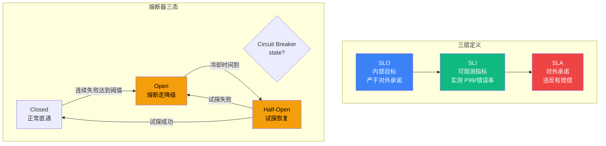

# 7.9 SLA 与降级策略

> 🟡🔴 进阶+专家

> **本节钩子**(反直觉):SLA ≠ "承诺 99.9%"——必须**降级策略 + 失败预算(Error Budget)+ 用户分群**,承诺易,降级难;0.1% 失败时的体验才决定 SLA 真实价值。

## 正文大纲

1. **意图**:Agent 系统对用户的承诺由三件套构成——**SLA**(对外承诺,有赔偿)+ **SLO**(内部目标,更严)+ **降级策略**(失败时的兜底体验)。**核心理念**:承诺数字易写,失败时给用户什么难做——必须把降级路径当一等公民设计,而非事后补丁。
2. **适用场景**(3 典型 + 2 反例):
   - **典型 1:对外承诺 SLA 的生产 Agent**——SaaS 标准版按月承诺,大客户企业版按年承诺,违反有赔偿条款。
   - **典型 2:大客户专属 SLA(分群降级)**——企业版承诺严格,标准版承诺宽松,降级时优先保企业版。
   - **典型 3:内部业务分级**——核心业务(下单 / 支付)保 SLA,辅助业务(推荐 / 分析)可降级,可选业务(导出 / 分享)可关闭。
   - **反例 1:承诺但无降级**——只看 SLA 数字,没设计失败路径;一旦违约,用户直接看到 500 + 赔偿,口碑双输。
   - **反例 2:统一 SLA 不分用户**——大客户和小客户同等对待,大客户对延迟敏感却拿到与免费用户一样的降级版,投诉升级。
3. **关键定义**(5 个核心概念):
   - **SLO**(Service Level Objective):内部目标,严于对外承诺,留 buffer 应对突发。
   - **SLI**(Service Level Indicator):可观测指标,实测延迟 / 错误率,数据源对齐 L6.7 / L6.8。
   - **SLA**(Service Level Agreement):对外承诺,违反有赔偿;数字必来自合同/产品页。
   - **错误预算**(Error Budget):`1 - SLO` 乘以时间窗口,允许失败率,耗尽触发降级。
   - **熔断器**(Circuit Breaker):Closed → Open → Half-Open 三态,故障时短路返回降级。
4. **代码骨架**(三态熔断器 + 降级兜底,见代码段)。
5. **反模式**(症状 + 根因 + 修复):
   - ❌ **"承诺严格但无降级"**——**症状**:故障时大量请求直接拿到 5xx,SLA 违约赔偿 + 用户流失。**根因**:只看 SLO 数字,未设计失败时的兜底路径。**修复**:**SLO + 降级 + 错误预算三件套**,承诺是数字,降级是体验,缺一不可。
   - ❌ **"统一 SLA 不分用户分群"**——**症状**:企业版客户对延迟敏感投诉,免费版用户无所谓降级,客服压力集中。**根因**:缺少用户/场景分群,所有用户走同一路径。**修复**:**分群 SLA**(按套餐/客户价值)+ 降级优先级(企业 > 标准 > 免费)+ 差异化兜底。
6. **与其他节对比**:
   - **7.9 vs 7.7**:7.7 是"流量入口限流"(主动拒绝超额流量);7.9 是"出口降级兜底"(对已进入的请求返回降级结果,不全拒)。
   - **7.9 vs 7.8**:7.8 演练发现薄弱点,7.9 生产期保 SLA——演练暴露的问题要落到降级策略里。
   - **对齐 L6.7 / L6.8**:SLO 阈值(延迟 / 错误率)由 L6 观测数据驱动,SLI 实时上报 L6 平台,形成"观测 → 设阈值 → 降级触发"闭环。

## 主图:SLO/SLI/SLA 三层 + Circuit Breaker 三态



> 三层定位:**🔴 SLA 红=对外承诺(赔偿线)/ 🔵 SLO 蓝=内部目标(buffer 线)/ 🟢 SLI 绿=实测数据(驱动线)**。**三态机**:**Closed 绿直通** → **Open 橙熔断**(快速失败)→ **Half-Open 橙试探**(恢复探测)→ 成功回 Closed,失败回 Open。**关键闭环**:SLI 实时上报 L6 平台 → 错误预算计算 → 耗尽自动触发降级。

## 代码骨架:Circuit Breaker 三态 + Fallback

```python
# circuit_breaker.py
"""熔断器 + 降级兜底最小实现(三态:Closed / Open / Half-Open)。
生产推荐 pybreaker / purgatory,支持分布式状态与指标导出。
"""
import time
from enum import Enum

class State(Enum):
    CLOSED, OPEN, HALF_OPEN = "closed", "open", "half_open"

class CircuitBreaker:
    def __init__(self, failure_threshold=5, recovery_timeout=30):
        self.failure_threshold = failure_threshold  # 失败阈值,达到熔断
        self.recovery_timeout = recovery_timeout    # 冷却秒数,转半开试探
        self.failures, self.state, self.last_failure = 0, State.CLOSED, 0

    async def call(self, func, fallback):
        if self.state == State.OPEN:
            if time.time() - self.last_failure > self.recovery_timeout:
                self.state = State.HALF_OPEN  # 试探 1 次,成功→CLOSED,失败→OPEN
            else:
                return await fallback()        # 短路降级
        try:
            result = await func(); self._on_success(); return result
        except Exception:
            self._on_failure(); return await fallback()  # 失败也降级

    def _on_success(self): self.failures, self.state = 0, State.CLOSED
    def _on_failure(self):
        self.failures += 1; self.last_failure = time.time()
        if self.failures >= self.failure_threshold: self.state = State.OPEN
```

> **字段注释**:
> - `failure_threshold`:连续失败次数阈值(默认 5),达到转 Open,防下游被压垮
> - `recovery_timeout`:熔断后冷却秒数(默认 30s),到点转 Half-Open 试探恢复
> - `state`:三态机,Closed → Open(快速失败)→ Half-Open(少量试探)→ Closed(恢复)
> - **生产提示**:标准库实现仅演示原理;生产推荐 `pybreaker`(异步友好,线程安全 + 指标导出)或 `purgatory`(支持 Redis 分布式状态)。
> - **fallback 双兜底**:`fallback()` 也可能失败,生产代码需 try/except 兜底返回缓存/默认值,避免熔断器本身成为故障源。

## 实战要点

1. **SLO 严于 SLA 留 buffer**——对外承诺时,内部 SLO 要设更严,留 buffer 应对突发;经验值:对外 SLA 99.9% → 内部 SLO 99.95%(留 0.05% buffer);数字口径以合同/产品页为准。
2. **降级优先级:核心 > 辅助 > 可选**——核心功能(LLM 推理)保 SLA,辅助功能(推荐/分析)可降级,可选功能(导出/分享)可关闭,降级顺序按业务价值排。
3. **错误预算触发自动降级**——预算耗尽时主动进入降级模式,避免 SLA 违约赔偿;预算重置节奏按月度/季度对齐 SLO 时间窗。
4. **Circuit Breaker 三态防雪崩**——快速失败 + 冷却 + 试探,避免下游被压垮;阈值与冷却时间通过 L6.7 / L6.8 数据调优,不靠拍脑袋。
5. **降级要"用户可感知"**——返回降级版响应(如简化摘要/缓存结果/排队提示),而非裸 5xx,用户体验连贯;降级文案要诚实,不要伪装成正常响应。

## 工具映射

| 工具 | 用途 | 备注 |
|---|---|---|
| pybreaker (Python) | 熔断器库 | github.com/danielfm/pybreaker,异步友好 + 指标导出 |
| Resilience4j (Java) | 现代熔断器 | github.com/resilience4j/resilience4j,模块化 + 函数式 |
| Netflix Hystrix (Java) | 熔断器经典 | github.com/Netflix/Hystrix,已停维护,思想沿用 |
| Prometheus alertmanager | 错误预算告警 | github.com/prometheus/alertmanager,自动降级触发 |
| Google SRE Book | SLO/SLI 圣经 | github.com/google/sre,Ch.4-5 SLO/SLI + Ch.8 错误预算 |

## 自测题

1. **概念辨析**:SLO / SLI / SLA 三者关系?为什么承诺 SLA 时内部 SLO 要更严?
2. **场景判断**:Agent 核心功能(P99 严要求)和辅助功能(P99 宽松),降级时哪个优先保?
3. **代码补全**:`CircuitBreaker.call` 中如果 `fallback()` 也抛异常,如何兜底?(提示:fallback 也需要熔断保护)
4. **反直觉题**:为什么"承诺易,降级难"?0.1% 失败时的体验为什么决定 SLA 真实价值?
5. **对比题**:7.7 限流、7.8 混沌、7.9 降级三者如何协作?

**答案要点**:
(1) SLO=内部目标,SLI=指标实测,SLA=对外承诺;SLA 比 SLO 留 buffer(如 SLA 宽松 → SLO 严,留出失败余量)。
(2) 核心功能保 SLA,辅助功能可降级;降级顺序按业务价值排,先砍"锦上添花",后保"必须可用"。
(3) `fallback()` 失败时记录 secondary error,返回缓存值或空响应;进一步可对 fallback 也加熔断,避免 fallback 链雪崩。
(4) 多数时候用户体验差不多,真正决定口碑的是失败时刻的体验;降级做得好,用户无感,降级差,赔偿 + 流失。
(5) 7.7 限流(入口挡超额)→ 7.8 混沌(演练发现薄弱)→ 7.9 降级(生产期兜底)三件套,缺一不可。

> 📚 本节参考
> - [S 级] pybreaker GitHub — https://github.com/danielfm/pybreaker
> - [S 级] Netflix Hystrix GitHub — https://github.com/Netflix/Hystrix
> - [A 级] Chip Huyen, *AI Engineering* (2024) Ch.7 Production
> - [A 级] Lilian Weng, *LLM Powered Autonomous Agents* (2023) — https://lilianweng.github.io/posts/2023-06-23-agent/

> **前向引用**:8.2 Coding Agent 案例将展示 SaaS Agent 99.9% 承诺在熔断 + 降级 + 错误预算联动下的实际兑现数据(待 P8 章节落地)。