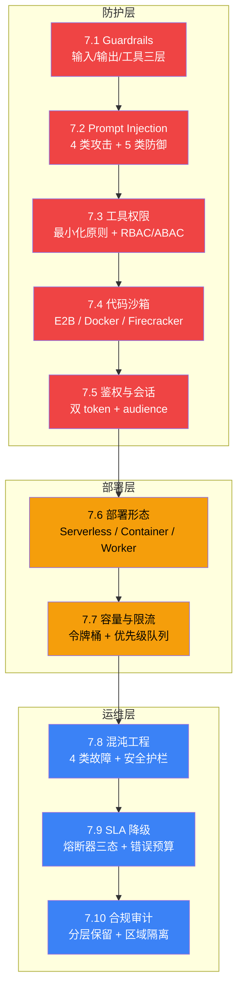

# L7 · 生产化与安全层（10 节 / 1.40 万字）

> 🔴 专家

> **本层定位**:从"**跑得稳**"到"**能在生产环境长期稳定运行 + 不被打**"——生产防护层。L5 讲"模式怎么搭",L6 讲"搭好的 Agent 怎么**度量、评估、观测**",L7 讲"Agent 进入生产后,如何**防护攻击、控制权限、安全部署、容量规划、混沌演练、承诺 SLA、合规审计**"。读完 L7 后,能为任意 Agent 系统接入生产级安全与韧性。

## 生产化与安全全景图



> Source: 基于 OWASP LLM Top 10 + GDPR Article 17 + Netflix Chaos Engineering + Google SRE SLO/SLI/SLA 整合。

## 10 节一句话导览

| 节 | 主题 | 一句话 |
|---|---|---|
| 7.1 | Guardrails 三层防护 | 输入/输出/工具三层防线 + 默认拒绝 + 白名单 |
| 7.2 | Prompt Injection 攻防 | 直接/间接/越狱/角色劫持 4 类攻击 + 5 类防御 |
| 7.3 | 工具权限 | 三维最小化(会话/时间/范围)+ RBAC/ABAC/临时 token |
| 7.4 | 代码执行沙箱 | E2B / Docker / Firecracker 三档隔离 + 冷启动权衡 |
| 7.5 | 鉴权与会话 | 双 token(access/refresh)+ audience 区分 + confused deputy |
| 7.6 | 部署形态 | Serverless / Container / Long-running Worker 三形态决策树 |
| 7.7 | 容量与限流 | 令牌桶 + 优先级队列 + 多租户限流架构 |
| 7.8 | 故障注入 | 杀 Pod / 断网 / 慢响应 / LLM 超时 4 类故障 + 安全护栏 |
| 7.9 | SLA 降级 | SLO/SLI/SLA 三层 + Circuit Breaker 三态 + 错误预算 |
| 7.10 | 合规审计 | 日志分层保留 + PII 脱敏 + 区域隔离(GDPR/CCPA/数据安全法) |

## 学习路径

- **必读路径**(🔴 核心 / 5 节):7.1 → 7.3 → 7.5 → 7.6 → 7.9
  - 14 天接入生产级防护:Guardrails + 权限 + 鉴权 + 部署 + SLA 降级
- **进阶路径**(🔴 进阶 / 8 节):+ 7.2 → 7.4 → 7.7
  - 30 天建完整生产防护:含注入防御 + 沙箱隔离 + 限流架构
- **专家路径**(🔴 专家 / 10 节):+ 7.8 → 7.10
  - 60 天建企业级生产体系:含混沌演练 + 长期合规审计
- **速读路径**(5 节精华):7.1 → 7.3 → 7.5 → 7.9 → 7.10
  - 2 小时掌握 Agent 生产防护骨架

## 与其他层衔接

| 层 | 衔接点 |
|---|---|
| **L4 框架** | L4.3 LangGraph Checkpoint 是 7.5 鉴权 session 状态基础;L4.2 ReAct 循环是 7.2 注入攻击的主要攻击面 |
| **L5 模式** | L5.10 HITL 是 7.3 工具权限的二次确认实现;L5.11 Multi-Agent 反模式 与 7.1 Guardrails 形成"模式 + 防护"双重血泪清单 |
| **L6 观测** | 6.7 成本监控 + 6.8 延迟分析是 7.7 容量评估的输入;6.9 A/B 灰度是 7.6 部署形态的实验工具;6.10 反模式是 7.9 SLA 降级的"避坑地图" |
| **L8 案例** | L8.2 Coding Agent 与 L8.3 DB Agent 是 L7 真实落地案例——7.4 E2B 沙箱 + 7.9 Circuit Breaker + 7.10 GDPR 合规在两类系统中的实际配置 |

## L7 关键概念地图

```
生产化与安全(Production & Security)
├── 防护(Defense)
│   ├── Guardrails:输入校验 / 输出过滤 / 工具调用拦截(默认拒绝 + 白名单)
│   ├── Prompt Injection:直接注入 / 间接注入(RAG 文档)/ 越狱 / 角色劫持
│   ├── 工具权限:会话级 / 时间级 / 范围级三维最小化
│   │   └── 鉴权:Access Token + Refresh Token + audience 区分 + confused deputy 防御
│   └── 代码沙箱:E2B(50ms 冷启动)/ Docker(1-3s)/ Firecracker(60-90s)
├── 部署(Deployment)
│   ├── 形态:Serverless(短任务)/ Container(中等)/ Long-running Worker(长会话)
│   └── 容量:QPS × 并发 × 延迟 → 令牌桶 + 优先级队列 + 多租户分层
└── 运维(Operations)
    ├── 混沌工程:4 类故障(进程/网络/性能/应用)+ 稳态基线 + 安全护栏
    ├── SLA:SLO(内部目标)→ SLI(实测)→ SLA(对外承诺)+ 错误预算 + 熔断器三态
    └── 合规:数据分级(公开/内部/机密/绝密)+ PII 脱敏 + 区域隔离(GDPR/CCPA/数据安全法)
```

> 📚 本章参考
> - [S 级] OWASP LLM Top 10 — https://github.com/OWASP/www-project-top-10-for-large-language-model-applications
> - [S 级] Google SRE Book Ch.4-5 SLO/SLI + Ch.8 Error Budget — https://github.com/google/sre
> - [S 级] Microsoft Presidio (PII Detection & De-identification) — https://github.com/microsoft/presidio
> - [A 级] Lilian Weng, *LLM Powered Autonomous Agents* (2023) — https://lilianweng.github.io/posts/2023-06-23-agent/
