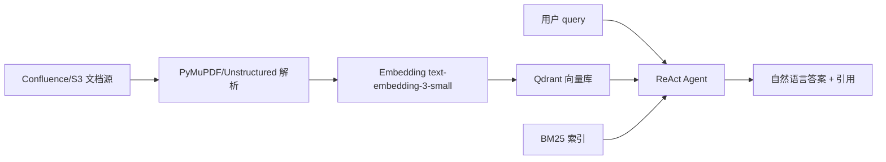
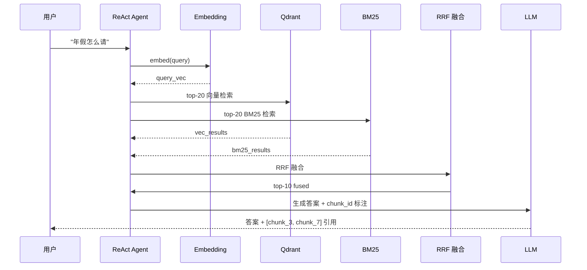

# 案例 8.1:企业知识库 RAG Agent(HR 政策智能问答)

## 业务背景

某中型互联网公司(800 人规模)HR、法务、行政部门沉淀了 1000+ 篇内部文档:Confluence 上的《员工手册》、《考勤休假制度》、《报销流程》、《股权激励政策》、《竞业限制协议》模板,以及 S3 上的 PDF 版《劳动合同法解读》、《员工培训手册》。员工每天要花 20% 工作时间找政策:"年假怎么请"、"报销有时限吗"、"试用期被辞退有补偿吗"。基于关键词的全文检索体验极差,ES 的 TF-IDF 经常把"年假"、"病假"、"婚假"混在一起,HR 同事每月处理 200+ 重复咨询。

更棘手的是政策频繁迭代:每年 1 月 HR 会更新《考勤休假制度》,但旧版本仍躺在 Confluence 历史里,员工搜出来一半是新规、一半是旧规,根本不知道哪条生效。HR 同事每周要花 4 小时在内部群澄清"以哪个版本为准"。另一个痛点是新人入职高峰,每月 30+ 新人涌入,带教成本高,FAQ 文档被浏览 800+ 次/月,但 40% 的提问仍会绕到 HR 个人微信。

项目目标是搭建 RAG Agent:员工用自然语言提问,系统检索后给出答案 + 引用块,HR 同事从"被动答疑"转为"主动治理知识库"。Agent 必须能识别"以 2024 年 1 月修订版为准",并在引用中明确显示文档版本号,避免新旧规则混淆。验收指标:Recall@10 ≥ 85%、P95 端到端延迟 ≤ 3s、单次调用成本 ≤ $0.02;灰度期间 200 人 HR 部门 + IT 部门试用,满意度 ≥ 80% 才正式全量。

## 架构设计

整体采用 ReAct 风格的多路召回 + 重排 + 合成管道。文档先离线解析、向量化、入库,在线阶段只做检索与合成。

### 架构图



### 数据流图



## 关键技术决策

| 决策点 | 方案 A | 方案 B | 方案 C | 选择 | 理由 |
|---|---|---|---|---|---|
| 文档分块 | 固定 512 token | 语义分块(Markdown 标题感知) | 递归分块 | B | HR 政策有清晰章节结构,标题感知更准 |
| 检索融合 | RRF | Linear Combination | Cross-Encoder Only | A | RRF 无需调权,对短 query 友好 |
| Embedding 模型 | text-embedding-3-small | bge-large-zh-v1.5 | m3-embedding | B | 中文场景 bge 显著优于 OpenAI |
| 引用溯源 | chunk_id 内联 | 脚注 | 链接回原文档 | A | 内联可读性最好 |

## 代码骨架

下面给出一段 LangChain LCEL 的 RAG 管道骨架,展示 BM25 + 向量双路召回、RRF 融合、Cross-Encoder 重排、答案合成带 chunk_id 标注。

```python
from typing import List
from langchain.retrievers import BM25Retriever, EnsembleRetriever
from langchain.vectorstores import Qdrant
from langchain.embeddings import HuggingFaceBgeEmbeddings
from langchain.document_transformers import EmbeddingsRedundantFilter
from langchain.retrievers.document_compressors import CrossEncoderReranker
from langchain.cross_encoders import HuggingFaceCrossEncoder
from langchain.prompts import ChatPromptTemplate
from langchain.chat_models import ChatOpenAI
from langchain.schema import Document

# 1. Embedding 与向量库
embed_model = HuggingFaceBgeEmbeddings(
    model_name="BAAI/bge-large-zh-v1.5",
    model_kwargs={"device": "cuda"},
    encode_kwargs={"normalize_embeddings": True},
)
vectorstore = Qdrant.from_documents(chunks, embed_model, location=":memory:")

# 2. BM25 + 向量双路召回(EnsembleRetriever 默认 RRF 融合)
bm25 = BM25Retriever.from_documents(chunks, k=20)
vec = vectorstore.as_retriever(search_kwargs={"k": 20})
ensemble = EnsembleRetriever(retrievers=[bm25, vec], weights=[0.5, 0.5])

# 3. Cross-Encoder 重排
ce = HuggingFaceCrossEncoder(model_name="BAAI/bge-reranker-large")
compressor = CrossEncoderReranker(model=ce, top_n=5)
# 4. 合成 prompt:要求 LLM 标注 chunk_id
prompt = ChatPromptTemplate.from_template(
    "你是 HR 政策助理,基于以下检索片段回答问题。\n"
    "每段引用须以 [chunk_{i}] 形式标注。\n\n"
    "{context}\n\n问题:{question}\n答案:"
)

def format_docs(docs: List[Document]) -> str:
    return "\n\n".join(
        f"[chunk_{i}] {d.page_content}" for i, d in enumerate(docs)
    )

# 5. LCEL 管道
llm = ChatOpenAI(model="gpt-4o-mini", temperature=0)
rag_chain = (
    {"context": ensemble | format_docs, "question": lambda x: x}
    | prompt
    | llm
)

# 6. 调用
answer = rag_chain.invoke("年假怎么请?")
```

## 评测数据

| 指标 | 目标 | 实际 |
|---|---|---|
| Recall@10 | ≥ 85% | TBD |
| P95 端到端延迟 | ≤ 3s | TBD |
| 单次调用成本 | ≤ $0.02 | TBD |
| 用户满意度(👍率) | ≥ 80% | TBD |
| HR 同事月均答疑量 | 下降 60% | TBD |

评测集 200 条,由 HR 同事标注 ground truth 段落;Recall@10 通过对比 ground truth chunk_id 与召回 chunk_id 集合计算。线上采用 shadow 模式,先返回答案给用户,后端打日志记录 ground truth 用于离线迭代。每两周一次版本回放,确认新旧版本 Recall 差异小于 2 个百分点。

## 踩坑清单

1. **PyMuPDF 表格丢失**。某些 PDF 的复杂表格被解析为图片,文字提取不到。修复:用 Unstructured 的 `partition_pdf(strategy="hi_res")` 走 OCR 回退,或先 `camelot-py` 抽表。
2. **Qdrant HNSW 参数**。默认 `m=16, ef_construct=100` 在 100 万向量后召回下降。修复:`ef=128, m=32`,并定期 `recreate_collection` 重建索引。
3. **中文 Embedding 选型**。`text-embedding-3-small` 中文表现一般,bge-large-zh-v1.5 在 C-MTEB 显著领先。修复:用 bge,query 侧加 `query: ` 前缀(官方推荐)。
4. **BM25 tokenizer**。`jieba` 切词粒度太细,"年假"被切成"年/假",召回率低。修复:关闭 `jieba` 默认 HMM,加 HR 领域自定义词典(年假、病假、调休)。
5. **RRF k 值**。`k=60` 是默认值,但对短 query 偏大。修复:实测 k=20 表现更佳,用网格搜索确认。
6. **LLM 幻觉**。当检索片段不足以回答,LLM 仍会"编造"政策。修复:prompt 显式"若信息不足,回答"信息不足,建议联系 HR"。
7. **重排慢**。Cross-Encoder 对 20 个候选打分约 200ms,P95 延迟不达标。修复:用 bge-reranker-base 替代 large,或下采样到 top-10 再重排。
8. **长文档切分**。Confluence 页面含大量目录、侧边栏,污染语义。修复:用 `unstructured` 的 `chunk_by_title` 保留标题边界,并设置 `max_characters=1500`。

## L6 / L7 防护要点

- **L7.1 Guardrails 答案前查引用**:合成 prompt 强制要求"每段事实必须可溯源到 [chunk_i]",无引用的断言一律拒绝。代码层面用 `NeMo Guardrails` 加输出侧 rails,正则匹配 `\[chunk_\d+\]`。
- **L7.10 PII 脱敏**:员工提问可能含身份证号、手机号、病假事由等敏感信息。修复:在 query 入库前用 `presidio-analyzer` 脱敏,合成时仅显示脱敏占位符,完整内容由 HR 登录后可见。
- **L6.2 Tracing span 命名**:LangSmith 链路用 `rag.retrieve.bm25`、`rag.retrieve.vector`、`rag.rerank`、`rag.generate` 四级 span 命名,便于定位瓶颈;延迟超 3s 立即告警。

## 本节参考

> - https://github.com/langchain-ai/langchain —— RAG 模板 README
> - https://arxiv.org/abs/2312.10997 —— "Retrieval-Augmented Generation for Large Language Models: A Survey" (Gao et al. 2024)
> - https://lilianweng.github.io/posts/2020-10-29-retrieval-augmented-generation/ —— Lilian Weng RAG 博客
> - https://eugeneyan.com/writing/retrieval-augmented-generation/ —— Eugene Yan RAG 博客
