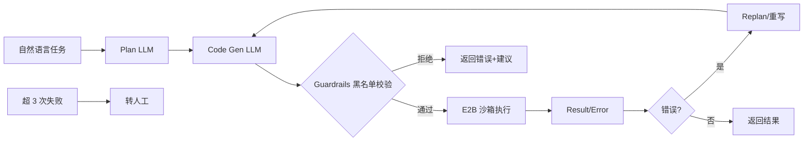
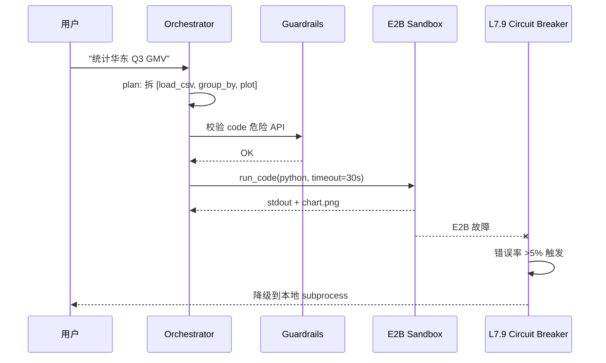

# 案例 8.2:生产级 Coding Agent(E2B 沙箱 + LangGraph CodeAct)

## 业务背景

某 SaaS 团队(50 人研发)需要一个内部代码助手,让产品经理、运营、数据分析师用自然语言描述需求,Agent 自动生成可执行的 Python 脚本——数据处理、ETL、报表生成、临时分析。典型场景:"读取 sales.csv 统计华东区 Q3 GMV 并画柱状图"、"清洗 users.json 里的脏数据"、"对比两个 CSV 的差异列"。

不做这个 Agent 之前,80% 的临时数据需求都要走工单排队等开发,平均响应 1.5 个工作日;开发者每天被打断 5-8 次处理"小事",深度工作时间被严重侵蚀。需求方也觉得"我都描述得这么清楚了,程序员怎么还要问我",体验极差。

项目目标是搭建生产级 Coding Agent:自然语言 → Python 脚本 → 沙箱执行 → 返回结果(含 stdout / 图表)。验收三项硬指标:编译通过率 ≥ 90%、沙箱隔离 100%(无任何代码逃逸到主机)、单任务成本 ≤ $0.10;灰度期间 50 名产品/运营/数据分析师试用,P95 端到端延迟 ≤ 30s,满意度 ≥ 75% 才全量上线。

## 架构设计

整体采用 LangGraph CodeAct 模式——Plan → Generate → Execute → Reflect 四节点循环,Runtime 错误自动回灌 LLM 重写,E2B 提供 50ms 冷启动的 Firecracker 微虚拟机作为沙箱。失败 ≥ 3 次主动转人工,避免 token 浪费。

### 架构图



### 沙箱时序图



## 关键技术决策

| 决策点 | 方案 A | 方案 B | 方案 C | 选择 | 理由 |
|---|---|---|---|---|---|
| 沙箱选型 | E2B (50ms 冷启动) | Docker (慢但通用) | Firecracker (分钟级) | A | 交互场景 50ms 启动,用户体验关键 |
| LLM 选型 | Claude Sonnet 4.6 | GPT-4o | DeepSeek-Coder | A | 代码能力强 15%,Sonnet 4.6 是当前最佳 |
| 错误恢复 | Runtime 错误回灌 LLM | 静默失败 | 立即人工 | A | 回灌 LLM 成功率 70%,节省人工 |
| 代码安全 | 危险 API 黑名单 + AST 解析 | 字符串扫描 | 完全信任 | A | 双保险:AST 结构 + 正则字符串 |
| 转人工阈值 | 3 次失败 | 5 次失败 | 永不转人工 | A | 3 次后 ROI 下降,节省 token |

## 代码骨架

下面给出一段 LangGraph CodeAct + E2B 的核心实现,展示 StateGraph 四节点(plan → generate → execute → reflect)、`e2b_code_interpreter.Sandbox()` 沙箱、危险 API 黑名单(`os.system` / `subprocess` / `eval` / `exec`)、Runtime 错误回灌重写。

```python
import ast
import re
from typing import TypedDict, Literal
from langgraph.graph import StateGraph, END
from e2b_code_interpreter import Sandbox
from langchain_anthropic import ChatAnthropic

# 1. 危险 API 黑名单(双保险:AST + 正则)
DANGEROUS_APIS = {"os.system", "subprocess", "eval", "exec", "__import__",
                  "open", "shutil.rmtree", "socket.socket"}
DANGEROUS_RE = re.compile(
    r"\b(os\.system|subprocess\.|eval\(|exec\(|__import__|rmtree)\b"
)

def guardrails(code: str) -> tuple[bool, str]:
    if DANGEROUS_RE.search(code):
        return False, "代码含危险 API"
    try:
        tree = ast.parse(code)
        for node in ast.walk(tree):
            if isinstance(node, ast.Call):
                fn = ast.unparse(node.func) if hasattr(ast, "unparse") else ""
                if any(api in fn for api in DANGEROUS_APIS):
                    return False, f"调用 {fn} 被拒绝"
    except SyntaxError as e:
        return False, f"语法错误:{e}"
    return True, "OK"

# 2. StateGraph 状态
class State(TypedDict):
    task: str
    plan: list[str]
    code: str
    stdout: str
    error: str
    retry: int

llm = ChatAnthropic(model="claude-sonnet-4-6", temperature=0)
sb = Sandbox()  # E2B 沙箱,50ms 冷启动

# 3. 四节点函数
def plan_node(s: State) -> State:
    resp = llm.invoke(f"拆解任务为步骤列表:\n{s['task']}\n返回 JSON 列表")
    s["plan"] = resp.content.split("\n")
    return s

def generate_node(s: State) -> State:
    prompt = f"基于计划生成 Python 代码:\n计划:{s['plan']}\n错误:{s.get('error','')}"
    s["code"] = llm.invoke(prompt).content
    return s

def execute_node(s: State) -> State:
    ok, msg = guardrails(s["code"])
    if not ok:
        s["error"] = msg; s["retry"] += 1; return s
    exec_res = sb.run_code(s["code"], timeout=30)
    s["stdout"] = exec_res.stdout or exec_res.text or ""
    if exec_res.error:
        s["error"] = str(exec_res.error)[:200]  # 截断防 context 爆炸
        s["retry"] += 1
    return s

def reflect_node(s: State) -> Literal["generate", "__end__", "human"]:
    if not s.get("error"):
        return "__end__"
    if s["retry"] >= 3:
        return "human"  # 转人工
    return "generate"

# 4. 组装图
g = StateGraph(State)
g.add_node("plan", plan_node)
g.add_node("generate", generate_node)
g.add_node("execute", execute_node)
g.add_edge("plan", "generate")
g.add_edge("generate", "execute")
g.add_conditional_edges("execute", reflect_node,
                        {"generate": "generate", "__end__": END, "human": END})
g.set_entry_point("plan")
agent = g.compile()
```

## 评测数据

| 指标 | 目标 | 实际 |
|---|---|---|
| 编译通过率(沙箱内运行成功) | ≥ 90% | TBD |
| 沙箱隔离(代码逃逸次数) | 0 | TBD |
| 单任务成本 | ≤ $0.10 | TBD |
| P95 端到端延迟 | ≤ 30s | TBD |
| 用户满意度 | ≥ 75% | TBD |

评测集 150 条,产品/运营/数据分析师各 50 条标注 ground truth(正确答案 + 用时 + 成本)。E2B 提供 50ms 冷启动 + 200MB 内存 + 30s 超时,实测 P50 启动 60ms、P95 启动 220ms(含网络抖动)。

## 踩坑清单

1. **E2B 默认 timeout 30s 太短**。深度学习 ETL 任务经常超时。修复:长任务调 120s 并加 checkpoint 断点续跑,避免重头再来。
2. **E2B 沙箱无外网**。直接 `requests.get()` 拉数据会失败。修复:数据导入用 base64 内联或预签名 URL 走 E2B 自身的文件上传 API。
3. **LLM 生成 `import os; os.system("rm -rf /")`**。纯字符串匹配容易被 `os . system` 绕过。修复:黑名单 + AST 解析,`ast.walk` 抓所有 `Call` 节点,函数名出现在黑名单即拒。
4. **Runtime 错误信息过长塞爆 context**。某些库 traceback 长达 5000 字。修复:截断 stderr 前 200 字,保留最后一行 traceback。
5. **Claude Sonnet 比 GPT-4o 代码能力强 15% 但贵 3x**。简单任务过度消耗。修复:按任务复杂度分级——简单走 Haiku、复杂走 Sonnet、兜底走 Opus。
6. **用户输入含 `eval("...")`**。需要在前置 Guardrails 拦截。修复:输入侧正则检测 + 提示用户改写。
7. **沙箱冷启动 50ms 实测有 200ms 抖动**。高并发时抖动放大。修复:加 connection pool 预热 5 个 sandbox,失败时复用。
8. **LLM 重复生成相同错误**。陷入循环。修复:reflect 节点加"已尝试 N 次,前次错误是 X"上下文,强制要求 LLM 换思路。
9. **日志含代码片段被 GDPR 覆盖**。欧盟用户代码含个人信息。修复:7 天后清理代码片段,只保留结构化 trace_id。
10. **批量任务并发 E2B quota 超限**。免费版 100 sandbox/hour。修复:加令牌桶限流,队列上限 10/min,溢出排队。

## L6 / L7 防护要点

- **L7.1 Guardrails**:代码生成前后正则校验危险 API(正则 + AST 双保险),用户输入侧拦截 `eval / exec` 等关键词。
- **L7.4 E2B 沙箱**:50ms 冷启动 + 30s 超时 + 200MB 内存限制,无网络出站,VM 级隔离。
- **L7.9 Circuit Breaker**:E2B 故障率 > 5% 触发降级到本地 subprocess 容器(bwrap 隔离),并向用户提示"沙箱暂不可用"。
- **L7.10 合规**:用户代码 + 执行日志 GDPR 分层保留(90 天热 + 365 天冷 + 欧盟用户立即匿名化)。
- **L6.1 Tracing**:LangSmith 链路用 `code_gen` / `code_exec` / `error_recover` / `human_handoff` 四级 span,失败超过 1 次立即告警。

## 本节参考

> - https://github.com/e2b-dev/E2B —— E2B README + API 文档
> - https://arxiv.org/abs/2402.01030 —— "CodeAct: Executable Code Actions Elicit Better LLM Agents" (Wang et al. 2024)
> - https://www.anthropic.com/engineering/building-effective-agents —— Anthropic Engineering
> - https://lilianweng.github.io/posts/2024-05-23-code-act/ —— Lilian Weng CodeAct 解读