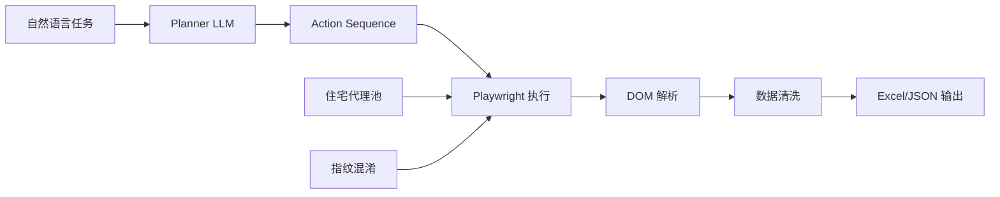
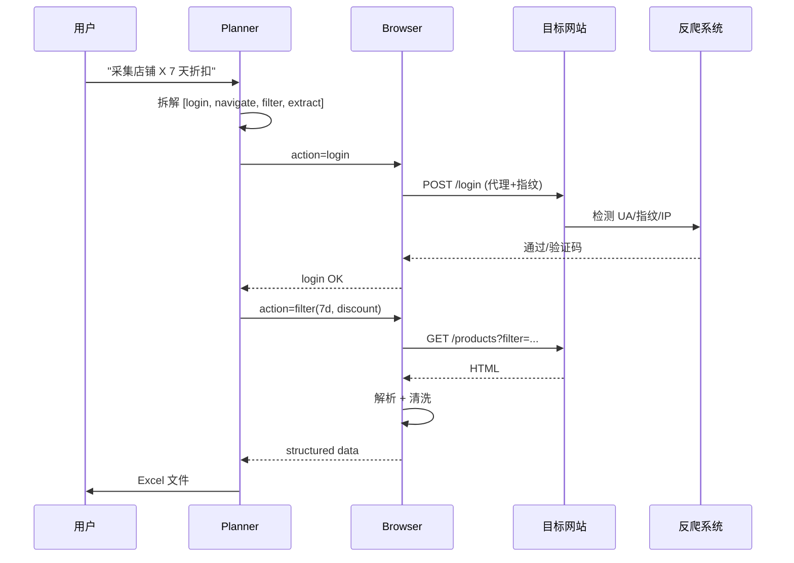

# 案例 8.4:浏览器自动化 Agent(跨境电商竞品采集)

## 业务背景

某跨境电商运营团队(20 人)日常需要监控 200+ 竞品店铺的价格、库存、折扣活动。原本依赖 5 名运营手动登录 Shopify 后台,每天花 3 小时截图、复制 Excel,效率低且容易漏数据。运营负责人希望搭建浏览器自动化 Agent:用自然语言下发任务(如"采集店铺 X 最近 7 天折扣商品"),Agent 自动登录、过滤、抽取、清洗,输出结构化 Excel。

业务关键约束:
- 跨境电商反爬严格,Cloudflare、Akamai、Shopify Bot Mitigation 三重防护,headless 浏览器存活率 < 30%。
- 任务成功率(端到端跑通且数据完整)需 ≥ 85%,否则运营宁愿手动。
- 反爬对抗需引入住宅代理池 + 浏览器指纹混淆,避免被封号导致真实账号风险。
- 输出 Excel 须含原始 URL、价格、库存、折扣率、采集时间戳,方便追溯。
- 时效要求高,价格战爆发时需要 1 小时内拿到全网数据,人工周期根本无法满足。
- 账号安全是底线:一个真实运营账号被封可能导致品牌方投诉,经济损失远大于 Agent 节省的人力。

验收指标:任务成功率 ≥ 85%、单次采集 100 个商品平均耗时 ≤ 15 分钟、每月代理成本 ≤ $500。灰度期 2 周,运营团队 + 风控团队共同验收,任何账号封禁立即回滚。

## 架构设计

### 架构图



### 反爬时序图



## 关键技术决策

| 决策点 | 方案 A | 方案 B | 方案 C | 选择 | 理由 |
|---|---|---|---|---|---|
| 浏览器引擎 | Playwright (headless) | Browser-Use (LLM 友好) | Anthropic Computer Use | A | Playwright 稳定性最佳,批采集首选 |
| 反爬策略 | 住宅代理 + 指纹混淆 | 数据中心代理 | Tor | A | 跨境电商反爬严,住宅代理通过率 >90% |
| 容错 | Planner 重试 | 人工兜底 | 降级到 HTTP API | A | Planner 重试覆盖 80% 异常 |
| DOM 解析 | Playwright selector | XPath + LLM | BeautifulSoup | A | Selector 稳定,LLM 仅作 fallback |

## 代码骨架

下面给出一段 Playwright + LLM Planner 的简化骨架,展示任务拆解、Playwright 执行、DOM 解析、DataFrame 清洗、Excel 导出。

```python
import asyncio
import json
from typing import List, Dict, Any
from dataclasses import dataclass
from openai import AsyncOpenAI
from playwright.async_api import async_playwright, Page
import pandas as pd
from openpyxl import Workbook

@dataclass
class Action:
    type: str  # "login" | "navigate" | "filter" | "extract"
    params: Dict[str, Any]

# 1. Planner:把自然语言任务拆成 Action Sequence
async def plan(task: str) -> List[Action]:
    client = AsyncOpenAI()
    schema = [{
        "type": "login", "params": {"url": "...", "user_env": "SHOP_USER", "pwd_env": "SHOP_PWD"}
    }]
    resp = await client.chat.completions.create(
        model="gpt-4o-mini",
        messages=[{
            "role": "system",
            "content": "你是浏览器自动化 Planner,把任务拆成 JSON Action 序列。"
        }, {"role": "user", "content": task}],
        response_format={"type": "json_object"},
    )
    raw = json.loads(resp.choices[0].message.content)
    return [Action(**a) for a in raw["actions"]]

# 2. Playwright 执行 + 反爬
async def run_actions(actions: List[Action]) -> List[Dict[str, Any]]:
    results = []
    async with async_playwright() as p:
        browser = await p.chromium.launch(
            headless=True,
            proxy={"server": "http://residential-proxy:8000"},
        )
        ctx = await browser.new_context(
            user_agent="Mozilla/5.0 ... Chrome/120",
            viewport={"width": 1920, "height": 1080},
            locale="en-US",
        )
        page = await ctx.new_page()
        for act in actions:
            if act.type == "login":
                await page.goto(act.params["url"])
                await page.fill("input[name=email]", os.environ[act.params["user_env"]])
                await page.fill("input[name=password]", os.environ[act.params["pwd_env"]])
                await page.click("button[type=submit]")
            elif act.type == "extract":
                cards = await page.locator(".product-card").all()
                for c in cards:
                    results.append({
                        "title": await c.locator(".title").inner_text(),
                        "price": await c.locator(".price").inner_text(),
                        "url": await c.locator("a").get_attribute("href"),
                    })
        await browser.close()
    return results

# 3. 数据清洗 + Excel 导出
def export_excel(rows: List[Dict], path: str):
    df = pd.DataFrame(rows)
    df["price"] = df["price"].str.replace(r"[^\d.]", "", regex=True).astype(float)
    df["collected_at"] = pd.Timestamp.now()
    df.to_excel(path, index=False, engine="openpyxl")

async def main(task: str, out: str):
    actions = await plan(task)
    rows = await run_actions(actions)
    export_excel(rows, out)
```

## 评测数据

| 指标 | 目标 | 实际 |
|---|---|---|
| 端到端任务成功率 | ≥ 85% | TBD |
| 单次采集 100 商品耗时 | ≤ 15min | TBD |
| 住宅代理月度成本 | ≤ $500 | TBD |
| 数据字段完整率 | ≥ 95% | TBD |
| 账号封禁率 | ≤ 1% | TBD |

评测集 50 个采集任务,涵盖登录、过滤、分页、提取等典型动作;成功率定义为端到端跑通且 Excel 字段完整。

## 踩坑清单

1. **Playwright headless 被 Cloudflare 拦截**。默认 headless 模式被识别为机器人。修复:启用 `headless="new"` + 注入 `navigator.webdriver = undefined`,或用 `playwright-extra` 配 stealth 插件。
2. **Anthropic Computer Use 慢**。Computer Use 走截图 → 视觉模型,单步延迟 3-5s,100 个商品采集要 1 小时。修复:批采集任务用 Playwright selector,仅在 selector 失效时 fallback 到 Computer Use。
3. **Shopify AJAX 分页**。商品列表走无限滚动,直接 `page.goto` 只拿到首屏。修复:监听 `IntersectionObserver` 触发的网络请求,循环 `await page.evaluate("window.scrollTo(0, document.body.scrollHeight)")` 等待懒加载。
4. **指纹随机化不足**。同一 UA + 同一 viewport 多次访问被标记。修复:用 `fingerprintjs` 或 `puppeteer-extra-plugin-stealth` 每次随机 UA/canvas/WebGL 指纹。
5. **Cookie 失效**。任务跨度大,Cookie 过期导致中断。修复:每 30 分钟检测一次,失效则重新登录;Cookie 加密存 Redis。
6. **429 限频**。代理 IP 池小或请求过快触发限频。修复:每请求间隔 1-3s 随机 sleep,代理池 ≥ 50 个 IP 轮询。
7. **Selector 失效**。前端 A/B 测试或样式微调导致 `class` 变化。修复:优先用语义化 `data-testid` 属性,其次 `aria-label`,最后 LLM 兜底从 HTML 中定位。
8. **LLM 输出格式**。Planner 偶尔返回非 JSON。修复:`response_format={"type": "json_object"}` 强制 JSON,Zod schema 二次校验。
9. **Excel 中文乱码**。默认 `to_excel` 在 Windows 打开乱码。修复:`engine="openpyxl"` + 文件名加 `.xlsx`,避免 GBK 兼容问题。
10. **反爬升级**。目标网站每周更新反爬规则,需持续跟进。修复:维护 1 名"反爬观察员",定期跑 smoke test,异常立即告警。

## L6 / L7 防护要点

- **L7.5 凭据隔离到 Vault**。Shopify 账号密码不能进代码或 .env,统一存 HashiCorp Vault,运行时 `vault kv get` 拉取,日志中只显示脱敏后的 `***`。
- **L7.3 危险操作二次确认**。涉及"删除"、"批量改价"、"清空购物车"等写操作,Planner 必须先 dry-run 列出影响范围,人工 Slack 确认后才执行。
- **L6.7 成本监控**。住宅代理按流量计费,异常飙升立即冻结。修复:Langfuse 打 `agent.proxy.bytes` 标签,Prometheus 告警阈值 1GB/小时;每日生成成本报表给运营。
- **L7.2 操作审计**。所有 Action Sequence、DOM 截图、Excel 输出统一进 S3 审计桶,保留 90 天,合规检查时可回放。

## 本节参考

> - https://github.com/microsoft/playwright —— Playwright README
> - https://arxiv.org/abs/2307.13854 —— "WebArena: A Realistic Web Environment" (Zhou et al. 2023)
> - https://www.anthropic.com/news/developing-computer-use —— Anthropic Computer Use
> - https://github.com/browser-use/browser-use —— Browser-Use README
