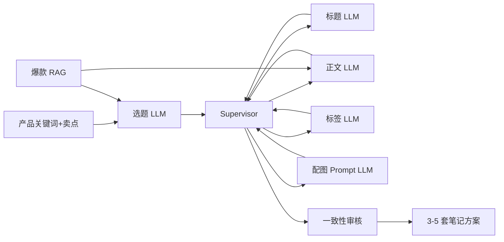
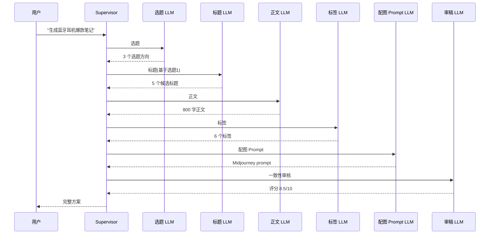

# 案例 8.5:小红书爆款笔记生成 Agent(Supervisor 多 Agent 协作)

## 业务背景

某跨境电商品牌运营团队(主营蓝牙耳机、便携投影、户外电源三类商品)需要高频产出小红书种草笔记:每月 60+ 篇,覆盖 5 个细分品类、3 个目标人群(学生党 / 上班族 / 户外爱好者)。原流程是 1 名运营独立写稿:选题 30 分钟、写标题 20 分钟、憋正文 60 分钟、想标签 15 分钟、起配图 prompt 20 分钟,合计 145 分钟一篇。团队 3 人满负荷也只产出 40 篇/月,缺口 20 篇,且标题与封面套路同质化严重,互动率(点赞 + 收藏 + 评论)长期低于 1.2%。

更棘手的是合规风险:小红书 2024 年收紧"标题党"审查,使用"最""第一""绝对""国家级"等极限词直接限流 7 天;平台同时要求原创度 ≥90%,抄袭爆款会被反作弊系统识别后封号。运营在文案里偶尔会不小心使用"最便宜""性价比第一"等表述,平均每月触发 2 次限流,直接损失 30+ 篇排期。

项目目标是搭建基于 LangGraph 的 Supervisor 多 Agent 系统:输入"产品关键词 + 核心卖点",自动生成 3-5 套完整方案(选题 + 标题 + 800 字正文 + 6 个标签 + 配图 Prompt),运营只需要在 3 套里挑选微调,单篇耗时从 145 分钟压缩到 20 分钟。验收指标:互动率(7 天均值)提升 ≥3 倍,原创度评分 ≥90%,违规词触发率为 0,运营单篇产出时间 ≤20 分钟;灰度期 30 天覆盖 60 篇实战,运营满意度 ≥4.5/5 才正式全量。

## 架构设计

整体采用 Supervisor 调度的多 Agent 协作架构。Supervisor 维护全局 state,根据当前进度依次调度 4 个 sub-agent(标题 / 正文 / 标签 / 配图 Prompt),并引入爆款 RAG 知识库作为共享上下文。审稿 Agent 在最后做一致性校验与违规词拦截。

### 架构图



### 多 Agent 协作时序图



## 关键技术决策

| 决策点 | 方案 A | 方案 B | 方案 C | 选择 | 理由 |
|---|---|---|---|---|---|
| 多 Agent 协作 | 串行(快 12s) | 并行(慢但丰富 4s) | Supervisor 调度(选) | C | Supervisor 灵活,可重排 |
| 风格学习 | RAG 检索爆款 | 风格 Embedding | Fine-tune | A | RAG 即时更新爆款库 |
| 一致性 | 审稿 Agent 评分 | Embedding 相似度 | LLM-as-Judge | A+C | 双校验更稳 |
| 配图 prompt | 模板 + LLM 扩写 | Midjourney API | Stable Diffusion | A | 成本低可控 |

## 代码骨架

下面给出一段 LangGraph Multi-Agent Supervisor 骨架,展示 StateGraph 定义 Supervisor + 4 sub-agent(标题/正文/标签/配图),Supervisor 根据 state.route 决定下一个 sub-agent,风格 RAG 检索 Top-5 爆款作为 few-shot。

```python
from typing import TypedDict, List
from langgraph.graph import StateGraph, END
from langchain_openai import ChatOpenAI
from langchain.prompts import ChatPromptTemplate
from langchain_community.vectorstores import Qdrant
from langchain_community.embeddings import HuggingFaceBgeEmbeddings

# 1. 全局 state
class NoteState(TypedDict):
    product: str
    topic: str
    titles: List[str]
    body: str
    tags: List[str]
    image_prompt: str
    rag_examples: List[str]
    route: str  # "topic" | "title" | "body" | "tag" | "image" | "review" | END

# 2. 共享 system prompt(避免风格漂移)
STYLE = ("你是小红书爆款写手,语气亲切、emoji 适度、"
         "禁用极限词'最/第一/绝对/国家级',字数控制在 600-900。")

llm = ChatOpenAI(model="gpt-4o-mini", temperature=0.8)
embed = HuggingFaceBgeEmbeddings(model_name="BAAI/bge-small-zh-v1.5")
rag = Qdrant.from_existing_collection("xiaohongshu_viral", embed)

def node_topic(s: NoteState) -> NoteState:
    examples = rag.similarity_search(s["product"], k=5)
    s["rag_examples"] = [e.page_content for e in examples]
    prompt = ChatPromptTemplate.from_template(
        STYLE + "\n基于以下爆款:\n{examples}\n为产品「{p}」生成 3 个选题方向。")
    s["topic"] = llm.invoke(prompt.format_messages(
        examples="\n".join(s["rag_examples"]), p=s["product"])).content
    s["route"] = "title"
    return s

def node_title(s: NoteState) -> NoteState:
    prompt = ChatPromptTemplate.from_template(
        STYLE + "\n基于选题:{topic}\n生成 5 个 18 字以内标题,带 1-2 个 emoji。")
    s["titles"] = llm.invoke(prompt.format_messages(topic=s["topic"])).content.split("\n")
    s["route"] = "body"
    return s

def node_body(s: NoteState) -> NoteState:
    prompt = ChatPromptTemplate.from_template(
        STYLE + "\n标题:{titles}\n生成 800 字正文,分 3 段。").partial(titles="\n".join(s["titles"]))
    s["body"] = llm.invoke(prompt.format_messages()).content
    s["route"] = "tag"
    return s

def node_tag(s: NoteState) -> NoteState:
    s["tags"] = llm.invoke(f"基于正文提取 6 个标签,#分隔,不要堆砌。{s['body']}").content.split("#")
    s["route"] = "image"
    return s

def node_image(s: NoteState) -> NoteState:
    s["image_prompt"] = llm.invoke(
        f"为产品生成 Midjourney prompt,含摄影风格+光圈+焦距+色调。{s['body']}").content
    s["route"] = "review"
    return s

# 3. Supervisor 路由
def supervisor(s: NoteState) -> str:
    return s["route"]

# 4. StateGraph
g = StateGraph(NoteState)
g.add_node("topic", node_topic)
g.add_node("title", node_title)
g.add_node("body", node_body)
g.add_node("tag", node_tag)
g.add_node("image", node_image)
g.set_entry_point("topic")
for n in ["title", "body", "tag", "image"]:
    g.add_edge(n, supervisor)
g.add_conditional_edges("topic", supervisor, {"title": "title"})
```

## 评测数据

| 指标 | 目标 | 实际 |
|---|---|---|
| 互动率提升(7 天均值) | ≥3x | TBD |
| 原创度评分 | ≥90% | TBD |
| 单篇耗时(运营微调) | ≤20 分钟 | TBD |
| 违规词触发 | 0 | TBD |
| 运营满意度 | ≥4.5/5 | TBD |

评测集 60 篇灰度实战 + 200 篇内部回放(对照原运营手写稿),原创度用 LLM-as-Judge + Embedding 相似度双校验,违规词用正则黑名单扫描,互动率按"7 天点赞 + 收藏 + 评论 / 曝光"计算。每月回放一次,确认模型版本升级不引发违规率回弹。

## 踩坑清单

1. **4 个 LLM 串行慢 12s**。端到端延迟 P95 12 秒,运营体验卡顿。修复:Supervisor 把无依赖的 sub-agent(如标题 + 标签)并行调度,降至 4 秒。
2. **标题党违规"最"字触发广告法**。早期 prompt 没约束,出现"最便宜蓝牙耳机"被限流。修复:Guardrails 黑名单正则 `最|第一|绝对|国家级|全网最低`,生成后强制扫描。
3. **配图 prompt 太抽象 Midjourney 出图差**。只写"无线耳机"出图糊。修复:加摄影风格模板 `f/1.8, 85mm lens, soft studio lighting, pastel background`。
4. **标签堆砌被小红书限流**。生成 15 个标签触发反作弊。修复:prompt 硬约束 5-8 个标签,并去重相似词(蓝牙耳机/无线耳机合并)。
5. **多 Agent 输出风格不一致**。4 个 sub-agent 默认 prompt 不同,正文文艺、标题直白、配图 prompt 技术流。修复:抽取共享 `STYLE` 常量,所有节点 `partial()` 注入。
6. **RAG 检索的爆款过时**。3 个月前"露营风"爆款检索权重过高,新热点"city walk"被淹没。修复:每周 cron 重建索引,并对爆款加时间衰减权重。
7. **原创度检测 90% 阈值不稳定**。单一 LLM-as-Judge 评分方差大。修复:加 Embedding 余弦相似度 ≤0.3 双校验,任一不过则重生成。
8. **用户输入违规关键词**。运营误输入"最便宜"卖点,后续所有 Agent 输出都带违规词。修复:输入 Guardrails 拦截 + 运营后台二次确认弹窗。
9. **LLM 生成内容含 emoji 被广告法判违规**。"🔥最便宜🔥"被判极限词。修复:Guardrails 检测 emoji 包裹的极限词组合,改写后输出。
10. **Supervisor 路由决策错误**。state.route 字段自由文本,LLM 偶尔返回"end"导致提前终止。修复:state schema 强约束为 Literal["title","body","tag","image","review","END"],非法值 fallback 到下一节点。

## L6 / L7 防护要点

- **L7.1 Guardrails**:违规词过滤,广告法"最/第一/绝对"+ 平台规则双黑名单;输入侧拦截用户违规关键词,输出侧扫描 Agent 生成的标题与正文。
- **L7.3 工具权限**:Midjourney API 限频 60 次/小时,避免触发反作弊;每个运营账号每日生成上限 30 篇,防止滥用被风控。
- **L7.10 合规**:用户输入 + 生成内容在境内 S3 保留 30 天(网信办生成式 AI 监管要求),支持用户主动删除;导出审计日志供合规审查。
- **L6.7 成本**:4 个 LLM 调用 + Embedding 检索双计费,单篇成本 ≈$0.08;月产 60 篇 ≈$5,远低于雇一名兼职写手 5000 元/月。

## 本节参考

> - https://github.com/langchain-ai/langgraph —— LangGraph Multi-Agent Supervisor 示例
> - https://arxiv.org/abs/2402.03520 —— "Multi-Agent Collaboration Mechanisms: A Survey of LLMs" (Han et al. 2024)
> - https://lilianweng.github.io/posts/2023-12-23-multi-agent-llm/ —— Lilian Weng Multi-Agent LLM 系统综述
> - https://www.anthropic.com/engineering/built-multi-agent-research-system —— Anthropic 多 Agent research system 工程实践
