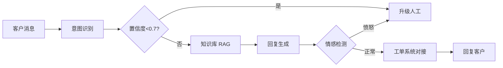
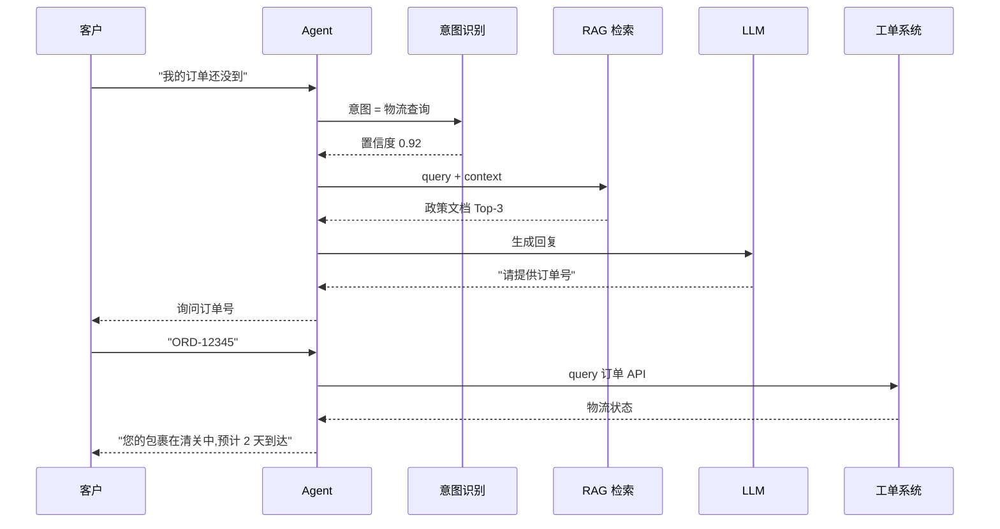

# 案例 8.6:电商智能客服 Agent(多语言 + 工单对接 + 升级策略)

## 业务背景

某跨境电商品牌在北美和欧洲运营 Shopify 独立站,主营家居小家电,日均 1500+ 客户咨询,语种涵盖英、法、德、西、日 5 种。原有客服团队 8 人 3 班倒,平均响应时长 4 分钟,夜间(美西时间 22:00-06:00)只能排队等白天处理,客户差评率 18%;更棘手的是退款/退换货流程:客户发邮件后客服手动查订单系统、复制物流单号、回邮件,平均处理时长 18 分钟,出错率 12%(主要是漏查订单状态就承诺退款)。

更糟的是 2024 年欧盟 GDPR 新规生效,客户对话必须 30 天后自动删除,且客户有权随时撤回历史记录。手工客服既无法准确记录 30 天生命周期,也无法在 30 天内导出删除,合规审计两次警告。运营负责人估算:如果继续靠人工扩编,GMV 增长 50% 时客服成本要涨 80%,ROI 撑不住。

项目目标是搭建基于 LangChain 的 Conversational Agent:7x24 自动回复售前售后咨询,常见问题(物流、退换货、尺寸、保修政策)走 RAG 知识库直接答,复杂问题(订单异常、投诉、情感激烈)升级人工并把完整上下文推给工单系统。验收指标:解决率 ≥75%、客户满意度 ≥4.5/5、P95 响应 ≤5 秒、GDPR 审计 100% 通过;灰度期 60 天覆盖美/欧 5 个站点,问题升级率 ≤25% 才正式全量。

## 架构设计

整体采用 LangChain Conversational Agent + 工单系统对接的多层架构。前端 Web Widget 收消息,经意图识别分流,知识库 RAG 生成答案,情感与置信度双判定决定是否升级人工,工单 API 异步推送完整对话上下文。

### 架构图



### 多轮对话时序图



## 关键技术决策

| 决策点 | 方案 A | 方案 B | 方案 C | 选择 | 理由 |
|---|---|---|---|---|---|
| 意图识别 | Fine-tune 小模型(快准) | LLM(灵活贵) | Hybrid(选) | C | Hybrid: 90% 走小模型,10% 模糊走 LLM |
| 多语言 | 统一英文 prompt + 翻译 | 多语言 prompt | 全部翻译 | A | 维护成本低,输出时翻译 |
| 升级人工 | 置信度阈值 | 情感检测 | 关键词 | A+B+C | 三重判定 |
| 工单对接 | REST API | Webhook | DB 直连 | A | REST 解耦好测试 |

## 代码骨架

下面给出一段 LangChain Conversational Agent 骨架,展示 ConversationBufferMemory 短期记忆 + RAG 检索 + 升级判定(置信度 <0.7 或情感=愤怒 → 转人工)+ 工单 API 对接。

```python
from typing import Dict, List
from langchain.agents import AgentExecutor, create_react_agent
from langchain.memory import ConversationBufferWindowMemory
from langchain_openai import ChatOpenAI
from langchain.prompts import ChatPromptTemplate
from langchain_community.vectorstores import Qdrant
from langchain_community.embeddings import OpenAIEmbeddings
from langchain.tools import Tool
import httpx

# 1. 知识库 RAG
embed = OpenAIEmbeddings(model="text-embedding-3-small")
kb = Qdrant.from_existing_collection("ecom_policy", embed)
def rag_lookup(q: str) -> str:
    docs = kb.similarity_search(q, k=3)
    return "\n".join(d.page_content for d in docs)

# 2. 工单 API(对接 Zendesk)
def open_ticket(payload: Dict) -> str:
    r = httpx.post("https://api.zendesk.example/tickets",
                   json=payload, timeout=5,
                   headers={"Authorization": "Bearer <token>"})
    return r.json()["ticket"]["id"]

# 3. 工具集
tools = [
    Tool(name="policy_search", func=rag_lookup,
         description="查询订单/退换货/保修政策"),
    Tool(name="open_ticket", func=open_ticket,
         description="升级人工工单,参数 payload 包含 user_id, summary, priority"),
]

# 4. 短期记忆:只保留最近 5 轮
memory = ConversationBufferWindowMemory(k=5, memory_key="chat_history",
                                         return_messages=True)

# 5. 升级判定
def should_escalate(intent_conf: float, sentiment: str, msg: str) -> bool:
    escalate_kw = ["lawyer", "refund", "sue", "scam", "fraud"]
    return (intent_conf < 0.7 or sentiment == "angry"
            or any(k in msg.lower() for k in escalate_kw))

# 6. 主循环
llm = ChatOpenAI(model="gpt-4o-mini", temperature=0)
prompt = ChatPromptTemplate.from_template(
    "你是电商客服小助手,语气友好专业。\n"
    "用户问题:{input}\n历史:{chat_history}\n工具:{agent_scratchpad}")
agent = create_react_agent(llm, tools, prompt)
executor = AgentExecutor(agent=agent, tools=tools, memory=memory,
                         verbose=False, handle_parsing_errors=True)

def handle(user_id: str, msg: str,
           intent: str, conf: float, sentiment: str) -> str:
    if should_escalate(conf, sentiment, msg):
        ticket_id = open_ticket({
            "user_id": user_id, "summary": msg,
            "priority": "high" if sentiment == "angry" else "normal",
            "history": memory.load_memory_variables({})["chat_history"],
        })
        return f"已为您升级人工客服,工单号 {ticket_id},5 分钟内联系您。"
    return executor.invoke({"input": msg})["output"]
```

## 评测数据

| 指标 | 目标 | 实际 |
|---|---|---|
| 解决率(无需人工) | ≥75% | TBD |
| 客户满意度(👍率) | ≥4.5/5 | TBD |
| P95 响应延迟 | ≤5s | TBD |
| 升级人工率 | ≤25% | TBD |
| GDPR 审计通过率 | 100% | TBD |

评测集 800 条,涵盖物流(35%)、退换货(25%)、尺寸/参数(20%)、保修(10%)、其他(10%);上线前在 Zendesk 历史工单做回放,LLM-as-Judge + 人工抽样 10% 双盲评分。GDPR 合规用合成客户 ID 跑 30 天自动删除脚本,验证数据生命周期。

## 踩坑清单

1. **多语言 prompt 翻译失真**。直接用 5 套语言 prompt,德语 prompt 把"保修"翻成"garantie"误导客户。修复:统一英文 prompt + 输出侧 DeepL 后置翻译,保留订单号/物流单号不动。
2. **多轮对话 context 撑爆**。5 轮对话后 prompt 长度从 800 token 涨到 3500 token,延迟翻倍。修复:`ConversationBufferWindowMemory(k=5)` 只保留最近 5 轮,老摘要入向量库按需检索。
3. **意图识别 LLM 慢 2s**。每次都调 GPT-4o-mini 识别意图,占 P95 延迟的 40%。修复:Fine-tune 一个 200M 的 bge-small 微调模型做前置分类,90% 高置信度直接走 RAG,10% 模糊走 LLM。
4. **工单 API 限频 429**。大促期间工单突发 3 倍,Zendesk 限频 100 req/min。修复:`httpx` 加指数退避(0.5s/1s/2s/4s)+ 队列削峰。
5. **客户骂人触发情感检测误升级**。"This is shit!" 被识别为 angry 直接升级,但实际是调侃。修复:情感词典加白名单("shit/damn/hell" 在感叹号语境下调低权重)。
6. **退款政策变化未同步**。法务调整 30 天退换政策,但 RAG 知识库还是旧版。修复:Confluence 政策页改完触发 webhook,自动重建向量索引 + 灰度 7 天。
7. **LLM 编造不存在的订单**。客户说"订单 ORD-XYZ",LLM 假装查到了物流状态。修复:工具调用前先 `httpx.get(order_api)` 验证订单真实存在,失败强制询问订单号。
8. **升级人工后上下文丢失**。客户聊了 8 轮被升级,人工客服只看到最后一句,前 7 轮要重新问。修复:`open_ticket` payload 强制带最近 10 轮对话历史,工单详情页直接渲染。
9. **跨境 GDPR 客户数据**。德国客户撤回授权后,工单里仍存着邮件地址。修复:每日 02:00 跑 cron 删除 30 天前 + 撤回名单的对话原文,审计日志保留 7 年(德国商法)。
10. **Shopify API 改版**。2024 年 11 月 Shopify 改 GraphQL 强制,旧 REST 适配代码直接 410。修复:抽象 `OrderAdapter` 接口,Shopify/ERP/3PL 各一套实现,改版只换 adapter。

## L6 / L7 防护要点

- **L7.5 鉴权**:客户身份与店铺账号分离,Widget 用 OAuth + audience 隔离,工单 API 用 scoped token(只读订单 / 只读政策),防止越权查他人订单。
- **L7.10 合规**:客户对话 GDPR 30 天保留 + 删除权,欧盟客户撤回授权触发 cron 删除 + 审计日志(7 年留存);境内客户按 PIPL 同步处理。
- **L7.9 SLA**:工单系统故障时降级到 FAQ 模板回复,20 条高频问题预生成模板;同时健康检查每 30s 探测 Zendesk API,失败转邮件兜底。
- **L6.8 延迟**:TTFT ≤500ms(意图识别小模型 + 流式输出),端到端 P95 ≤5s;LangSmith 链路埋点定位瓶颈,延迟超 4s 立即告警。

## 本节参考

> - https://github.com/langchain-ai/langchain —— LangChain Conversational Agent 与 Memory 模块文档
> - https://www.anthropic.com/engineering/building-effective-customer-service-agents —— Anthropic 客服 Agent 工程实践
> - https://eugeneyan.com/writing/customer-service-llm/ —— Eugene Yan 客服 LLM 设计模式
> - https://arxiv.org/abs/2402.17555 —— "A Survey on Conversational Agents" (Huang et al. 2024)
