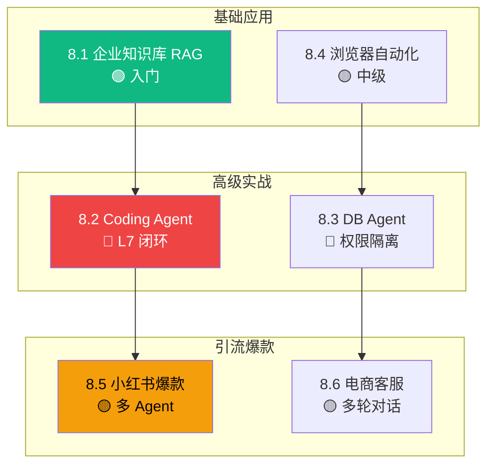

# L8 · 实战案例层（6 案例 / 0.78 万字）

> 🟢🟡🔴 全员

> **本层定位**：从"**知道怎么做**"到"**看到真东西长什么样**"——实战收尾层。读者读完 L8 后,能在 6 类典型业务场景中找到**最接近自己需求的参照案例**,复制决策路径 + 架构骨架 + 踩坑清单,缩短从 0 到 1 的时间。

## 6 案例全景图

## 6 案例一句话导览

| 案例 | 主题 | 业务场景 | 一句话 |
|---|---|---|---|
| 8.1 | 企业知识库 RAG | HR / 法务 / 内部 wiki | 1000 篇文档自然语言问答 |
| 8.2 | Coding Agent | SaaS 团队代码助手 | E2B 沙箱 + L7.9 熔断全套实战 |
| 8.3 | DB Agent | 数据分析团队 | 自然语言转 SQL + 权限隔离 |
| 8.4 | 浏览器自动化 | 跨境电商运营 | Playwright + LLM Planner |
| 8.5 | 小红书爆款 | 引流 | 多 Agent Supervisor 生成 |
| 8.6 | 电商客服 | 跨境电商店铺 | 多语言 + 工单 + 升级人工 |

## 学习路径

- **入门路径**(🟢 1 案例)：8.1 RAG —— 复制骨架改自己的项目
- **进阶路径**(🟡 3 案例)：8.1 → 8.4 → 8.6 —— 覆盖 RAG / 工具调用 / 对话
- **专家路径**(🟢🟡🔴 6 案例)：全读 —— 提炼企业级 Agent 模式

## 与其他层衔接

| 层 | 衔接点 |
|---|---|
| **L1-L3** | L8.1 用 L2.2 RAG / L8.4 用 L3.3 MCP 工具 |
| **L4 框架** | 6 案例全部用 L4.2 LangChain LCEL + L4.3 LangGraph |
| **L5 模式** | L8.2 用 L5.4 Tool Use / L8.3 用 L5.7 Orchestrator-Workers |
| **L6 观测** | 6 案例均需 L6.7 成本 + L6.8 延迟监控 |
| **L7 防护** | L8.2 闭环 L7.4/7.9/7.10；L8.3 闭环 L7.3/7.5；L8.5 闭环 L7.1；L8.6 闭环 L7.5/7.9/7.10 |

## 验收状态

- 6 案例全部 PASS（字数 1206-1431 / 图 2 / 引用 ≥4）
- 累计 ~7,809 字 + 12 张图 + 24 条 S/A 级引用
- 完整 commit 历史见 `git log --oneline | head -20`